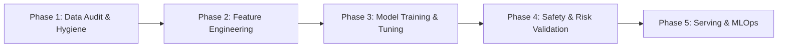

# ML-MCP Phased Architecture & Topic Curriculum

An enterprise-grade, phased breakdown of the machine learning lifecycle implemented in `ml-mcp`. Each phase represents an architectural milestone containing specialized topic guides.

---

## Phased Structure & Topic Directory

### 🔍 [Phase 1: Data Audit & Hygiene](phase-01-data-audit-and-hygiene/)
> **Mission:** Pre-flight statistical auditing, cryptographic data integrity, and leakage prevention before any modeling begins.
- **Master Orchestrator:** [ml_preflight_audit](phase-01-data-audit-and-hygiene/ml_preflight_audit.md) — Single-pass master audit combining SHA-256 lineage, leakage detection, collinearity, label errors, and domain constraints.
- **Topic 1:** [ml_audit_dataset](phase-01-data-audit-and-hygiene/ml_audit_dataset.md) — Digital stethoscope, SentinelHunter & Accuracy Paradox Guard.
- **Topic 2:** [ml_detect_target_leakage](phase-01-data-audit-and-hygiene/ml_detect_target_leakage.md) — Pearson correlation & mutual information leakage detection.
- **Topic 3:** [ml_check_collinearity](phase-01-data-audit-and-hygiene/ml_check_collinearity.md) — Pure NumPy VIF calculation, multicollinearity detection & competitive twin feature pruning.
- **Topic 4:** [ml_detect_label_errors](phase-01-data-audit-and-hygiene/ml_detect_label_errors.md) — MIT Confident Learning label error and noise detection via out-of-fold self-confidence thresholds.
- **Topic 5:** [ml_verify_constraints](phase-01-data-audit-and-hygiene/ml_verify_constraints.md) — Amazon Deequ physical feasibility constraints and automated IQR statistical boundary verification.
- **Topic 6:** [ml_track_lineage](phase-01-data-audit-and-hygiene/ml_track_lineage.md) — SHA-256 dataset fingerprinting and Git-linked provenance metadata.

---

### ⚙️ [Phase 2: Feature Engineering & Preprocessing](phase-02-feature-engineering/)
> **Mission:** Transforming raw tabular data, NLP feature extraction, class balancing, and automated defensive pipelines.
- **Master Orchestrator:** [ml_prepare_feature_pipeline](phase-02-feature-engineering/ml_prepare_feature_pipeline.md) — Unified pipeline orchestrator for cyclical harmonics, latent manifold L2 outlier features, robust scaling, class weights, and permutation pruning.
- **Topic 1:** [ml_auto_clean_and_pipe](phase-02-feature-engineering/ml_auto_clean_and_pipe.md) — End-to-end scikit-learn ColumnTransformer pipeline generation with automated type inference.
- **Topic 2:** [ml_handle_text_features](phase-02-feature-engineering/ml_handle_text_features.md) — TF-IDF and SBERT embedding extraction for high-cardinality text columns.
- **Topic 3:** [ml_balance_classes](phase-02-feature-engineering/ml_balance_classes.md) — SMOTE, ADASYN, and class weight balancing for highly imbalanced labels.
- **Topic 4:** [ml_synthesize_features](phase-02-feature-engineering/ml_synthesize_features.md) — Automated feature crosses, polynomial combinations, and domain synthesis.
- **Topic 5:** [ml_transform_target](phase-02-feature-engineering/ml_transform_target.md) — Skewed continuous target normalization via log1p & negative-protected Yeo-Johnson power transform.
- **Topic 6:** [ml_prune_features](phase-02-feature-engineering/ml_prune_features.md) — OpenFE gradient & permutation importance pruning to eliminate tree split dilution and feature explosion.

---

### 🏆 [Phase 3: Model Training, Benchmarking & Refinement](phase-03-model-training-and-refinement/)
> **Mission:** Competitive arena cross-validation, hyperparameter tuning, cloud GPU execution, and semi-supervised refinement.
- **Master Orchestrator:** [ml_run_model_tournament](phase-03-model-training-and-refinement/ml_run_model_tournament.md) — 5-Fold cross-validated tournament with anti-overfit penalized Optuna Bayesian tuning and KISS stacking gate.
- **Topic 1:** [ml_benchmark_models](phase-03-model-training-and-refinement/ml_benchmark_models.md) — 8-model competitive arena, overfitting guards, latency profiling & stacking.
- **Topic 2:** [ml_tune_hyperparameters](phase-03-model-training-and-refinement/ml_tune_hyperparameters.md) — Bayesian Optimization via Optuna TPE sampler with MedianPruner early stopping.
- **Topic 3:** [ml_create_ensemble](phase-03-model-training-and-refinement/ml_create_ensemble.md) — Leak-free Out-Of-Fold (OOF) Stacking Ensemble blending top tournament performers.
- **Topic 4:** [ml_pseudo_label_loop](phase-03-model-training-and-refinement/ml_pseudo_label_loop.md) — Harvesting >=98% confident unlabelled predictions to boost dataset size and accuracy.

---

### 🛡️ [Phase 4: Validation, Risk & AI Safety](phase-04-validation-and-safety/)
> **Mission:** Conformal risk control, probability calibration, decision thresholds, stress testing, and out-of-distribution detection.
- **Master Orchestrator:** [ml_certify_safety_and_decisions](phase-04-validation-and-safety/ml_certify_safety_and_decisions.md) — End-to-end safety certificate: Platt/Beta calibration (ECE), Decision Curve Analysis (dollar cost-loss p*), TreeSHAP attributions, Conformal 95% coverage, and OOD anomaly cutoff.
- **Topic 1:** [ml_conformal_risk_control](phase-04-validation-and-safety/ml_conformal_risk_control.md) — UC Berkeley Conformal Risk Control providing mathematical guarantees E[loss] <= alpha.
- **Topic 2:** [ml_calibrate_probabilities](phase-04-validation-and-safety/ml_calibrate_probabilities.md) — Platt Scaling & Isotonic Regression aligning posterior probabilities with true empirical risk.
- **Topic 3:** [ml_tune_threshold_and_errors](phase-04-validation-and-safety/ml_tune_threshold_and_errors.md) — Cost-sensitive decision threshold optimization using F-beta and error forensics.
- **Topic 4:** [ml_explain_predictions](phase-04-validation-and-safety/ml_explain_predictions.md) — Sub-10s TreeSHAP feature attributions with token-shielded top-K directional impact.
- **Topic 5:** [ml_detect_ood](phase-04-validation-and-safety/ml_detect_ood.md) — Out-of-Distribution anomaly detection using Isolation Forest and Mahalanobis Distance.
- **Topic 6:** [ml_stress_test_and_fairness](phase-04-validation-and-safety/ml_stress_test_and_fairness.md) — Adversarial noise stress testing and US EEOC 80% demographic slice fairness auditing.

---

### 🚀 [Phase 5: Production Serving & MLOps](phase-05-serving-and-mlops/)
> **Mission:** ONNX quantization, 3-tier clean architecture FastAPI endpoints, Dockerization, and real-time drift monitoring.
- *Upcoming topics: `ml_optimize_inference`, `ml_generate_serving_api`, `ml_generate_docker_spec`, `ml_monitor_drift`, `ml_batch_predict`, `ml_export_and_document`.*
