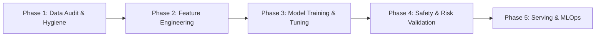

# ML-MCP Phased Architecture & Topic Curriculum

An enterprise-grade, phased breakdown of the machine learning lifecycle implemented in `ml-mcp`. Each phase represents an architectural milestone containing specialized topic guides.

---

## Phased Structure & Topic Directory

### 🔍 [Phase 1: Data Audit & Hygiene](phase-01-data-audit-and-hygiene/)
> **Mission:** Pre-flight statistical auditing, cryptographic data integrity, and leakage prevention before any modeling begins.
- **Topic 1:** [ml_audit_dataset](phase-01-data-audit-and-hygiene/ml_audit_dataset.md) — Digital stethoscope, SentinelHunter & Accuracy Paradox Guard.
- **Topic 2:** [ml_detect_target_leakage](phase-01-data-audit-and-hygiene/ml_detect_target_leakage.md) — Pearson correlation & mutual information leakage detection.
- **Topic 3:** [ml_track_lineage](phase-01-data-audit-and-hygiene/ml_track_lineage.md) — SHA-256 dataset fingerprinting and Git-linked provenance metadata.

---

### ⚙️ [Phase 2: Feature Engineering & Preprocessing](phase-02-feature-engineering/)
> **Mission:** Transforming raw tabular data, NLP feature extraction, class balancing, and automated defensive pipelines.
- **Topic 1:** [ml_auto_clean_and_pipe](phase-02-feature-engineering/ml_auto_clean_and_pipe.md) — End-to-end scikit-learn ColumnTransformer pipeline generation with automated type inference.
- **Topic 2:** [ml_handle_text_features](phase-02-feature-engineering/ml_handle_text_features.md) — TF-IDF and SBERT embedding extraction for high-cardinality text columns.
- **Topic 3:** [ml_balance_classes](phase-02-feature-engineering/ml_balance_classes.md) — SMOTE, ADASYN, and class weight balancing for highly imbalanced labels.
- **Topic 4:** [ml_synthesize_features](phase-02-feature-engineering/ml_synthesize_features.md) — Automated feature crosses, polynomial combinations, and domain synthesis.

---

### 🏆 [Phase 3: Model Training, Benchmarking & Refinement](phase-03-model-training-and-refinement/)
> **Mission:** Competitive arena cross-validation, hyperparameter tuning, cloud GPU execution, and semi-supervised refinement.
- **Topic 1:** [ml_benchmark_models](phase-03-model-training-and-refinement/ml_benchmark_models.md) — 8-model competitive arena, overfitting guards, latency profiling & stacking.
- **Topic 2:** [ml_tune_hyperparameters](phase-03-model-training-and-refinement/ml_tune_hyperparameters.md) — Bayesian Optimization via Optuna TPE sampler with MedianPruner early stopping.
- **Topic 3:** [ml_create_ensemble](phase-03-model-training-and-refinement/ml_create_ensemble.md) — Leak-free Out-Of-Fold (OOF) Stacking Ensemble blending top tournament performers.
- **Topic 4:** [ml_pseudo_label_loop](phase-03-model-training-and-refinement/ml_pseudo_label_loop.md) — Harvesting >=98% confident unlabelled predictions to boost dataset size and accuracy.

---

### 🛡️ [Phase 4: Validation, Risk & AI Safety](phase-04-validation-and-safety/)
> **Mission:** Conformal risk control, probability calibration, decision thresholds, stress testing, and out-of-distribution detection.
- **Topic 1:** [ml_conformal_risk_control](phase-04-validation-and-safety/ml_conformal_risk_control.md) — UC Berkeley Conformal Risk Control providing mathematical guarantees E[loss] <= alpha.
- **Topic 2:** [ml_calibrate_probabilities](phase-04-validation-and-safety/ml_calibrate_probabilities.md) — Platt Scaling & Isotonic Regression aligning posterior probabilities with true empirical risk.
- **Topic 3:** [ml_tune_threshold_and_errors](phase-04-validation-and-safety/ml_tune_threshold_and_errors.md) — Cost-sensitive decision threshold optimization using F-beta and error forensics.
- *Upcoming topics: `ml_explain_predictions`, `ml_detect_ood`, `ml_stress_test_and_fairness`.*

---

### 🚀 [Phase 5: Production Serving & MLOps](phase-05-serving-and-mlops/)
> **Mission:** ONNX quantization, 3-tier clean architecture FastAPI endpoints, Dockerization, and real-time drift monitoring.
- *Upcoming topics: `ml_optimize_inference`, `ml_generate_serving_api`, `ml_generate_docker_spec`, `ml_monitor_drift`.*
