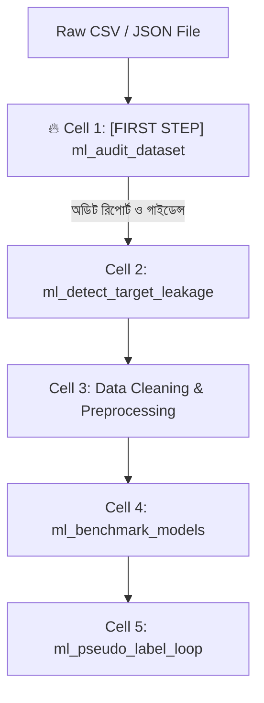
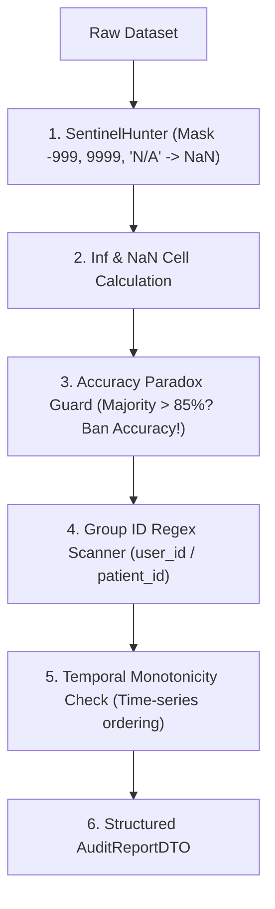

# ml_audit_dataset: Deep-Dive Architectural Guide & Reference

> **Tool Name:** `ml_audit_dataset`  
> **Module Source:** `src/ml_mcp/engine/dataset_auditor.py` / `src/ml_mcp/tools.py`  
> **Class Implementation:** `DatasetAuditor`  
> **Layer:** Phase 1: Data Audit & Hygiene

---

## ১. মানুষের গল্পের মতো পেছনের ইতিহাস (The Human Story: "The Illusion of Clean Data")

মেশিন লার্নিং ইঞ্জিনিয়ারিংয়ের সবচেয়ে বড় ভুল সান্ত্বনা হলো:  
> *"বস, ডেটাতে তো কোনো নাল ভ্যালু নেই, পুরো ডেটাসেট একদম পরিষ্কার!"*

বাস্তব জীবনের একটি চরম ঘটনা:
একটি বড় ফিনটেক কোম্পানি তাদের ক্রেডিট কার্ড ফ্রড ডিটেকশন মডেল বানাতে গিয়ে দেখল: ডাটায় কোনো `NaN` নেই। ইঞ্জিনিয়ার একটি স্ট্যান্ডার্ড ক্লাসিফায়ার ট্রেইন করে দেখল **৯৯.২% এক্যুরেসি!**  
সবাই মহা খুশি। কিন্তু লাইভ প্রোডাকশনে যাওয়ার পর দেখা গেল মডেল একটাও ফ্রড ট্রানজাকশন ধরতে পারছে না!

**কেন এমন বিপর্যয় ঘটেছিল?**  
পোস্টমর্টেম অডিটে ধরা পড়ল দুটি মারাত্মক গোপন রোগ, যা সাধারণ পান্ডাস ফাংশন ধরতে পারে না:

#### ক. ছদ্মবেশী নাল ভ্যালু (Sentinel Values):
ডেটাবেজের ফিল্ডে যখন কোনো ইউজারের আয় বা বয়স পাওয়া যায়নি, তখন ডেটাবেজ সেখানে খালি না রেখে ডিফল্ট সংখ্যা বসিয়ে দিয়েছিল: **`-999`** অথবা **`9999`**!  
অ্যালগরিদম ধরে নিয়েছে গ্রাহকের বয়স আসলেই `-999` বছর! ফলে পুরো গাণিতিক প্রেডিকশন ভেতরে ভেতরে পচে গিয়েছিল।

#### খ. অ্যাকুরেসি প্যারাডক্স (The Accuracy Paradox):
ডেটাসেটের ৯৯.২% মানুষই ছিল সৎ, আর মাত্র ০.৮% ছিল ফ্রড।  
মডেল কোনো কিছু না শিখে স্রেফ সবাইকে "সৎ" ঘোষণা করেছিল। যেহেতু ৯৯.২% মানুষ আসলেই সৎ, তাই মডেল কিছুই না চিনেও খাতার পাতায় **৯৯.২% নম্বর** পেয়ে বসেছিল!

এই ধরনের অদৃশ্য ফাঁদ এবং গোপন রোগ থেকে প্রজেক্টকে বাঁচাতে জন্ম হয়েছে **`ml_audit_dataset`**-এর। এটি ডেটাবেজের প্রতিটি ঘরের রক্ত পরীক্ষা করে বলে দেয় ডেটাটা কি আসলে সুস্থ, নাকি রোগাক্রান্ত।

---

## ২. এটা আসলে কী কাজ করে? (Core Mission)

সহজ কথায়: **এটি ডেটাসেটের একটি "ফুল-বডি মেডিকেল চেকআপ ও প্রি-ফ্লাইট অডিট"।**

মডেলিংয়ের আগে এটি ডেটাসেটের প্রতিটি কলাম ও রো স্ক্যান করে:
1. **সেন্টিনেল হান্টিং:** `-999`, `9999`, `?`, `Unknown`-এর মতো ছদ্মবেশী নাল ভ্যালু শনাক্ত করে সেগুলোকে আসল `NaN` দিয়ে মাস্ক করে।
2. **অ্যাকুরেসি প্যারাডক্স পাহারা:** মেজরিটি ক্লাস ৮৫%-এর বেশি হলে অ্যাকুরেসি মেট্রিককে নিষিদ্ধ করে স্বয়ংক্রিয়ভাবে `PR-AUC` বা `F1-Score` রেকমেন্ড করে।
3. **গ্রুপ লিকেজ ডিটেকশন:** ডেটায় কাস্টমার আইডি (`customer_id`) বা পেশেন্ট আইডি আছে কি না তা শনাক্ত করে, যাতে এক ব্যক্তির তথ্য ট্রেইনিং ও টেস্টিংয়ে ভাগ হয়ে মডেল ফাঁকিবাজি না করতে পারে।
4. **টাইম-সিরিজ অর্ডার স্ক্যান:** ডেটায় সময়ের ক্রমানুসারী ধারা আছে কি না তা পরীক্ষা করে সাধারণ স্প্লিট নিষিদ্ধ করে।

---

## ৩. নোটবুকের ঠিক কোন কোড সেলে এটি কাজ করবে? (Pipeline Placement)

> 🎯 **এটি পুরো পাইপলাইনের একদম প্রথম ধাপ (Day 1, Cell 1)!**



### কেন এটি সবার প্রথমে বসবে?
একজন ডাক্তার যেমন রক্তচাপ ও অ্যালার্জি টেস্ট না করে কোনো ওষুধ দিতে পারেন না, তেমনই ডেটার ইনভারিয়েন্ট ও সেন্টিনেল পরীক্ষা না করে কোনো ক্লিনিং বা মডেলিং কোড লেখা চরম ঝুঁকিপূর্ণ।

---

## ৪. কখন এটি কাজ করে / কখন ব্যবহার করবেন? (When to Use)

###  ব্যবহারের একদম পারফেক্ট সময়:
1. **যেকোনো নতুন ডেটা ফাইল হাতে আসার পর:** প্রজেক্টের প্রথম ৫ সেকেন্ডেই এই টুল চালিয়ে ডেটার এক্স-রে দেখে নেওয়া।
2. **মেট্রিক সিলেক্ট করার আগে:** আপনার সমস্যার জন্য Accuracy সঠিক হবে, নাকি F1-Score, নাকি RMSE লাগবে—তা নির্ধারণের সময়।
3. **স্প্লিটিং স্ট্র্যাটেজি ঠিক করার সময়:** সাধারণ K-Fold চালাবেন, নাকি GroupKFold, নাকি TimeSeriesSplit—তা নিশ্চিত হতে।

### ❌ যে সময় এটি লাগবে না:
- মডেল ট্রেইনিং বা অপটিমাইজেশন শেষ হওয়ার পর (কারণ এটি প্রি-ফ্লাইট টুল)।

---

## ৫. প্যারামিটার পরিচিতি (The Exact Parameters)

| প্যারামিটার | টাইপ | রিকোয়ার্ড? | ডিফল্ট | বিবরণ |
| :--- | :---: | :---: | :---: | :--- |
| **`csv_path`** | `string` | **হ্যাঁ** | - | যে ডেটাসেটে ফুল-বডি অডিট চলবে তার পাথ। |
| **`target_column`** | `string` | না | `null` | আপনি যে কলাম প্রেডিক্ট করতে চান (যেমন: `"price"` বা `"rating"`). |
| **`task_type`** | `string` | না | `"classification"` | প্রেডিকশন সংখ্যা হলে `"regression"`, ক্যাটাগরি হলে `"classification"`. |
| **`view`** | `string` | না | `"compact"` | `"compact"` দিলে সারসংক্ষেপ দেবে, আর `"detailed"` দিলে প্রতিটা কলামের আলাদা হিস্ট্রি দেবে। |

---

## ৬. টুলের ভেতরের গভীর ইঞ্জিনিয়ারিং ফিচার (Internal Engine Secrets)

`DatasetAuditor` ক্লাসের ভেতরের আর্কিটেকচারাল ফ্লো:



### প্রধান ফিচারসমূহ:

#### ১. সেন্টিনেল হান্টার (`SentinelHunter`)
এটি শুধু সাধারণ `NaN` খোঁজে না। এটি ডেটাসেটে লুকিয়ে থাকা ছদ্মবেশী মান:  
`[-999, -1, 9999, 99999, "?", "None", "null", "missing", "unknown"]`-কে স্ক্যান করে এবং সেগুলোকে আসল `NaN` দিয়ে মাস্ক করে দেয়, যাতে মডেল ভুল সংখ্যাকে আসল ভেবে ভুল না করে।

#### ২. অ্যাকুরেসি প্যারাডক্স গার্ড (`Accuracy Paradox Guard`)
সোর্স কোডের এই শর্তটি অত্যন্ত শক্তিশালী:
```python
# কোনো ক্লাসের উপস্থিতি ৮৫% ছাড়িয়ে গেলে অ্যাকুরেসি মেট্রিক নিষিদ্ধ!
if majority_ratio > 0.85:
    recommended_metric = "pr_auc" if num_classes == 2 else "f1_weighted"
else:
    recommended_metric = "accuracy"
```
এটি মডেল নির্মাতাকে অন্ধ অ্যাকুরেসির ফাঁদে পড়ে ভুল মডেল প্রোডাকশনে পাঠানো থেকে বাঁচায়।

#### ৩. গ্রুপ লিকেজ ডিটেক্টর (`GROUP_ID_REGEX`)
```python
GROUP_ID_REGEX = re.compile(r".*(_id|id|_key|user|customer|patient|account)$", re.IGNORECASE)
```
কাস্টমার আইডি বা পেশেন্ট আইডি থাকলে এটি স্বয়ংক্রিয়ভাবে ডিটেক্ট করে বলে দেয়:  
`group_column_candidate = "customer_id"`। ফলে ডাউনস্ট্রিমে সাধারণ K-Fold স্প্লিট না চলে `StratifiedGroupKFold` চলে।

#### ৪. টাইম-সিরিজ অর্ডার স্ক্যানার (`is_monotonic_increasing`)
তারিখের কলামগুলো ক্রমান্বয়ে ভবিষ্যৎমুখী কি না তা পরীক্ষা করে। যদি থাকে, তবে `has_temporal_order = True` ফ্ল্যাগ দেয়, যার মানে ডেটা এলোমেলো শাফেল করা নিষিদ্ধ।

#### ৫. ইনফিনিটি ও ডুপ্লিকেট সেল অডিট
ডাটায় গাণিতিক ভাগ করার ভুলের কারণে `np.inf` বা `-np.inf` তৈরি হয়েছে কি না এবং হুবহু একই রো একাধিকবার কপি করা আছে কি না (`duplicate_rows`) তা হিসাব করে।

#### ৬. স্ট্রাকচার্ড অডিট DTO (`AuditReportDTO`)
টুলটি রান শেষে এই ফরম্যাটে পূর্ণাঙ্গ স্বাস্থ্য রিপোর্ট রিটার্ন করে:
```json
{
  "row_count": 102,
  "column_count": 9,
  "missing_cells": 0,
  "missing_ratio": 0.0,
  "sentinel_count": 0,
  "infinite_count": 0,
  "duplicate_rows": 0,
  "class_imbalance_ratio": null,
  "recommended_metric": "rmse",
  "group_column_candidate": null,
  "has_temporal_order": false
}
```

---

## ৭. প্রোডাকশন ব্যবহারবিধি (Usage Example via MCP)

```json
{
  "csv_path": "e:/ML Testing/data/dataset.csv",
  "target_column": "price",
  "task_type": "regression"
}
```

---

### এক লাইনে সারমর্ম:
`ml_audit_dataset` হলো পুরো মেশিন লার্নিং পাইপলাইনের **ডিজিটাল স্টেথোস্কোপ ও প্যাথলজি ডাক্তার**। এটি ছদ্মবেশী নাল ভ্যালু, অ্যাকুরেসি প্যারাডক্স ও গ্রুপ লিকেজ দূর করে প্রথম দিন থেকেই ডেটাসেটের স্বাস্থ্য সম্পূর্ণ নিষ্কণ্টক রাখে!
