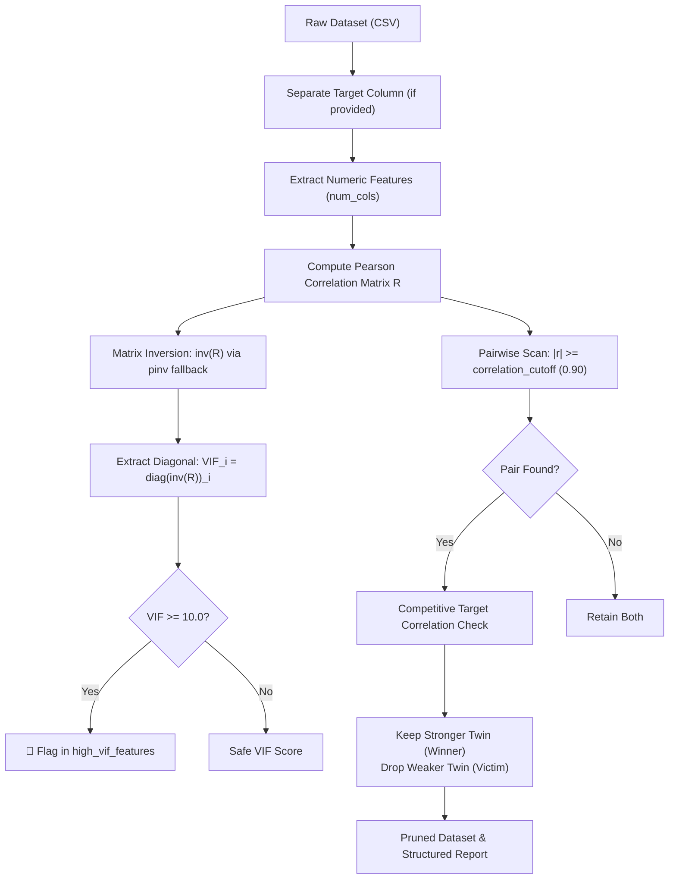

# ml_check_collinearity: Deep-Dive Architectural Guide & Reference

> **Tool Name:** `ml_check_collinearity`  
> **Module Source:** `src/ml_mcp/engine/collinearity.py` / `src/ml_mcp/tools.py`  
> **Class Implementation:** `CollinearityFilter`  
> **Layer:** Phase 1: Data Audit & Hygiene

---

## ১. বাস্তব জীবনের গল্প ও সমস্যা (The Human Story)

কল্পনা করুন, আপনি একটি ব্যাংকের ক্রেডিট স্কোরিং বা রিয়েল এস্টেট প্রাইসিং মডেল তৈরি করছেন। আপনার ডেটাসেটে শত শত ফিচার রয়েছে।

হঠাৎ আপনি লক্ষ্য করলেন:
- মডেলে দুটি কলাম আছে: `annual_income` (বার্ষিক আয়) এবং `monthly_income` (মাসিক আয়)।
- আরেকটি জোড়া কলাম: `house_area_sqft` এবং `house_area_sq_meters`।

বাহ্যিকভাবে মনে হতে পারে যত বেশি ফিচার, মডেল তত ভালো শিখবে। কিন্তু গণিত ও মেশিনের জন্য এটি এক মারাত্মক বিপর্যয়—যাকে বলা হয় **মাল্টিকোলিনিয়ারিটি (Multicollinearity)**।

### কেন এটি মডেলের জন্য ক্ষতিকর?
1. **ওজন বা কো-এফিশিয়েন্টের বিভ্রান্তি (Exploding Variance):** লিনিয়ার মডেল, লজিস্টিক রিগ্রেশন কিংবা নিউরাল নেটওয়ার্কে যখন দুটি ফিচার একে অপরের ৯৯% জেরক্স কপি হয়, তখন অপটিমাইজার বুঝতে পারে না কোন ফিচারটির কৃতিত্ব বেশি। ফলে কো-এফিশিয়েন্টের ভ্যারিয়্যান্স বিস্ফোরিত হয় এবং সামান্য ডেটা পরিবর্তনের সাথে সাথে প্রেডিকশন নাটকীয়ভাবে উল্টে যায়।
2. **মডেল ইন্টারপ্রেটিবিলিটি ধ্বংস (SHAP / Feature Importance Confusion):** কোন ফিচারের প্রভাব আসল আর কোনটি প্রতিচ্ছবি, তা আলাদা করা অসম্ভব হয়ে পড়ে।
3. **অনর্থক মেমরি ও লেটেন্সি অপচয়:** প্রোডাকশন ইনফারেন্সে অপ্রয়োজনীয় কলাম প্রসেস করতে সিপিইউ সাইকেল ও ব্যান্ডউইথ নষ্ট হয়।

এই রোগ শনাক্ত ও নির্মূল করার জন্যই তৈরি করা হয়েছে **`ml_check_collinearity`**।

---

## ২. এটা আসলে কী কাজ করে? (Core Mission)

`ml_check_collinearity` হলো ডেটাসেটের ফিচারের জন্য একটি **ডুয়েল-ডিফেন্স রিডানড্যান্সি ফিল্টার**।

এটি দুটি প্রধান মেকানিজম প্রয়োগ করে:
1. **পিওর NumPy-ভিত্তিক VIF ($VIF_i = \frac{1}{1 - R_i^2}$) অ্যানালাইসিস:** কোনো ফিচারের ইনফ্লেশন ফ্যাক্টর $VIF \ge 10.0$ হলে তাকে মাল্টিকোলিনিয়ার হিসেবে ফ্ল্যাগ করে।
2. **টার্গেট-অ্যাওয়ার কম্পিটিটিভ ড্রপ রুল (Competitive Drop Rule):** দুটি ফিচারের পারস্পরিক সম্পর্ক $|r| \ge 0.90$ হলে, নির্বিচারে যেকোনো একটি না ফেলে—যে ফিচারটি টার্গেটের সাথে বেশি প্রেডিক্টিভ ক্ষমতা রাখে তাকে **রেখে দেয় (Winner)** এবং দুর্বল ফিচারটিকে **ড্রপ করে (Victim)**।

---

## ৩. কখন এটি কাজ করে / কখন ব্যবহার করবেন? (When to Use)

###  ব্যবহারের সঠিক সময়:
1. **প্রি-ফ্লাইট ডাটা হাইজিন (Pre-flight Audit):** ডেটা লোড করার পর `ml_audit_dataset` এবং `ml_detect_target_leakage` চালানোর পর পাইপলাইন তৈরির আগেই এটি চালানো জরুরি।
2. **ফিচার ইঞ্জিনিয়ারিংয়ের পর:** পলিনোমিয়াল, রেশিও বা ক্রস ফিচার তৈরি করার পর রিডানড্যান্ট টুইন দূর করতে।
3. **লিনিয়ার/লজিস্টিক বা ব্যাখ্যাযোগ্য মডেলিংয়ের ক্ষেত্রে:** যেখানে মাল্টিকোলিনিয়ারিটি থাকলে কো-এফিশিয়েন্টের সাইন (চিহ্ন) উল্টে যাওয়ার ঝুঁকি থাকে।

### ❌ যে সময় এটি প্রযোজ্য নয়:
- হাইপার-ডাইমেনশনাল টেক্সট এমবেডিং বা TF-IDF স্পার্স ম্যাট্রিক্সের ক্ষেত্রে (যেখানে হাজার হাজার স্পার্স কলাম থাকে)।

---

## ৪. প্যারামিটার পরিচিতি (The Exact Parameters)

| প্যারামিটার | টাইপ | রিকোয়ার্ড? | ডিফল্ট | বিবরণ |
| :--- | :---: | :---: | :---: | :--- |
| **`csv_path`** | `string` | **হ্যাঁ** | - | যে ডেটাসেটের ওপর কোলিনিয়ারিটি টেস্ট চালানো হবে তার ফাইল পাথ। |
| **`target_column`** | `string` | না | `None` | টার্গেট কলামের নাম (কম্পিটিটিভ ড্রপের জন্য আবশ্যক)। |
| **`vif_threshold`** | `float` | না | `10.0` | VIF কাটঅফ সীমা ($VIF \ge 10.0$ হলে মাল্টিকোলিনিয়ার সতর্কবার্তা)। |
| **`correlation_cutoff`** | `float` | না | `0.90` | দুটি ফিচারের মাঝে সর্বোচ্চ অনুমোদিত পারস্পরিক পেয়ারসন কোরিলেশন। |
| **`view`** | `string` | না | `"compact"` | `"compact"` (সংক্ষিপ্ত সারাংশ) অথবা `"detailed"` (সম্পূর্ণ VIF ও পেয়ার ম্যাট্রিক্স)। |

---

## ৫. টুলের অভ্যন্তরীণ আর্কিটেকচার ও ইঞ্জিন ফিচার (Internal Engine Mechanics)



### প্রধান ৪টি গাণিতিক ও ইঞ্জিন সুবিধা:

#### ১. ইনভার্স কোরিলেশন ম্যাট্রিক্স ডায়াগনাল থেকে সরাসরি VIF
সাধারণত VIF বের করতে প্রতিটি ফিচারের জন্য আলাদা ওএলএস রিগ্রেশন ($OLS$) চালাতে হয়, যা অত্যন্ত ধীরগতির $\mathcal{O}(p \cdot n^2)$।  
আমাদের ইঞ্জিন ব্যবহার করে ক্লাসিক্যাল মাল্টিভ্যারিয়েট থিওরেম:
$$VIF_i = \frac{1}{1 - R_i^2} = (R^{-1})_{ii}$$
যেখানে $R$ হলো ফিচারগুলোর কোরিলেশন ম্যাট্রিক্স এবং $(R^{-1})_{ii}$ হলো তার বিপরীত ম্যাট্রিক্সের $i$-তম ডায়াগনাল উপাদান। এর ফলে মাত্র একটি ম্যাট্রিক্স ইনভার্শনে চোখের পলকে সমস্ত ফিচারের VIF গণনা সম্পন্ন হয়।

#### ২. সিঙ্গুলারিটি ও পারফেক্ট ডুপ্লিকেট সেফগার্ড (`np.linalg.pinv`)
দুটি ফিচার যদি হুবহু একই হয় ($r = 1.0$), তখন সাধারণ ম্যাট্রিক্স ইনভার্সন ক্র্যাশ করে (`LinAlgError: Singular matrix`)। আমাদের ইঞ্জিন স্বয়ংক্রিয়ভাবে কন্ডিশন নম্বর পরীক্ষা করে মুর-পেনরোজ সিউডো-ইনভার্স (`np.linalg.pinv`) ব্যবহার করে এবং ইনফিনিটি হ্যান্ডল করে।

#### ৩. টার্গেট-অ্যাওয়ার কম্পিটিটিভ ড্রপ রুল (Target-Aware Competitive Drop)
ধরুন Feature A ও Feature B-এর মধ্যে কোরিলেশন $0.96$। কোনটি বাদ দেবেন?  
- যদি Feature A-এর সাথে টার্গেটের কোরিলেশন $0.65$ হয় এবং Feature B-এর সাথে $0.20$ হয়, তবে অন্ধভাবে Feature A বাদ দিলে মডেলের প্রেডিক্টিভ ক্ষমতা ধ্বংস হবে!  
- আমাদের ইঞ্জিন টার্গেটের সাথে সম্পর্কের তুলনা করে নিশ্চিত করে যেন প্রেডিক্টিভলি দুর্বল টুইনটিই (`Feature B`) বাদ পড়ে।

#### ৪. নন-মিউটেটিং টার্গেট রিজেনারেশন
ফিল্টারিং শেষে টার্গেট কলামটি অক্ষত অবস্থায় প্রুনড ডেটাফ্রেমে রিস্টোর করা হয়, যাতে ডেটাসেটের টার্গেট লেবেল কখনোই ক্ষতিগ্রস্ত না হয়।

---

## ৬. প্রোডাকশন ব্যবহারবিধি (Usage Example via MCP)

### ইনপুট রিকোয়েস্ট:
```json
{
  "csv_path": "e:/ML Testing/data/dataset.csv",
  "target_column": "price",
  "vif_threshold": 10.0,
  "correlation_cutoff": 0.90,
  "view": "compact"
}
```

### প্রত্যাশিত আউটপুট রেসপন্স:
```json
{
  "vif_threshold": 10.0,
  "correlation_cutoff": 0.9,
  "high_vif_features": [
    "sqft_living",
    "sqft_above"
  ],
  "dropped_features": [
    "sqft_above"
  ],
  "collinear_pairs_count": 1,
  "remaining_features_count": 14
}
```

যেকোনো জটিল রিগ্রেশন বা ক্লাসিফিকেশন পাইপলাইনে মডেলের স্ট্যাবিলিটি ও পারফরম্যান্স নিশ্চিত করতে এই টুলটি Phase 1-এর এক অন্যতম স্তম্ভ।
