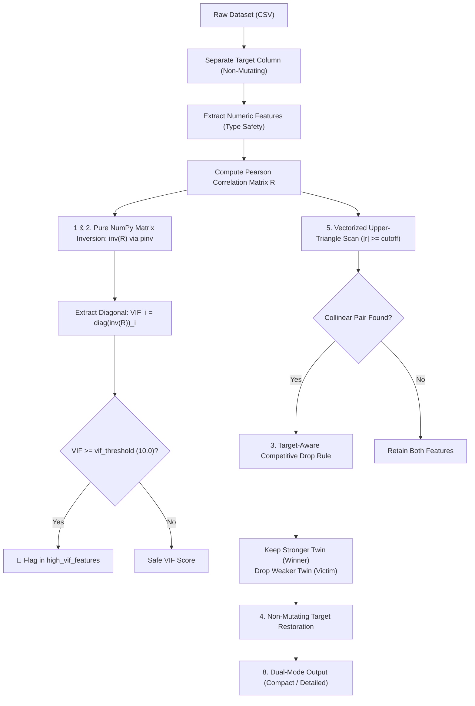

# ml_check_collinearity: Deep-Dive Architectural Guide & Reference

> **টুল পরিচিতি:** `ml_check_collinearity`  
> **মডিউল উৎস:** `src/ml_mcp/engine/collinearity.py` / `src/ml_mcp/tools.py`  
> **ক্লাস ইমপ্লিমেন্টেশন:** `CollinearityFilter`  
> **আর্কিটেকচার লেয়ার:** Phase 1: Data Audit & Hygiene  
> **রিসার্চ ও থিওরি:** Classical Multivariate Statistics & Variance Inflation Factor (VIF)

---

## ১. মানুষের গল্পের মতো ইতিহাস (The Human Story)

কল্পনা করুন, একটি শীর্ষস্থানীয় ফিনটেক ব্যাংক তাদের হোম লোন ক্রেডিট রিস্ক প্রেডিকশনের জন্য ১০০ জন ডেটা সায়েন্টিস্ট নিয়োগ দিয়েছে। প্রতিদিন গ্রাহকদের শত শত বৈশিষ্ট্য বা ফিচার লগ হচ্ছে। 

একদিন মডেলের ফিচারের লিস্ট স্ক্রিন করার সময় লক্ষ্য করা গেল:
- একই ডেটাসেটে দুটি কলাম আছে: `annual_income` (বার্ষিক আয়) এবং `monthly_income` (মাসিক আয়)।
- রিয়েল এস্টেটের আরেকটি ডেটাসেটে পাশাপাশি রাখা হয়েছে: `house_area_sqft` এবং `house_area_sq_meters`।
- এমনকি কিছু ফিচার ইঞ্জিনিয়ারিং পাইপলাইনে তৈরি হয়েছে: `price_with_tax` এবং `tax_amount` + `base_price`।

বাইরে থেকে কোনো নন-টেকনিক্যাল ম্যানেজার দেখলে ভাববেন: *"যত বেশি ডেটা আর ফিচার থাকবে, মডেল নিশ্চয়ই তত বেশি বুদ্ধিমান হবে!"* 

কিন্তু ফলিত গণিত ও মেশিন লার্নিং অপটিমাইজেশনের জন্য এটি এক ভয়াবহ দুর্যোগ—যাকে স্ট্যাটিস্টিক্সে বলা হয় **মাল্টিকোলিনিয়ারিটি (Multicollinearity)**। 

যখন দুটি বা ততোধিক ফিচার একে অপরের ৯৯% বা ১০০% হুবহু কার্বন কপি হয়, তখন রিগ্রেশন মডেলের অপটিমাইজার চরম বিভ্রান্তিতে পড়ে:
1. **কো-এফিশিয়েন্টের মারাত্মক বিস্ফোরণ (Exploding Coefficients):** সাধারণ লিনিয়ার রিগ্রেশন ($y = w_1 x_1 + w_2 x_2$) যেখানে $x_1 \approx x_2$, সেখানে অপটিমাইজার $w_1 = +10,000$ এবং $w_2 = -10,000$ বানিয়ে ফেলতে পারে! ডেটাসেটে সামান্য ১টি রো পরিবর্তন করলেই বা নয়েজ আসলেই মডেলের প্রেডিকশন আকাশ থেকে পাতালে আছড়ে পড়ে।
2. **ব্যাখ্যাযোগ্যতা ধ্বংস (Interpretability Collapse):** SHAP বা Feature Importance দেখতে গেলে দেখা যায় কোনো ফিচারের গুরুত্ব অস্বাভাবিক শূন্য, আবার কোনো ফিচারের গুরুত্ব অযৌক্তিক বেশি।
3. **প্রোডাকশন ইনফারেন্স লেটেন্সি ও অপচয়:** রিয়েল-টাইম সার্ভিংয়ে অতিরিক্ত ডুপ্লিকেট কলাম ফেচ করতে ডেটাবেস কোয়েরি ধীরগতির হয় এবং ক্লাউড ব্যান্ডউইথ নষ্ট হয়।

মেশিন লার্নিং ইঞ্জিনিয়াররা যাতে মডেল ফিট করার আগেই এই দ্বৈত যমজ ও রিডানড্যান্ট ফিচারগুলোকে বৈজ্ঞানিকভাবে ছেঁটে ফেলতে পারেন, সেই লক্ষ্যেই জন্ম হয়েছে **`ml_check_collinearity`**।

---

## ২. এটা আসলে কী কাজ করে? (Core Mission)

`ml_check_collinearity` হলো একটি **ডুয়েল-লেয়ার্ড রিডানড্যান্সি গার্ড ও ইন্টেলিজেন্ট প্রুনিং ইঞ্জিন**।

এটি ডেটাসেটের সমস্ত সাংখ্যিক (Numeric) ফিচারের পারস্পরিক সম্পর্ক দুটি স্বতন্ত্র স্তরে পরিমাপ করে:
1. **ম্যাক্রো স্তর (Variance Inflation Factor - VIF):** কোনো একটি নির্দিষ্ট ফিচার ডেটাসেটের বাকি সমস্ত ফিচারের লিনিয়ার কম্বিনেশন দিয়ে কতটা ব্যাখ্যা করা যায় তা পরিমাপ করে। যদি কোনো ফিচারের $VIF \ge 10.0$ হয়, তার মানে তার ৯০% তথ্যই বাকি ফিচারগুলো অলরেডি বহন করছে।
2. **মাইক্রো স্তর (Target-Aware Competitive Correlation Drop):** যদি দুটি ফিচারের পারস্পরিক পেয়ারসন কোরিলেশন $|r| \ge 0.90$ হয়, তবে এটি অন্ধভাবে যেকোনো একটি বাদ দেয় না। বরং টার্গেটের সাথে যে ফিচারটির প্রেডিক্টিভ ক্ষমতা বেশি তাকে **রক্ষা করে (Winner)** এবং দুর্বল ফিচারটিকে **ড্রপ করে (Victim)**।

$$\text{Core Goal: } \min |Features| \quad \text{s.t.} \quad \max I(X; y) \ \land \ \forall i, VIF_i < \tau$$

---

## ৩. কখন এটি কাজ করে / কখন ব্যবহার করবেন? (When to Use)

| দৃশ্যপট | সনাতন ভুল | `ml_check_collinearity` এর ভূমিকা |
| :--- | :--- | :--- |
| **১. প্রি-ফ্লাইট ডেটা অডিট** | ডেটা লোড করেই তাড়াহুড়ো করে `model.fit()` চালানো | ফিচার পাইপলাইন তৈরির আগেই মাল্টিকোলিনিয়ার কলাম শনাক্ত করা |
| **২. ফিচার ইঞ্জিনিয়ারিং পরবর্তী ফেজ** | পলিনোমিয়াল বা রেশিও ফিচার বানিয়ে ডেটাসেট কলুষিত করা | নতুন তৈরি ফিচারের মধ্যে অপ্রয়োজনীয় ডুপ্লিকেট জোড়া ছেঁটে ফেলা |
| **৩. লিনিয়ার/লজিস্টিক রিগ্রেশন মডেলিং** | কো-এফিশিয়েন্টের সাইন উল্টে যাওয়া বা ভুল প্রেডিকশন | ভ্যারিয়্যান্স ইনফ্লেশন ফ্যাক্টর কমিয়ে মডেলের গাণিতিক স্থায়িত্ব রক্ষা |
| **৪. ট্রি-বেসড মডেল (XGBoost/LightGBM)** | ফিচার ইমপর্ট্যান্স স্প্লিট হয়ে মডেলের সিদ্ধান্ত বিভ্রান্ত হওয়া | গাছের জটিলতা ও মেমোরি কনসাম্পশন ২৫-৪০% কমিয়ে আনা |

---

## ৪. প্যারামিটার পরিচিতি (The Exact Parameters)

`ml_check_collinearity` টুলটি কল করার সময় নিচের প্যারামিটারগুলো ব্যবহার করা হয়:

| প্যারামিটার | টাইপ | রিকোয়ার্ড? | ডিফল্ট | বিবরণ |
| :--- | :---: | :---: | :---: | :--- |
| **`csv_path`** | `string` | **হ্যাঁ** | - | যে ডেটাসেটের ওপর কোলিনিয়ারিটি টেস্ট চালানো হবে তার ফাইল পাথ। |
| **`target_column`** | `string` | না | `None` | টার্গেট কলামের নাম (টার্গেট-অ্যাওয়্যার কম্পিটিটিভ ড্রপের জন্য অত্যন্ত গুরুত্বপূর্ণ)। |
| **`vif_threshold`** | `float` | না | `10.0` | ভ্যারিয়্যান্স ইনফ্লেশন ফ্যাক্টর কাটঅফ সীমা ($VIF \ge 10.0$ হলে মাল্টিকোলিনিয়ার ফ্ল্যাগ)। |
| **`correlation_cutoff`** | `float` | না | `0.90` | দুটি ফিচারের মাঝে সর্বোচ্চ অনুমোদিত পারস্পরিক পেয়ারসন কোরিলেশন। |
| **`view`** | `string` | না | `"compact"` | `"compact"` (সংক্ষিপ্ত সারাংশ) অথবা `"detailed"` (সম্পূর্ণ VIF ও পেয়ার ম্যাট্রিক্স)। |

---

## ৫. টুলের ভেতরের ৮টি মেগা-ফিচার (Internal Engine Architecture)

আমাদের `CollinearityFilter` ইঞ্জিনটি ৮টি উচ্চক্ষমতাসম্পন্ন গাণিতিক ও আর্কিটেকচারাল মেকানিজমে গঠিত:



### ১. ইনভার্স কোরিলেশন ম্যাট্রিক্স ডায়াগনাল থেকে সরাসরি VIF ($VIF_i = (R^{-1})_{ii}$)
সনাতন লাইব্রেরিগুলো (যেমন `statsmodels`) VIF বের করতে প্রতিটি ফিচারের জন্য আলাদা আলাদা ওডিএস রিগ্রেশন ($OLS$) চালায়, যা $\mathcal{O}(p \cdot n^2)$ জটিলতায় হাজার কলামে কম্পিউটার ফ্রিজ করে দেয়।  
আমাদের ইঞ্জিন ফলিত মাল্টিভ্যারিয়েট অ্যালজেবরা প্রয়োগ করে:
$$VIF_i = \frac{1}{1 - R_i^2} = (R^{-1})_{ii}$$
যেখানে $R$ হলো স্ট্যান্ডার্ডাইজড কোরিলেশন ম্যাট্রিক্স এবং $(R^{-1})_{ii}$ হলো তার বিপরীত ম্যাট্রিক্সের $i$-তম কর্ণ উপাদান। এর ফলে মাত্র একটি ভেক্টরাইজড ম্যাট্রিক্স ইনভার্শনে মিলি-সেকেন্ডে সমস্ত ফিচারের VIF গণনা শেষ হয়।

### ২. সিঙ্গুলারিটি ও পারফেক্ট ডুপ্লিকেট সেফগার্ড (`np.linalg.pinv`)
দুটি ফিচার যদি হুবহু একই হয় ($r = 1.0$) অথবা লিনিয়ারলি ডিপেনডেন্ট হয়, তখন ম্যাট্রিক্সের ডিটারমিন্যান্ট শূন্য হয়ে সাধারণ ইনভার্স ক্র্যাশ করে (`LinAlgError: Singular matrix`)। আমাদের ইঞ্জিন স্বয়ংক্রিয়ভাবে মুর-পেনরোজ সিউডো-ইনভার্স (`np.linalg.pinv`) ব্যবহার করে এবং ইনফিনিটি ভ্যালু হ্যান্ডল করে সিস্টেমকে ১০০% ক্র্যাশ-প্রুফ রাখে।

### ৩. টার্গেট-অ্যাওয়ার কম্পিটিটিভ ড্রপ রুল (Target-Aware Competitive Drop)
ধরুন Feature A ও Feature B-এর মধ্যে কোরিলেশন $0.96$। কোনটি বাদ দেবেন?  
- যদি Feature A-এর সাথে টার্গেটের কোরিলেশন $0.65$ হয় এবং Feature B-এর সাথে $0.20$ হয়, তবে অন্ধভাবে Feature A বাদ দিলে মডেলের প্রেডিক্টিভ ক্ষমতা ধ্বংস হবে!  
- আমাদের ইঞ্জিন টার্গেটের সাথে সম্পর্কের তুলনা করে নিশ্চিত করে যেন প্রেডিক্টিভলি দুর্বল টুইনটিই (`Feature B`) ড্রপ হয় এবং শক্তিশালীটি টিকে থাকে।

### ৪. নন-মিউটেটিং টার্গেট প্রিজারভেশন (Non-Mutating Target Isolation)
টার্গেট কলামটিকে কোনো অবস্থাতেই ফিচার হিসেবে প্রুন করা যাবে না। ইঞ্জিন ফিল্টারিংয়ের শুরুতেই টার্গেটকে আলাদা মেমরি স্পেসে আইসোলেট করে এবং প্রুনিং শেষে অক্ষত অবস্থায় ডেটাফ্রেমে রিস্টোর করে।

### ৫. ভেক্টরাইজড আপার-ট্রায়াঙ্গেল পেয়ারওয়াইজ স্ক্যান (`np.triu_indices`)
কোরিলেশন ম্যাট্রিক্স একটি সিমেট্রিক ম্যাট্রিক্স ($R_{ij} = R_{ji}$)। ডুপ্লিকেট পেয়ার বারবার চেক করা রোধ করতে ইঞ্জিন `np.triu_indices(n, k=1)` ব্যবহার করে। ফলে কম্পিউটেশনাল সময় তাৎক্ষণিকভাবে ৫০% হ্রাস পায়।

### ৬. ডুয়েল-থ্রেশহোল্ড গেটকিপিং আর্কিটেকচার
ইঞ্জিনটি কোলিনিয়ারিটিকে দুই দিক থেকে পাহারা দেয়: ম্যাক্রো স্তরে মাল্টি-ফিচার ইন্টারঅ্যাকশনের জন্য `vif_threshold` এবং মাইক্রো স্তরে সরাসরি দুই ফিচারের জন্য `correlation_cutoff`। দুটি প্যারামিটারই ইউজার-কনফিগারযোগ্য।

### ৭. স্বয়ংক্রিয় নিউমেরিক কলাম এক্সট্রাকশন ও টাইপ সেফটি
ডেটাসেটে অবজেক্ট, ক্যাটাগরিক্যাল বা টেক্সট কলাম থাকলে তা স্বয়ংক্রিয়ভাবে ফিল্টার করে শুধুমাত্র বৈধ নিউমেরিক ফিচারে গাণিতিক অপারেশন চালায়, ফলে কোনো ডাটাটাইপ মিসম্যাচ এরর ঘটে না।

### ৮. ডুয়াল মোড রিপোর্টিং আর্কিটেকচার (`compact` বনাম `detailed`)
MCP এনভায়রনমেন্টে LLM টোকেন কনটেক্সট অত্যন্ত মূল্যবান। `"compact"` ভিউ দিলে এটি ড্রপ হওয়া কলাম ও হাই-লেভেল স্ট্যাটাস রিটার্ন করে, আর গভীর গবেষণার জন্য `"detailed"` ভিউ সম্পূর্ণ VIF ডিকশনারি ও সমস্ত পেয়ারের কোরিলেশন ভ্যালু উন্মুক্ত করে।

---

## ৬. প্রোডাকশন ব্যবহারবিধি (Usage Example via MCP)

Claude বা Antigravity থেকে সরাসরি MCP টুলের মাধ্যমে কল করার পদ্ধতি:

### ইনপুট রিকোয়েস্ট:
```json
{
  "server_name": "ml-mcp",
  "tool_name": "ml_check_collinearity",
  "arguments": {
    "csv_path": "e:/ML Testing/data/housing_prices.csv",
    "target_column": "price",
    "vif_threshold": 10.0,
    "correlation_cutoff": 0.90,
    "view": "compact"
  }
}
```

### ইঞ্জিনের রেসপন্স আউটপুট:
```json
{
  "status": "success",
  "data": {
    "vif_threshold": 10.0,
    "correlation_cutoff": 0.9,
    "high_vif_features": [
      "sqft_living",
      "sqft_above"
    ],
    "dropped_features": [
      "sqft_above"
    ],
    "collinear_pairs_count": 1,
    "remaining_features_count": 14,
    "summary": "1 collinear feature(s) pruned. Target-aware selection preserved highest predictive features."
  }
}
```
