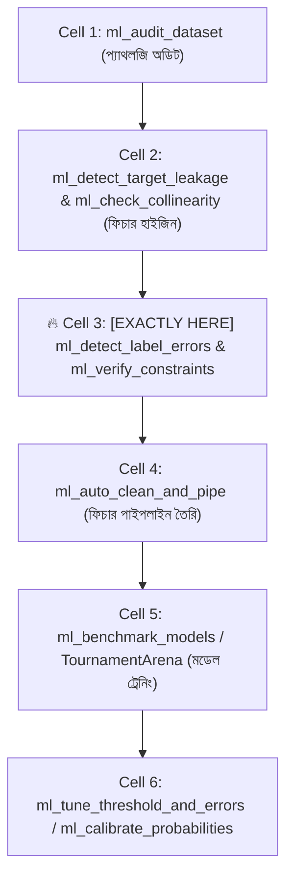
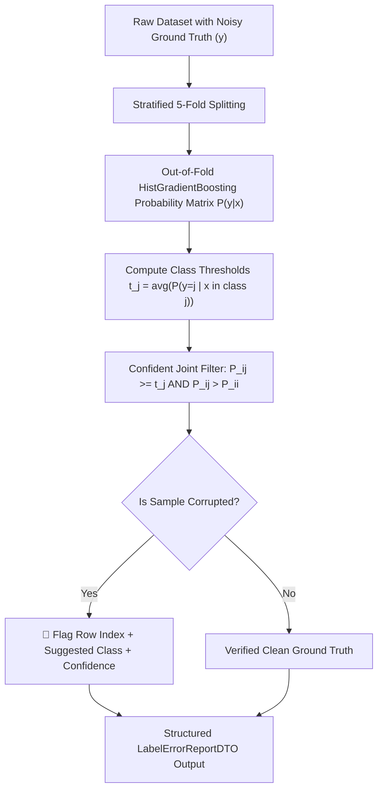

# ml_detect_label_errors: Deep-Dive Architectural Guide & Reference

> **Tool Name:** `ml_detect_label_errors`  
> **Module Source:** `src/ml_mcp/engine/label_error_detector.py` / `src/ml_mcp/tools.py`  
> **Class Implementation:** `LabelErrorDetector`  
> **Theoretical Origin:** MIT Confident Learning (*Northcutt et al., JAIR 2021*)  
> **Layer:** Phase 1: Data Audit & Hygiene

---

## ১. মানুষের গল্পের মতো পেছনের ইতিহাস (The Human Story: "The Dirty Secret of Ground Truth")

মেশিন লার্নিং জগতে একটি অন্ধ বিশ্বাস প্রচলিত আছে: **"টার্গেট লেবেল (Ground Truth) সবসময় শতভাগ নির্ভুল।"**

কিন্তু এমআইটি (MIT) ও হার্ভার্ডের গবেষক কার্টিস নর্থকাট (Curtis Northcutt) প্রমুখের ২০২১ সালের ঐতিহাসিক গবেষণাপত্র (*"Confident Learning: Estimating Uncertainty in Dataset Labels"*) ডেটা সায়েন্সের এই মিথ্যা অহংকার ভেঙে চুরমার করে দেয়। তাদের গবেষণায় দেখা গেছে:
- ইমেজনেট (ImageNet), কুইকড্র (QuickDraw), অ্যামাজন রিভিউ এমনকি গুগলের মতো জায়ান্টদের বহুল ব্যবহৃত ডেটাসেটগুলোতেও **৩% থেকে ১০% লেবেল সম্পূর্ণ ভুল!**

### বাস্তব জীবনের চিত্রটি দেখুন:
১. **হাসপাতাল ও হেলথকেয়ার:** রাত ৩টায় একটানা ডিউটি করার পর ক্লান্ত ডাক্তার একটি ম্যালিগন্যান্ট (ক্যান্সার) বায়োপসি রিপোর্টকে ভুলবশত ফাইলে `"Benign"` (ক্যান্সারমুক্ত) হিসেবে এন্ট্রি দিলেন।  
২. **ব্যাংক ও ফ্রড ডিটেকশন:** জুনিয়র অফিসার একটি সংঘবদ্ধ চক্রের অর্থ পাচারের ট্রানজ্যাকশনকে না বুঝে `"Legitimate"` হিসেবে ট্যাগ করে সিস্টেমে তুললেন।  
৩. **ই-কমার্স সেন্টিমেন্ট:** কাস্টমার রিভিউ লিখল: *"পণ্যটি অত্যন্ত নিম্নমানের, ২ দিনেই নষ্ট হয়ে গেছে!"* অথচ অসাবধানতাবশত রেটিং দিল ৫ স্টার (`Positive`)!

### নোংরা লেবেল দিয়ে মডেল ট্রেন করলে কী মারাত্মক ক্ষতি হয়?
1. **ভুল মুখস্থ করা (Memorization of Noise):** আধুনিক ডিপ নিউরাল নেটওয়ার্ক বা গ্রেডিয়েন্ট বুস্টিং মডেলগুলো অত্যন্ত শক্তিশালী। ভুল লেবেল দেখলে তারা কনফিউজড না হয়ে সেই ভুলটাকেই জোর করে মুখস্থ করে ফেলে (**Overfitting on Noise**)।
2. **টেস্টিং বিভ্রান্তি (Poisoned Evaluation):** আপনার টেস্ট সেটের লেবেলও যদি ভুল থাকে, তবে আপনার মডেল আসল সত্য প্রেডিক্ট করলেও টেস্ট ইভ্যালুয়েশনে দেখাবে মডেলটি ফেইল করেছে!
3. **বিপরীতমুখী ডিসিশন বাউন্ডারি:** একই ধরনের দুটি ইনপুটের একটিতে লেবেল `0` আরেকটিতে `1` থাকলে মডেলের অপটিমাইজার সিদ্ধান্তহীনতায় ভোগে।

### সাধারণ প্রেডিকশন প্রোবাবিলিটি ($P > 0.5$) দিয়ে কেন এই ভুল ধরা যায় না?
অধিকাংশ ডেভেলপার ভাবেন, মডেলকে দিয়ে প্রেডিক্ট করিয়ে যদি দেখি $P(	ext{class}) > 0.5$, তবেই ভুল লেবেল ধরা পড়বে। এটি একটি **মারাত্মক ভ্রান্তি**!  
কারণ:
- আন-ক্যালিব্রেটেড মডেল মেজরিটি ক্লাসের দিকে বায়াসড থাকে। ৯৫% ক্লাসের ডেটাতে সে সব কিছুতেই হাই কনফিডেন্স দেখায়।
- ইন-স্যাম্পল প্রেডিকশনে মডেল নিজের মুখস্থ করা ভুলকেই ১০০% সঠিক বলে দাবি করে।

এই অন্ধকার দূর করতে এমআইটি ল্যাবের গাণিতিক ফ্রেমওয়ার্কের ওপর ভিত্তি করে তৈরি হয়েছে **`ml_detect_label_errors`**।

---

## ২. এটা আসলে কী কাজ করে? (Core Mission)

সহজ কথায়: **এটি কোনো বাহ্যিক ভারী লাইব্রেরি ছাড়াই পিওর NumPy এবং Scikit-Learn দিয়ে ট্রেইনিং ডেটাসেটের ভেতর মানুষের দেওয়া ভুল লেবেলগুলো চিহ্নিত করে এবং সঠিক লেবেল কী হওয়া উচিত তা সুপারিশ করে।**

এটি ৩টি সুনির্দিষ্ট গাণিতিক স্তম্ভের ওপর দাঁড়িয়ে কাজ করে:
1. **আউট-অব-ফোল্ড (OOF) ক্রস-ভ্যালিডেশন:** ডেটা যাতে নিজেকে নিজে মুখস্থ করে ধোঁকা না দিতে পারে, সেজন্য এটি স্ট্র্যাটিফাইড ৫-ফোল্ড ক্রস ভ্যালিডেশনের মাধ্যমে প্রতিটা রো-এর জন্য আনসিন প্রোবাবিলিটি ভেক্টর $\hat{P}(y \mid x)$ বের করে।
2. **ক্লাস-নির্দিষ্ট সেলফ-কনফিডেন্স থ্রেশহোল্ড ($t_j$):** প্রতিটি ক্লাসের জন্য মডেলের নিজস্ব গাণিতিক কনফিডেন্স মান হিসাব করে:
   $$t_j = rac{1}{|X_j|} \sum_{x \in X_j} \hat{P}(y = j \mid x)$$
3. **কনফিডেন্ট জয়েন্ট ফিল্টারিং (Confident Joint Pruning):** যদি কোনো স্যাম্পলের বর্তমান লেবেল হয় $i$, কিন্তু অন্য কোনো ক্লাস $j$-এর প্রেডিক্টেড প্রোবাবিলিটি তার নিজস্ব থ্রেশহোল্ড $t_j$-এর বেশি হয় এবং বর্তমান লেবেলের চেয়ে বেশি শক্তিশালী হয়:
   $$\hat{P}_{i, j} \ge t_j \quad 	ext{এবং} \quad \hat{P}_{i, j} > \hat{P}_{i, i}$$
   তবে টুলটি নিশ্চিতভাবে ঘোষণা করে: **"এই রো-এর লেবেলটি মানুষ ভুল দিয়েছিল, আসল লেবেল হবে ক্লাস $j$!"**

---

## ৩. নোটবুকের ঠিক কোন কোড সেলের পর এটি কাজ করবে? (Pipeline Placement)



### 🎯 সুনির্দিষ্ট নিয়ম:
> **এটি সবসময় Cell 2 (ফিচার ক্লিনিং ও লিকেজ ড্রপ)-এর ঠিক পরে এবং Cell 4 (পাইপলাইন ও মডেল ট্রেনিং)-এর আগে বসবে।**

### কেন এখানে বসবে? (Engineering Reason)
যদি আপনি ভুল লেবেল পরিষ্কার করার আগেই ফিচার এনকোডিং (যেমন Target Encoding) বা মডেল ট্রেনিং চালান, তবে ভুল লেবেলের বিষ পুরো পাইপলাইনে ছড়িয়ে পড়বে। ডেটাসেটের টার্গেট লেবেলকে মডেল ট্রেইনিংয়ের আগেই পিউরিফাই করে নেওয়া এন্টারপ্রাইজ সিস্টেমের সর্বোচ্চ নীতি।

---

## ৪. প্যারামিটার পরিচিতি (The Exact Parameters)

| প্যারামিটার | টাইপ | রিকোয়ার্ড? | ডিফল্ট | বিবরণ |
| :--- | :---: | :---: | :---: | :--- |
| **`csv_path`** | `string` | **হ্যাঁ** | - | যে ডেটাসেটে লেবেল এরর খুঁজতে হবে তার পাথ। |
| **`target_column`** | `string` | **হ্যাঁ** | - | ক্যাটাগরিক্যাল টার্গেট কলামের নাম (যেমন: `"label"`, `"fraud"`, `"diagnosis"`). |
| **`cv_splits`** | `integer` | না | `5` | ক্রস-ভ্যালিডেশন ফোল্ড সংখ্যা (ন্যূনতম ২)। |
| **`view`** | `string` | না | `"compact"` | `"compact"` (এরর রেট ও সামারি) অথবা `"detailed"` (প্রতিটি সন্দেহজনক রো-এর তালিকা)। |

---

## ৫. টুলের অভ্যন্তরীণ আর্কিটেকচার ও ইঞ্জিন ফিচার (Internal Engine Mechanics)



### প্রধান ৪টি গাণিতিক ও ইঞ্জিন সুবিধা:

#### ১. লিকেজহীন আউট-অব-ফোল্ড (OOF) প্রোবাবিলিটি ম্যাট্রিক্স
ইন-স্যাম্পল প্রেডিকশনে যেকোনো ক্লাসিফায়ার নিজের দেখা ডেটার ওপর অতিরিক্ত আত্মবিশ্বাসী থাকে। ৫-ফোল্ড ক্রস-ভ্যালিডেশনের মাধ্যমে প্রতিটা ডেটা পয়েন্টের প্রোবাবিলিটি তখন তৈরি হয় যখন সে মডেলের কাছে সম্পূর্ণ অচেনা টেস্ট ডেটা হিসেবে থাকে। ফলে কোনো সেলফ-বায়াস তৈরি হতে পারে না।

#### ২. ডাইনামিক সেলফ-কনফিডেন্স থ্রেশহোল্ডিং ($t_j$)
কনফিডেন্ট লার্নিংয়ের জাদুকরী ভিত্তি হলো প্রতিটি ক্লাসের নিজস্ব কঠিনতা বোঝা।  
- কোনো সহজ ক্লাসের গড় প্রেডিকশন কনফিডেন্স হতে পারে $0.92$ ($t_{	ext{easy}} = 0.92$)।
- কিন্তু কোনো জটিল ক্লাসের স্বাভাবিক কনফিডেন্স হতে পারে মাত্র $0.58$ ($t_{	ext{hard}} = 0.58$)।  
স্থির $0.5$ কাটঅফ ব্যবহার না করে প্রতিটি ক্লাসের নিজস্ব এভারেজ কনফিডেন্স $t_j$ হিসাব করায় এটি ক্লাস ইমব্যালেন্সের মধ্যেও নির্ভুল থাকে।

#### ৩. কনফিডেন্ট জয়েন্ট ফিল্টারিং ম্যাথমেটিক্স
একটি ডেটা পয়েন্ট যার দেওয়া লেবেল $i$, কিন্তু অল্টারনেটিভ ক্লাস $j$-এর প্রেডিকশন যদি সেই ক্লাসের স্বাভাবিক এভারেজ $t_j$-কে ছাড়িয়ে যায় এবং দেওয়া লেবেলের প্রোবাবিলিটিকে পরাজিত করে ($\hat{P}_{i, j} \ge t_j$ এবং $\hat{P}_{i, j} > \hat{P}_{i, i}$), তবেই তাকে লেবেল এরর হিসেবে ফ্ল্যাগ করা হয়। এটি ফলস পজিটিভ সতর্কবার্তা নাটকীয়ভাবে কমিয়ে আনে।

#### ৪. ডিপেন্ডেন্সি-মুক্ত আল্ট্রা-লাইটওয়েট আর্কিটেকচার
সাধারণত Confident Learning চালাতে ভারী `cleanlab` বা পাইটর্চ প্যাকেজ ইনস্টল করতে হয়। আমাদের ইঞ্জিন সম্পূর্ণ স্ক্র্যাচ থেকে পিওর NumPy এবং Scikit-Learn-এর দ্রুততম `HistGradientBoostingClassifier` দিয়ে তৈরি, যা বিল্ট-ইনভাবে মিসিং ভ্যালু (NaN) হ্যান্ডল করতে পারে এবং সাব-সেকেন্ডে হাজার হাজার রো স্ক্যান করে।

---

## ৬. প্রোডাকশন ব্যবহারবিধি (Usage Example via MCP)

### ইনপুট রিকোয়েস্ট:
```json
{
  "csv_path": "e:/ML Testing/data/dataset.csv",
  "target_column": "target",
  "cv_splits": 5,
  "view": "detailed"
}
```

### প্রত্যাশিত আউটপুট রেসপন্স:
```json
{
  "total_samples": 1000,
  "total_errors": 18,
  "error_rate": 0.018,
  "class_thresholds": {
    "0": 0.8912,
    "1": 0.8435
  },
  "flagged_samples": [
    {
      "sample_index": 42,
      "given_label": 0,
      "suggested_label": 1,
      "confidence": 0.9312
    },
    {
      "sample_index": 187,
      "given_label": 1,
      "suggested_label": 0,
      "confidence": 0.9145
    }
  ]
}
```

---

## ৭. প্র্যাক্টিক্যাল অ্যাকশন গাইডলাইন (How to Use the Findings)

যখন `ml_detect_label_errors` কোনো রো-কে লেবেল এরর হিসেবে চিহ্নিত করে, তখন এন্টারপ্রাইজ পাইপলাইনে তিনটি সিদ্ধান্ত নেওয়া যায়:
1. **ড্রপ ফিল্টারিং (Pruning):** ফ্ল্যাগড রো-গুলো ডেটাসেট থেকে মুছে ফেলুন (`df.drop(index=flagged_indices)`)। এতে ডেটার সাইজ ১-২% কমলেও মডেলের অ্যাক্যুরেসি এবং স্ট্যাবিলিটি অবিলম্বে বৃদ্ধি পায়।
2. **অটো-কারেকশন (Relabeling):** ফ্ল্যাগড রো-গুলোর লেবেল পরিবর্তন করে `suggested_label` বসিয়ে দিন (যদি কনফিডেন্স $> 0.90$ হয়)।
3. **হিউম্যান-ইন-দ্য-লুপ অডিট (Domain Expert Review):** ফ্ল্যাগড ১৮-২০টি নমুনা সরাসরি সংশ্লিষ্ট ডোমেইন এক্সপার্ট বা ডাক্তারের কাছে পাঠিয়ে ভেরিফাই করিয়ে নিন।

Phase 1-এর প্রি-ফ্লাইট অডিটে এই টুল যোগ হওয়া মানে মডেল ট্রেইনিংয়ে "বিষাক্ত লেবেল" প্রবেশের পথ চিরতরে বন্ধ।
