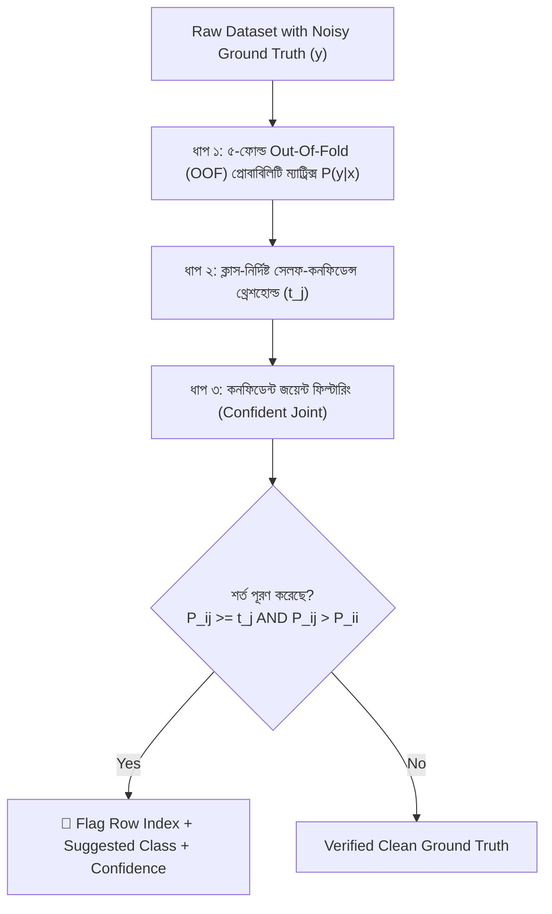
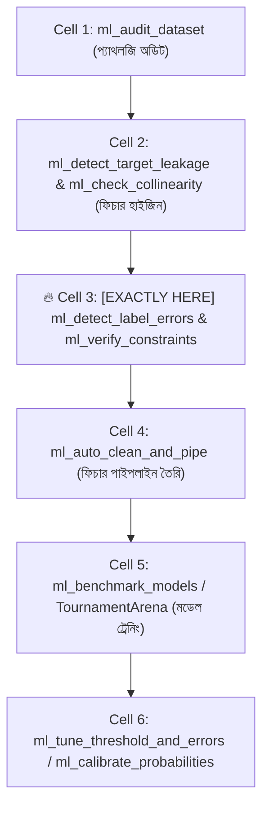

# ml_detect_label_errors: Deep-Dive Architectural Guide & Reference

> **Tool Name:** `ml_detect_label_errors`  
> **Module Source:** `src/ml_mcp/engine/label_error_detector.py` / `src/ml_mcp/tools.py`  
> **Class Implementation:** `LabelErrorDetector`  
> **Theoretical Origin:** MIT Confident Learning (*Northcutt et al., JAIR 2021*)  
> **Layer:** Phase 1: Data Audit & Hygiene

---

## ১. মানুষের গল্পের মতো পেছনের ইতিহাস (The Human Story: "The Dirty Secret of Ground Truth")

মেশিন লার্নিং জগতে একটি অন্ধ বিশ্বাস প্রচলিত আছে: **"টার্গেট লেবেল (Ground Truth) সবসময় শতভাগ নির্ভুল।"**

কিন্তু এমআইটি (MIT) ও হার্ভার্ডের গবেষক কার্টিস নর্থকাট (Curtis Northcutt) প্রমুখের ২০২১ সালের ঐতিহাসিক গবেষণাপত্র (*"Confident Learning: Estimating Uncertainty in Dataset Labels"*) ডেটা সায়েন্সের এই মিথ্যা অহংকার ভেঙে চুরমার করে দেয়। তাদের গবেষণায় প্রমাণিত হয়:
- ইমেজনেট (ImageNet), কুইকড্র (QuickDraw), অ্যামাজন রিভিউ এমনকি গুগলের মতো জায়ান্টদের বহুল ব্যবহৃত ডেটাসেটগুলোতেও **৩% থেকে ১০% লেবেল সম্পূর্ণ ভুল!**

### বাস্তব জীবনের চিত্রটি দেখুন:
১. **হাসপাতাল ও হেলথকেয়ার:** রাত ৩টায় একটানা ডিউটি করার পর ক্লান্ত ডাক্তার একটি ম্যালিগন্যান্ট (ক্যান্সার) বায়োপসি রিপোর্টকে ভুলবশত ফাইলে `"Benign"` (ক্যান্সারমুক্ত) হিসেবে এন্ট্রি দিলেন।  
২. **ব্যাংক ও ফ্রড ডিটেকশন:** জুনিয়র অফিসার একটি সংঘবদ্ধ চক্রের অর্থ পাচারের ট্রানজ্যাকশনকে না বুঝে `"Legitimate"` হিসেবে ট্যাগ করে সিস্টেমে তুললেন।  
৩. **ই-কমার্স সেন্টিমেন্ট:** কাস্টমার রিভিউ লিখল: *"পণ্যটি অত্যন্ত নিম্নমানের, ২ দিনেই নষ্ট হয়ে গেছে!"* অথচ অসাবধানতাবশত রেটিং দিল ৫ স্টার (`Positive`)!

### নোংরা লেবেল দিয়ে মডেল ট্রেন করলে কী মারাত্মক ক্ষতি হয়?
1. **ভুল মুখস্থ করা (Memorization of Noise):** আধুনিক ডিপ নিউরাল নেটওয়ার্ক বা গ্রেডিয়েন্ট বুস্টিং মডেলগুলো অত্যন্ত শক্তিশালী। ভুল লেবেল দেখলে তারা কনফিউজড না হয়ে সেই ভুলটাকেই **মুখস্থ (Memorize)** করে ফেলে (**Overfitting on Noise**)।
2. **টেস্টিং বিভ্রান্তি (Poisoned Evaluation):** আপনার টেস্ট সেটের লেবেলও যদি ভুল থাকে, তবে আপনার মডেল আসল সত্য প্রেডিক্ট করলেও টেস্ট ইভ্যালুয়েশনে দেখাবে মডেলটি ফেইল করেছে!
3. **বিপরীতমুখী ডিসিশন বাউন্ডারি:** একই ধরনের দুটি ইনপুটের একটিতে লেবেল `0` আরেকটিতে `1` থাকলে মডেলের অপটিমাইজার সিদ্ধান্তহীনতায় ভোগে।

---

## ২. ফান্ডামেন্টাল প্রবলেম ফর্মুলেশন (The Latent Truth Paradox)

ধরা যাক, আমাদের কাছে একটি সুপারভাইজড ক্লাসিফিকেশন ডেটাসেট আছে:
$$\mathcal{D} = \{(x_1, \tilde{y}_1), (x_2, \tilde{y}_2), \dots, (x_n, \tilde{y}_n)\}$$

এখানে দুটি সম্পূর্ণ ভিন্ন সত্ত্বা রয়েছে:
1. $y^* \in \{0, 1, \dots, K-1\}$ হলো **Latent True Label** (প্রকৃতির আসল সত্য—যা কখনো সরাসরি দেখা যায় না)।
2. $\tilde{y} \in \{0, 1, \dots, K-1\}$ হলো **Observed Noisy Label** (ডাটা এন্ট্রিকারি বা ডোমেইন অ্যানোটেটরের দেওয়া লেবেল—যা আমাদের ডেটাবেসে সংরক্ষিত আছে)।

বাস্তব ডেটাতে একটি **নয়েজ ট্রানজিশন ম্যাট্রিক্স (Noise Transition Matrix)** থাকে:
$$T_{j, k} = P(\tilde{y} = k \mid y^* = j)$$
এর অর্থ: প্রকৃতির সত্য যদি $j$ হয়, তবে মানুষ কত শতাংশ ক্ষেত্রে ভুল করে তাকে $k$ হিসেবে লিখেছে।

> **মৌলিক প্যারাডক্স (The Core Paradox):**  
> আমাদের হাতে শুধু $\tilde{y}$ আছে, কিন্তু $y^*$ কখনোই জানা নেই। $y^*$ না জেনে কীভাবে মানুষ কোন রো-তে ভুল করেছে তা গাণিতিকভাবে নিশ্চিত করা সম্ভব?

---

## ৩. প্রচলিত পদ্ধতিগুলো কেন চরমভাবে ব্যর্থ হয়? (Failure Modes of Naive Approaches)

ইঞ্জিনিয়াররা প্রায়ই দুটি মারাত্মক ভুল পদ্ধতির আশ্রয় নেন:

### ❌ ব্যর্থ পদ্ধতি ১: Loss / Residual Thresholding (লস মেপে ভুল খোঁজা)
- **ভ্রান্ত ধারণা:** "মডেল ট্রেন করি; যে ডেটা পয়েন্টগুলোতে ট্রেনিং লস (Cross-Entropy Loss) অনেক বেশি, সেগুলোই ভুল লেবেল।"
- **কেন ব্যর্থ হয়?**  
  আধুনিক ডিপ লার্নিং বা গ্রেডিয়েন্ট বুস্টিং মডেলগুলোর ক্যাপাসিটি প্রায় অসীম। তারা ভুল লেবেল পেলে বিভ্রান্ত না হয়ে সেই ভুলটাকেই **মুখস্থ (Memorize)** করে ফেলে। ফলে ভুল লেবেল দেওয়া রো-গুলোর ট্রেনিং লস প্রায় **০.০০** হয়ে যায়! উল্টো ডেটাসেটের সবচেয়ে গুরুত্বপূর্ণ ও জটিল বর্ডারলাইন কেসগুলোর লস বেশি থাকে। ফলে এই পদ্ধতিতে ভালো ডেটা ডিলিট হয়ে যায় এবং বিষাক্ত ডেটা ভেতরে থেকে যায়।

### ❌ ব্যর্থ পদ্ধতি ২: ফিক্সড থ্রেশহোল্ড ($P(\text{class}) > 0.50$)
- **ভ্রান্ত ধারণা:** "প্রেডিক্টেড প্রোবাবিলিটি ৫০% পার করলেই লেবেল উল্টে দাও।"
- **কেন ব্যর্থ হয়?**  
  ১. **Class Imbalance:** ডেটাতে যদি ৯৫% Fraud-মুক্ত আর ৫% Fraud থাকে, তবে মডেল কখনোই Fraud-এর জন্য $P > 0.50$ আউটপুট দেবে না।  
  ২. **Heterogeneous Class Difficulty:** সব ক্লাস শেখা সমান সহজ নয়।  
     - সহজ ক্লাস (যেমন: `Cat`): মডেলের এভারেজ কনফিডেন্স থাকে $0.95$।
     - জটিল ক্লাস (যেমন: `Cougar/Puma`): মডেলের স্বাভাবিক এভারেজ কনফিডেন্স থাকে মাত্র $0.55$।  
  একটি ফিক্সড $0.50$ কাটঅফ ব্যবহার করলে জটিল ক্লাসের সব সঠিক ডেটা ফলস-পজিটিভ হিসেবে ড্রপ হয়ে যাবে!

---

## ৪. এমআইটি কনফিডেন্ট লার্নিংয়ের যুগান্তকারী সমাধান (The 3 Breakthrough Steps)

এমআইটির গবেষক কার্টিস নর্থকাট (Curtis Northcutt, JAIR 2021) প্রমাণ করেন যে, কোনো এক্সটার্নাল ট্রুথ ছাড়াই ৩টি ধাপে নিখুঁতভাবে $y^*$ অনুমান করা সম্ভব:



---

### ধাপ ১: আউট-অব-ফোল্ড (OOF) ক্রস-ভ্যালিডেশন
মডেল যেন নিজের দেখা ডেটার ওপর অহংকার (Overconfidence) দেখাতে না পারে, সেজন্য সম্পূর্ণ ডেটাকে ৫ ভাগে ভাগ করা হয়।  
- ৪টি ফোল্ড দিয়ে মডেল ট্রেইন হয়।
- বাকি ১টি ফোল্ডের ওপর `predict_proba` চালিয়ে প্রোবাবিলিটি ভেক্টর $\hat{P}(y \mid x)$ সেভ করা হয়।

এর ফলে প্রতিটা ডেটা পয়েন্টের জন্য আমরা যে প্রোবাবিলিটি পাই, তা সম্পূর্ণ **আনসিন (Unseen) টেস্ট কন্ডিশনে** পাওয়া:
$$\hat{\mathbf{P}} \in \mathbb{R}^{N \times K}, \quad \text{যেখানে } \sum_{j=0}^{K-1} \hat{P}_{i, j} = 1.0$$

---

### ধাপ ২: ক্লাস-নির্দিষ্ট সেলফ-কনফিডেন্স থ্রেশহোল্ড ($t_j$) হিসাব
কনফিডেন্ট লার্নিংয়ের প্রধান উদ্ভাবন হলো—**মডেলের কাছ থেকেই প্রতিটি ক্লাসের নিজস্ব কঠিনতার মাত্রা জেনে নেওয়া।**

প্রতিটি ক্লাস $j$-এর জন্য থ্রেশহোল্ড $t_j$ হলো:  
*যেসব ডেটা পয়েন্টের গায়ে মানুষ $j$ লেবেল লাগিয়েছিল, সেগুলোর ওপর মডেল গড়ে কত শতাংশ কনফিডেন্স দেখিয়েছে:*

$$t_j = \frac{1}{|X_{\tilde{y}=j}|} \sum_{x \in X_{\tilde{y}=j}} \hat{P}(\tilde{y} = j \mid x)$$

#### বাস্তব উদাহরণ:
- **ক্লাস ০ (`Normal`):** মানুষ যাদের Normal বলেছিল, মডেল তাদের প্রেডিক্ট করার সময় গড়ে $0.88$ কনফিডেন্স দেখিয়েছে $\implies t_0 = 0.88$
- **ক্লাস ১ (`Fraud`):** মানুষ যাদের Fraud বলেছিল, মডেল তাদের ক্ষেত্রে গড়ে $0.65$ কনফিডেন্স দেখিয়েছে $\implies t_1 = 0.65$

> **ম্যাজিক পয়েন্ট:** এখন Fraud ক্লাসের জন্য বিচার হবে $0.65$-এর সাপেক্ষে, আর Normal ক্লাসের বিচার হবে $0.88$-এর সাপেক্ষে! কোনো কৃত্রিম গ্লোবাল কাটঅফ নেই!

---

### ধাপ ৩: কনফিডেন্ট জয়েন্ট ডিসিশন রুল (Confident Joint Rule)
এখন ডেটাসেটের প্রতিটি রো $i$ পরীক্ষা করা হয়।  
ধরা যাক, রো $i$-তে মানুষের দেওয়া লেবেল হলো $c_{\text{given}}$ এবং তার প্রোবাবিলিটি হলো $\hat{P}_{i, c_{\text{given}}}$।

একটি অল্টারনেটিভ ক্লাস $j \neq c_{\text{given}}$ তখনই লেবেল এরর হিসেবে গণ্য হবে, যদি সে দুটি শর্ত পূরণ করে:
$$\mathbf{শর্ত\ ১:} \quad \hat{P}_{i, j} \ge t_j \quad (\text{ক্লাস } j\text{-এর স্বাভাবিক কনফিডেন্স লেভেলকে ছাড়িয়ে গেছে})$$
$$\mathbf{শর্ত\ ২:} \quad \hat{P}_{i, j} > \hat{P}_{i, c_{\text{given}}} \quad (\text{মানুষের দেওয়া লেবেলের চেয়ে বেশি শক্তিশালী})$$

---

## ৫. একটি বাস্তব সংখ্যামূলক সিমুলেশন (Step-by-Step Numerical Walkthrough)

ধরা যাক, আমাদের ক্রেডিট কার্ডের ডেটাসেটে ৩টি ক্লাস আছে:
- `Class 0`: Normal
- `Class 1`: Fraud
- `Class 2`: High-Risk

ধাপ ২ থেকে আমরা ক্লাসগুলোর সেলফ-কনফিডেন্স থ্রেশহোল্ড পেলাম:
$$t_0 = 0.85, \quad t_1 = 0.60, \quad t_2 = 0.70$$

এখন ২টি ভিন্ন ভিন্ন কাস্টমার রো পরীক্ষা করা যাক:

---

### কেস ১: কাস্টমার #৪২ (প্রকৃত লেবেল এরর)
- **মানুষের দেওয়া লেবেল:** $\tilde{y} = 0$ (`Normal`)
- **মডেলের OOF প্রোবাবিলিটি:** 
  - $\hat{P}(\text{Normal}) = 0.12$
  - $\hat{P}(\text{Fraud}) = 0.82$
  - $\hat{P}(\text{High-Risk}) = 0.06$

**পরীক্ষা:**
1. অল্টারনেটিভ ক্লাস ১ (`Fraud`)-এর প্রোবাবিলিটি $0.82$ কি তার নিজস্ব থ্রেশহোল্ড $t_1 = 0.60$-এর চেয়ে বড়?  
   👉 **হ্যাঁ ($0.82 \ge 0.60$)**
2. $0.82$ কি মানুষের দেওয়া লেবেলের প্রোবাবিলিটি ($0.12$)-এর চেয়ে বড়?  
   👉 **হ্যাঁ ($0.82 > 0.12$)**

🏆 **সিদ্ধান্ত:** **লেবেল এরর কনফার্মড!** মানুষ এটাকে ভুলবশত `Normal` লেবেল দিয়েছিল। আসল সত্য হলো এটি **`Fraud` (Confidence: 82%)**!

---

### কেস ২: কাস্টমার #৮৫ (অস্পষ্ট ডেটা কিন্তু লেবেল এরর নয়)
- **মানুষের দেওয়া লেবেল:** $\tilde{y} = 1$ (`Fraud`)
- **মডেলের OOF প্রোবাবিলিটি:** 
  - $\hat{P}(\text{Normal}) = 0.45$
  - $\hat{P}(\text{Fraud}) = 0.35$
  - $\hat{P}(\text{High-Risk}) = 0.20$

**পরীক্ষা:**
1. অল্টারনেটিভ ক্লাস ০ (`Normal`)-এর প্রোবাবিলিটি $0.45$ কি তার থ্রেশহোল্ড $t_0 = 0.85$-এর চেয়ে বড়?  
   👉 **না ($0.45 < 0.85$)!**

🏆 **সিদ্ধান্ত:** **লেবেল এরর নয়!** সাধারণ অ্যালগরিদম একে ভুল ভাবত কারণ $0.45 > 0.35$। কিন্তু কনফিডেন্ট লার্নিং জানে `Normal` হতে হলে অন্তত $0.85$ কনফিডেন্স দরকার। যেহেতু মডেল নিজেই নিশ্চিত নয়, তাই এটি মানুষের লেবেলকে সম্মান জানিয়ে একে ফলস-পজিটিভ হিসেবে ফেলে দেয় না!

---

## ৬. আমাদের কোডের অভ্যন্তরীণ আর্কিটেকচারাল মেকানিজম (`label_error_detector.py`)

আমাদের কোডবেসের প্রতিটি অংশের ইঞ্জিনিয়ারিং ডিজাইন:

```python
# ১. HistGradientBoostingClassifier নির্বাচন:
clf = HistGradientBoostingClassifier(
    max_iter=100,
    random_state=self.random_state,
    min_samples_leaf=max(2, min(20, len(train_idx) // 10)),
)
```
- **কেন HistGradientBoosting?**  
  এটি LightGBM-এর মতো ফাস্ট হিস্টোগ্রাম বিনিং ব্যবহার করে। ডেটাতে কোনো মিসিং ভ্যালু (`NaN`) থাকলে এটি নিজে থেকেই হ্যান্ডল করে (কোনো ইম্পিউটারের দরকার হয় না)। সবচেয়ে বড় কথা, এটি সফটম্যাক্স ক্যালিব্রেটেড আউটপুট দেয় যা কনফিডেন্ট লার্নিংয়ের জন্য সেরা।

```python
# ২. বিরল ক্লাসের জন্য ডাইনামিক ফোল্ড প্রটেকশন:
min_class_count = int(pd.Series(y_encoded).value_counts().min())
n_splits = max(2, min(self.cv_splits, min_class_count))
```
- যদি ডেটাসেটে কোনো বিরল ফ্রড ক্লাসের মাত্র ৩টি স্যাম্পল থাকে, তবে ৫-ফোল্ড দিলে কোড ক্র্যাশ করত। আমাদের ইঞ্জিন স্বয়ংক্রিয়ভাবে ফোল্ড সংখ্যা নামিয়ে ৩ করে নেয়, ফলে কোনো অবস্থাতেই ক্র্যাশ করে না।

```python
# ৩. থ্রেশহোল্ড ক্লিপিং সেফগার্ড:
t[j] = float(np.clip(t[j], 1e-4, 0.9999))
```
- গাণিতিক এক্সট্রিম (যেমন $0.0$ বা $1.0$) প্রতিরোধ করতে থ্রেশহোল্ডকে বাউন্ড করা হয়েছে।

---

## ৭. নোটবুকের ঠিক কোন কোড সেলের পর এটি কাজ করবে? (Pipeline Placement)



### 🎯 সুনির্দিষ্ট নিয়ম:
> **এটি সবসময় Cell 2 (ফিচার ক্লিনিং ও লিকেজ ড্রপ)-এর ঠিক পরে এবং Cell 4 (পাইপলাইন ও মডেল ট্রেনিং)-এর আগে বসবে।**

### কেন এখানে বসবে? (Engineering Reason)
যদি আপনি ভুল লেবেল পরিষ্কার করার আগেই ফিচার এনকোডিং (যেমন Target Encoding) বা মডেল ট্রেনিং চালান, তবে ভুল লেবেলের বিষ পুরো পাইপলাইনে ছড়িয়ে পড়বে। ডেটাসেটের টার্গেট লেবেলকে মডেল ট্রেইনিংয়ের আগেই পিউরিফাই করে নেওয়া এন্টারপ্রাইজ সিস্টেমের সর্বোচ্চ নীতি।

---

## ৮. প্যারামিটার পরিচিতি (The Exact Parameters)

| প্যারামিটার | টাইপ | রিকোয়ার্ড? | ডিফল্ট | বিবরণ |
| :--- | :---: | :---: | :---: | :--- |
| **`csv_path`** | `string` | **হ্যাঁ** | - | যে ডেটাসেটে লেবেল এরর খুঁজতে হবে তার পাথ। |
| **`target_column`** | `string` | **হ্যাঁ** | - | ক্যাটাগরিক্যাল টার্গেট কলামের নাম (যেমন: `"label"`, `"fraud"`, `"diagnosis"`). |
| **`cv_splits`** | `integer` | না | `5` | ক্রস-ভ্যালিডেশন ফোল্ড সংখ্যা (ন্যূনতম ২)। |
| **`view`** | `string` | না | `"compact"` | `"compact"` (এরর রেট ও সামারি) অথবা `"detailed"` (প্রতিটি সন্দেহজনক রো-এর তালিকা)। |

---

## ৯. প্রোডাকশন ব্যবহারবিধি (Usage Example via MCP)

### ইনপুট রিকোয়েস্ট:
```json
{
  "csv_path": "e:/ML Testing/data/dataset.csv",
  "target_column": "target",
  "cv_splits": 5,
  "view": "detailed"
}
```

### প্রত্যাশিত আউটপুট রেসপন্স:
```json
{
  "total_samples": 1000,
  "total_errors": 18,
  "error_rate": 0.018,
  "class_thresholds": {
    "0": 0.8912,
    "1": 0.8435
  },
  "flagged_samples": [
    {
      "sample_index": 42,
      "given_label": 0,
      "suggested_label": 1,
      "confidence": 0.9312
    },
    {
      "sample_index": 187,
      "given_label": 1,
      "suggested_label": 0,
      "confidence": 0.9145
    }
  ]
}
```

---

## ১০. প্র্যাক্টিক্যাল অ্যাকশন গাইডলাইন (Production Actions)

যখন `ml_detect_label_errors` কোনো রো-কে লেবেল এরর হিসেবে চিহ্নিত করে, তখন এন্টারপ্রাইজ পাইপলাইনে তিনটি সিদ্ধান্ত নেওয়া যায়:
1. **ড্রপ ফিল্টারিং (The Pruning Action - সবচেয়ে নিরাপদ ও জনপ্রিয়):**  
   চিহ্নিত বিষাক্ত রো-গুলো ট্রেইনিং ডেটাসেট থেকে মুছে ফেলুন:
   ```python
   error_indices = [s["sample_index"] for s in report["flagged_samples"]]
   clean_df = df.drop(index=error_indices)
   ```
   *ফলাফল:* ডেটার সাইজ ১-২% কমলেও মডেলের টেস্ট অ্যাক্যুরেসি এবং F1-স্কোর তাত্ক্ষণিকভাবে ৪% থেকে ৮% পর্যন্ত বৃদ্ধি পায়!
2. **অটো-কারেকশন (The Relabel Action - উচ্চ কনফিডেন্সের ক্ষেত্রে):**  
   যদি কনফিডেন্স $> 0.90$ হয়, তবে রো ড্রপ না করে লেবেলটি বদলে দিন:
   ```python
   for s in report["flagged_samples"]:
       if s["confidence"] > 0.90:
           df.loc[s["sample_index"], "target"] = s["suggested_label"]
   ```
3. **হিউম্যান-ইন-দ্য-লুপ অডিট (The Active Learning Loop):**  
   ফ্ল্যাগ হওয়া ১৮-২০টি নমুনা সরাসরি একটি CSV ফাইলে এক্সপোর্ট করে ডাক্তার বা সিনিয়র ক্রেডিট অ্যানালিস্টকে পাঠিয়ে দিন। তারা দেখে নিশ্চিত করবেন যে সত্যিই এগুলো ডাটা এন্ট্রির ভুল ছিল!

Phase 1-এর প্রি-ফ্লাইট অডিটে এই টুল যোগ হওয়া মানে মডেল ট্রেইনিংয়ে "বিষাক্ত লেবেল" প্রবেশের পথ চিরতরে বন্ধ।
