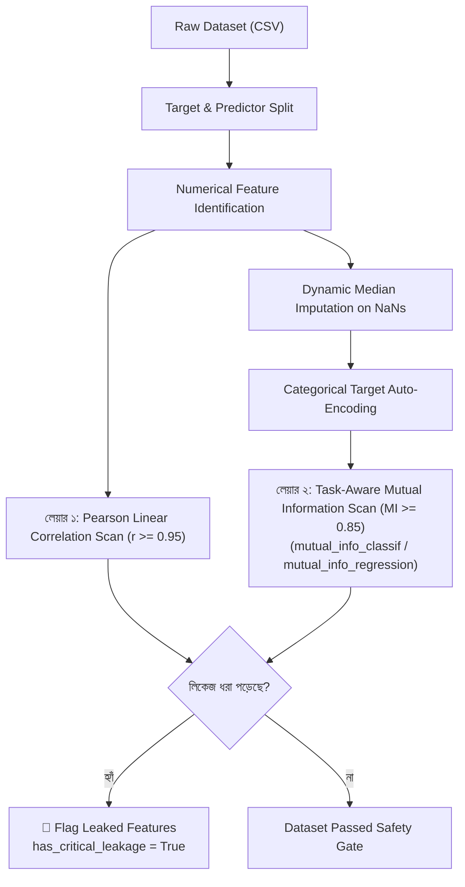

# ml_detect_target_leakage: Deep-Dive Architectural Guide & Reference

> **Tool Name:** `ml_detect_target_leakage`  
> **Module Source:** `src/ml_mcp/engine/leakage_detector.py` / `src/ml_mcp/tools.py`  
> **Class Implementation:** `TargetLeakageDetector`  
> **Layer:** Data Hygiene & Pre-flight Auditing

---

## ১. মানুষের গল্পের মতো ইতিহাস (The Human Story)

মেশিন লার্নিংয়ের ইতিহাসে সবচেয়ে বড় বিপর্যয় এবং কোটি কোটি টাকার ক্ষতির কারণ হলো **"টার্গেট লিকেজ" (Target Leakage)**।

বাস্তব একটি ঘটনার উদাহরণ:
একটি বড় হাসপাতাল তাদের রোগীদের নিউমোনিয়া আগেভাগে শনাক্ত করতে একটি সুপারভাইজড লার্নিং মডেল বানাতে চেয়েছিল। 
- ডেটা সায়েন্টিস্ট মডেল ট্রেইন করার পর দেখল: **৯৯.৯% অ্যাকুরেসি!** মডেল কখনোই ভুল করে না।
- আনন্দের সাথে সিইও এবং মেডিকেল বোর্ড এই মডেলকে হাসপাতালের লাইভ সার্ভারে ডিপ্লয় করল।
- **কিন্তু লাইভ পেশেন্টদের ওপর মডেলটি চালাতেই দেখা গেল মডেল পুরোপুরি ব্যর্থ!** নতুন কোনো রোগীর ক্ষেত্রে সে নিউমোনিয়া সঠিকভাবে ধরতে পারছে না।

### আসল রহস্যটা কী ছিল?
পোস্টমর্টেম অডিটে ধরা পড়ে, ডেটাসেটে রোগীর তাপমাত্রা এবং রক্তের রিপোর্টের পাশাপাশি আরেকটি কলাম ছিল: `antibiotic_prescribed` (রোগীকে অ্যান্টিবায়োটিক দেওয়া হয়েছে কি না)।

বাস্তব হাসপাতালে একজন রোগী যখন প্রথম চেম্বারে ঢোকে, তখন তাকে অ্যান্টিবায়োটিক দেওয়া হয়নি। কিন্তু ডেটাবেজে রোগীর অতীত হিস্ট্রি সেভ করার সময় এই তথ্যটি যুক্ত হয়েছিল। মডেল কোনো রোগ ডায়াগনসিস করতে শেখেনি; সে কেবল ডেটা থেকে চুরি করে দেখেছে রোগীকে অ্যান্টিবায়োটিক প্রেসক্রাইব করা হয়েছে কি না—যদি হ্যাঁ হয়, তবে সে বলেছে নিউমোনিয়া আছে! অর্থাৎ **ভবিষ্যতের ঘটনা বর্তমানের ডেটাতে লিক হয়ে মডেলকে এক ভুয়া সুপারস্টার বানিয়েছিল।**

বাস্তব জীবনের অন্যান্য উদাহরণ:
1. **ই-কমার্স চchurn/ক্যান্সেলেশন:** ডেটাসেটে `refund_date` কলাম রাখা (অথচ রিফান্ড তো ক্যানসেল করার পরই হয়)।
2. **ব্যাংকিং লোন ডিফল্ট:** ডেটাসেটে `collection_agency_contacted` বা `late_fee_applied` থাকা।

এই ভয়ংকর রোগীকে ধরার জন্যই সৃষ্টি হয়েছে **`ml_detect_target_leakage`**। এটি মডেল ট্রেইনিংয়ের আগেই ডেটাসেটকে জেরা করে এবং ভবিষ্যত থেকে তথ্য চুরি করা কলামগুলোকে ধ্বংস করে।

---

## ২. এটা আসলে কী কাজ করে? (Core Mission)

`ml_detect_target_leakage` হলো ডেটাসেটের জন্য একটি **অটোনোমাস লাই-ডিটেক্টর ও সিআইডি স্ক্যানার**।

মডেল ট্রেইন করার আগেই এটি:
1. টার্গেট ফিচারের সাথে প্রতিটি ইনপুট ফিচারের গাণিতিক সম্পর্ক চুলচেরা বিশ্লেষণ করে।
2. কোনো ফিচারে অতিরিক্ত সন্দেহজনক কোরিলেশন বা মিউচুয়াল ইনফরমেশন আছে কি না তা শনাক্ত করে।
3. যদি কোনো ফিচার ধরা পড়ে, তবে তাকে `leaked_features` তালিকায় ফেলে এবং সিস্টেমকে সতর্ক করার জন্য `has_critical_leakage = True` ফ্ল্যাগ জারি করে।

---

## ৩. কখন এটি কাজ করে / কখন ব্যবহার করবেন? (When to Use)

###  ব্যবহারের সঠিক সময়:
1. **প্রি-ফ্লাইট গেট (Pre-flight Audit):** ডেটা হাতে পাওয়ার পর `ml_audit_dataset` চালানোর সাথে সাথেই এটি চালানো উচিত—মডেল ট্রেইনিংয়ে যাওয়ার আগেই।
2. **অস্বাভাবিক হাই পারফরম্যান্স দেখলে:** যদি কোনো মডেলে ৯৮% থেকে ১০০% এক্যুরেসি বা $R^2 \approx 1.0$ চলে আসে, তখন প্রায় নিশ্চিতভাবেই ডেটা লিকেজ হয়েছে। সাথে সাথে এই টুল চালিয়ে চোর ধরা যায়।

### ❌ যে সময় এটি প্রযোজ্য নয়:
- আন-লেবেল্ড ডেটা (যেখানে কোনো টার্গেট কলাম নেই, যেমন কে-মিনস ক্লাস্টারিং)।

---

## ৪. প্যারামিটার পরিচিতি (The Exact Parameters)

| প্যারামিটার | টাইপ | রিকোয়ার্ড? | ডিফল্ট | বিবরণ |
| :--- | :---: | :---: | :---: | :--- |
| **`csv_path`** | `string` | **হ্যাঁ** | - | যে ডেটাসেটের ওপর স্ক্যান চলবে তার ফাইল পাথ। |
| **`target_column`** | `string` | **হ্যাঁ** | - | আপনি যে কলাম প্রেডিক্ট করতে চান (যেমন: `"price"` বা `"is_churn"`). |
| **`task_type`** | `string` | না | `"classification"` | প্রেডিকশন সংখ্যা হলে `"regression"`, ক্যাটাগরি হলে `"classification"`. |

---

## ৫. টুলের অভ্যন্তরীণ আর্কিটেকচার ও ইঞ্জিন ফিচার (Internal Engine Mechanics)

`TargetLeakageDetector` ক্লাসের ভেতরের আর্কিটেকচারাল ফ্লো:



### প্রধান ৫টি অভ্যন্তরীণ ফিচার:

#### ১. পেয়ারসন লিনিয়ার কোরিলেশন ফিল্টার ($r \ge 0.95$)
- টার্গেটের সাথে প্রতিটি নিউমেরিক কলামের লিনিয়ার কোরিলেশন কোয়েফিশিয়েন্ট হিসাব করে।
- কোরিলেশন মান যদি **০.৯৫ বা তার বেশি** হয়, তবে এটি ধরে নেয় কলামটি টার্গেটেরই একটি সরাসরি ডুপ্লিকেট বা লিকড রূপ।

#### ২. টাস্ক-অ্যাওয়ার নন-লিনিয়ার মিউচুয়াল ইনফরমেশন স্ক্যানার ($MI \ge 0.85$)
সব তথ্য লিনিয়ারলি ফাঁস হয় না। জটিল নন-লিনিয়ার সম্পর্ক (যেমন $y = x^2$ বা নন-লিনিয়ার ম্যাপিং) সাধারণ কোরিলেশনে ধরা পড়ে না।
- এর জন্য এটি **Information Theory** ব্যবহার করে `mutual_info_classif` বা `mutual_info_regression` চালায়।
- মিউচুয়াল ইনফরমেশন স্কোর **০.৮৫ বা তার বেশি** হলে এটি নন-লিনিয়ার লিকেজ হিসেবে মার্ক করে।

#### ৩. অটো-মেডিয়ান ইম্পিউটেশন প্রোটেকশন
মিউচুয়াল ইনফরমেশন হিসাব করার সময় কোনো কলামে `NaN` ভ্যালু থাকলে স্কাইকিট-লার্ন ক্র্যাশ করে। এই টুল স্বয়ংক্রিয়ভাবে ব্যাকগ্রাউন্ডে মেডিয়ান ভ্যালু দিয়ে মিসিং ডাটা ইম্পিউট করে নেয়, যাতে স্ক্যান কখনোই ফেইল না করে।

#### ৪. ক্যাটাগরিক্যাল টার্গেট অটো-কনভার্টার
টার্গেট কলামটি যদি স্ট্রিং বা ক্যাটাগরিক্যাল হয় (যেমন `"yes"`/`"no"` বা `"fraud"`/`"legit"`), তবে এটি কোনো ম্যানুয়াল কোডিং ছাড়াই `astype("category").cat.codes` দিয়ে নিউমেরিক্সে রূপান্তর করে নেয়।

#### ৫. স্ট্রাকচার্ড DTO আউটপুট (`TargetLeakageReportDTO`)
টুলটি এক্সিকিউশন শেষে একটি এন্টারপ্রাইজ রেডি DTO অবজেক্ট রিটার্ন করে:
- `target_column`
- `leaked_features` (যেগুলো ড্রপ করতে হবে)
- `correlation_matrix` (লিনিয়ার কোরিলেশন)
- `mutual_info_scores` (ইনফরমেশন শেয়ারিং স্কোর)
- `has_critical_leakage` (বুলিয়ান অ্যালার্ট ফ্ল্যাগ)

---

## ৬. প্রোডাকশন ব্যবহারবিধি (Usage Example via MCP)

```json
{
  "csv_path": "e:/ML Testing/data/dataset.csv",
  "target_column": "price",
  "task_type": "regression"
}
```
যেকোনো পাইপলাইন তৈরির আগে এই টুল চালানো আবশ্যক, যাতে এন্টারপ্রাইজ প্রোডাকশনে কোনো "নকল এক্যুরেসি" সমৃদ্ধ বিষাক্ত মডেল ডিপ্লয় না হতে পারে।
