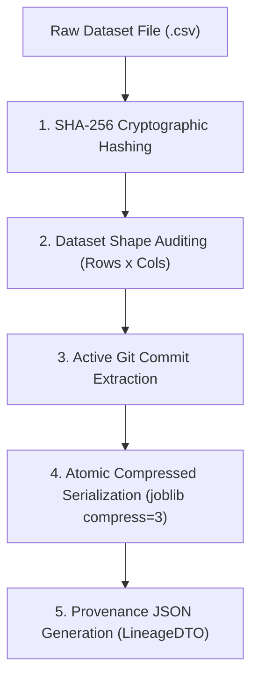

# ml_track_lineage: Deep-Dive Architectural Guide & Reference

> **Tool Name:** `ml_track_lineage`  
> **Module Source:** `src/ml_mcp/engine/checkpoint_manager.py` / `src/ml_mcp/tools.py`  
> **Class Implementation:** `CheckpointManager`  
> **Layer:** Data Hygiene & Experiment Provenance

---

## ১. মানুষের গল্পের মতো পেছনের ইতিহাস (The Human Story: "The Reproducibility Crisis")

মেশিন লার্নিং ইন্ডাস্ট্রিতে সবচেয়ে পরিচিত এবং হতাশাজনক সংলাপটি হলো:  
> *"গত সপ্তাহে তো এই মডেলটা টেস্ট ডাটায় ৯২% এক্যুরেসি দিয়েছিল! আজকে রি-রান করার পর কেন ৬৪% দিচ্ছে?!"*

ডেটা সায়েন্স টিমে এই ট্র্যাজেডি প্রতিনিয়ত ঘটে:
1. একজন ইঞ্জিনিয়ার এক মাস ধরে খেটে একটি দুর্দান্ত মডেল ট্রেইন করল।
2. ৬ মাস পর কোম্পানি বলল: *"আমাদের নতুন সার্ভারে এই মডেলটা আবার হুবহু রি-ট্রেইন করে তুলতে হবে।"*
3. কিন্তু হায়! কেউ জানে না ৬ মাস আগের সেই আসল CSV ফাইলটা কোথায়! 
   - ডেটা ফোল্ডারে দেখা যায় ৫টা ফাইল: `data_final.csv`, `data_final_v2.csv`, `data_really_final.csv`!
   - কেউ জানে না কোন গিট কমিটের কোড দিয়ে মডেল বানানো হয়েছিল।
   - কেউ জানে না ট্রেইনিংয়ের সময় `random_seed` কত ছিল।

**এর চেয়েও বড় সমস্যা হলো লিগ্যাল এবং অডিট ট্রায়াল:**  
ইউরোপিয়ান ইউনিয়নের নতুন আইন (**EU AI Act**) বা ব্যাংকিং/মেডিকেল এআই অডিটে সরকার সরাসরি প্রশ্ন করে:  
> *"আপনার এআই যে সিদ্ধান্ত নিচ্ছে, এর জন্মের সময় ঠিক কোন ডেটা দিয়ে ট্রেইন করা হয়েছিল তার অকাট্য গাণিতিক প্রমাণ দেখান। কোনো হ্যাকার কি সেই ডেটা বদলে দিয়েছিল?"*

কোড ভার্সন করার জন্য আমাদের **Git** আছে, কিন্তু **ডেটা ও এক্সপেরিমেন্টের অকাট্য জন্মসনদ তৈরি করার জন্যই জন্ম হয়েছে `ml_track_lineage`-এর।**

---

## ২. এটা আসলে কী কাজ করে? (Core Mission)

সহজ কথায়: **এটি ডেটাসেট ও মডেলের জন্য একটি "ডিজিটাল জন্মসনদ ও বায়োমেট্রিক পাসপোর্ট" তৈরি করে।**

এটি ডেটাসেটের প্রতিটি বাইট স্ক্যান করে একটি অপরিবর্তনযোগ্য **ক্রিপ্টোগ্রাফিক ফিঙ্গারপ্রিন্ট (SHA-256 Digest)** তৈরি করে এবং নিচের তথ্যগুলোকে এক সুতোয় বেঁধে ফেলে:
1. ডেটা ফাইলের ইউনিক ক্রিপ্টোগ্রাফিক হ্যাশ (`dataset_hash`).
2. এক্সিকিউশনের সময় ঠিক কয়টি রো (`row_count`) এবং কয়টি কলাম (`column_count`) ছিল।
3. কোডবেসের কোন গিট কমিটে এই মডেল ট্রেইন হয়েছিল (`git_commit`).
4. মডেলের ট্রেইন্ড ফাইলটি কোথায় জমা রয়েছে (`checkpoint_path`).
5. কোন র্যান্ডম সীড (`random_seed`) ব্যবহার করা হয়েছিল।

সবশেষে এটি একটি অ্যাটমিক JSON ফাইলে পুরো বংশলতিকা (Lineage) সিলগালা করে সংরক্ষণ করে।

---

## ৩. কখন এটি কাজ করে / কখন ব্যবহার করবেন? (When to Use)

###  ব্যবহারের একদম পারফেক্ট সময়:
1. **মডেল ফাইনাল করার মুহূর্তে:** যখন কোনো মডেল ভালো রেজাল্ট দিয়েছে এবং আপনি সেটিকে প্রোডাকশনে পাঠাতে চান—তার ঠিক আগে এই টুল চালিয়ে তার পরিচয়পত্র ইস্যু করে নেওয়া।
2. **রেগুলেটরি ও অডিট কমপ্লায়েন্স:** ব্যাংকিং, মেডিকেল বা লিগ্যাল এআই সিস্টেমে যেখানে প্রতিটা প্রেডিকশনের জবাবদিহিতা থাকতে হয়।
3. **ডেটা টেম্পারিং ডিটেকশন:** ৬ মাস পর কেউ যদি ডেটা ফাইলে গোপনে ১টি সংখ্যাও বদলে দেয়, এই টুলের হ্যাশ স্ক্যান সাথে সাথে তা ধরে ফেলবে।

### ❌ যে সময় এটি লাগবে না:
- প্রজেক্টের একদম শুরুতে যখন শুধুই রাফ ডেটা দেখা হচ্ছে বা আইডিয়া এক্সপ্লোর করা হচ্ছে।

---

## ৪. প্যারামিটার পরিচিতি (The Exact Parameters)

টুলটির প্যারামিটার মাত্র ২টি:

| প্যারামিটার | টাইপ | রিকোয়ার্ড? | ডিফল্ট | বিবরণ |
| :--- | :---: | :---: | :---: | :--- |
| **`csv_path`** | `string` | **হ্যাঁ** | - | যে ডেটাসেটের ওপর ক্রিপ্টোগ্রাফিক ফিঙ্গারপ্রিন্ট স্ক্যান হবে তার পাথ। |
| **`checkpoint_dir`** | `string` | না | `"artifacts/checkpoints"` | যেখানে মডেল চেকপয়েন্ট এবং বংশলতিকা JSON সেভ হবে। |

---

## ৫. টুলের ভেতরের গভীর ইঞ্জিনিয়ারিং ফিচার (Internal Engine Secrets)

`CheckpointManager` ক্লাসের ভেতরের আর্কিটেকচারাল ফ্লো:



### প্রধান ফিচারসমূহ:

#### ১. ক্রিপ্টোগ্রাফিক SHA-256 হ্যাশিং (`hashlib.sha256`)
- এটি কোনো ফাইল সাইজ বা নামের ওপর নির্ভর করে না; এটি ডেটা ফাইলের বাইনারি কন্টেন্টের ওপর গণিতের অন্যতম নিরাপদ অ্যালগরিদম **SHA-256** চালায়।
- ডেটাসেটে ১টি ডট (.) বা স্পেস বদলালেও পুরো ৬৫ ক্যারেক্টারের হ্যাশ কোড বদলে যায়।

#### ২. গিট কমিট অটো-বাইন্ডিং (`git_commit`)
- ট্রেইনিংয়ের মুহূর্তে কোডবেসের কোন গিট ব্রাঞ্চ ও কোন কমিট হ্যাশ অ্যাক্টিভ ছিল, তা স্বয়ংক্রিয়ভাবে মেটাডেটাতে ঢুকিয়ে দেয়। ফলে কোড ও ডেটার মাঝে চিরস্থায়ী সেতু তৈরি হয়।

#### ৩. কম্প্রেসড অ্যাটমিক সিরিয়ালাইজেশন (`joblib.dump(..., compress=3)`)
- মডেল চেকপয়েন্ট সেভ করার সময় এটি সাধারণ ডাম্প করে না। লেভেল-৩ কম্প্রেশন ব্যবহার করে ডিস্ক স্পেস ৬০% বাঁচায় এবং অ্যাটমিক রাইট করে, যাতে ডিস্ক ক্র্যাশ করলেও অর্ধেক লেখা ফাইল তৈরি না হয়।

#### ৪. স্ট্রাকচার্ড প্রোভেন্যান্স DTO (`LineageDTO`)
টুলটি রান করার পর হুবহু এই ফরম্যাটে একটি বংশলতিকা অবজেক্ট রিটার্ন করে এবং ডিস্কে `{job_id}_lineage.json` আকারে লিখে রাখে:
```json
{
  "dataset_hash": "e3b0c44298fc1c149afbf4c8996fb92427ae41e4649b934ca495991b7852b855",
  "row_count": 102,
  "column_count": 9,
  "random_seed": 42,
  "git_commit": "a1b2c3d4e5f67890",
  "checkpoint_path": "artifacts/checkpoints/model.joblib"
}
```

---

## ৬. প্রোডাকশন ব্যবহারবিধি (Usage Example via MCP)

```json
{
  "csv_path": "e:/ML Testing/data/dataset.csv",
  "checkpoint_dir": "artifacts/checkpoints"
}
```
