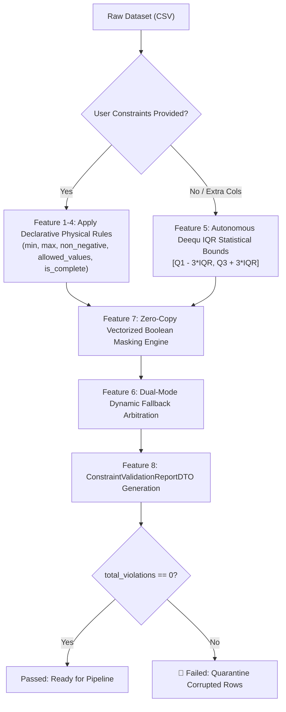

# ml_verify_constraints: Deep-Dive Architectural Guide & Reference

> **Tool Name:** `ml_verify_constraints`  
> **Module Source:** `src/ml_mcp/engine/constraint_validator.py` / `src/ml_mcp/tools.py`  
> **Class Implementation:** `ConstraintValidator`  
> **Theoretical Origin:** Amazon Deequ (*Schelter et al., Amazon Research, VLDB 2018*)  
> **Layer:** Phase 1: Data Audit & Hygiene

---

## ১. মানুষের গল্পের মতো ইতিহাস (The Human Story: "The Impossible Numbers in the Database")

মেশিন লার্নিং সিস্টেমে একটি ভয়ংকর বাস্তবতা হলো: **একটি সংখ্যা সিনট্যাক্টিক্যালি (Syntax) শতভাগ বৈধ হতে পারে, কিন্তু বাস্তবিক বা প্রাকৃতিক নিয়মে (Physics) তা সম্পূর্ণ অসম্ভব!**

পান্ডাস (`Pandas`) বা পাইথনের ডাটাটাইপ চেক কখনোই বাস্তব পৃথিবীর নিয়ম বোঝে না:
- `price = -50.0` $\implies$ টাইপ `float64` $\implies$ পান্ডাস বলবে: *সব ঠিক আছে!*
- `age = 280` $\implies$ টাইপ `int64` $\implies$ পান্ডাস বলবে: *সব ঠিক আছে!*
- `latitude = 195.4` $\implies$ টাইপ `float64` $\implies$ পান্ডাস বলবে: *সব ঠিক আছে!*

কিন্তু একজন সুস্থ স্বাভাবিক মানুষ কখনো ২৮০ বছর বাঁচে না, কোনো পণ্যের দাম ঋণাত্মক ৫০ টাকা হতে পারে না এবং পৃথিবী পৃষ্ঠে ল্যাটিচিউড কখনো $\pm ৯০^\circ$-এর বেশি হতে পারে না!

### বাস্তব জীবনের ৪টি প্রোডাকশন বিপর্যয়:
১. **ই-কমার্স ও ফিনটেক ক্যাটাষ্ট্রফি:** একটি বড় ই-কমার্স সাইটে ডিসকাউন্ট বাগ বা ডাটা এন্ট্রি ভুলের কারণে কিছু পণ্যের `price = -10` ডাটাবেসে সেভ হয়েছিল। স্বয়ংক্রিয় রোবট কাস্টমাররা লাখ লাখ টাকার মালামাল কিনে নিল, উল্টো কোম্পানির ব্যাংক অ্যাকাউন্ট থেকে কাস্টমারদের টাকা দেওয়া হলো!  
২. **হেলথকেয়ার ও মেডটেক ভুল:** হাসপাতালে রোগীর `systolic_blood_pressure = -5` অথবা `body_temperature = 104` (ফারেনহাইটের মান সেলসিয়াসের কলামে ইনপুট দেওয়া হয়েছে)। এআই ডায়াগনস্টিক মডেল রোগীকে মৃত অথবা ভয়াবহ ভুল প্রেসক্রিপশন জেনারেট করল।  
৩. **লজিস্টিকস ও ড্রোন ডেলিভারি:** ডেলিভারি ট্র্যাকিং সিস্টেমে জিপিএস ড্রিপ্টের কারণে ল্যাটিচিউড আসলো `210.5`। অটোনোমাস ডেলিভারি ড্রোন পৃথিবীর বায়ুমণ্ডলের বাইরে উড়ে যাওয়ার পথ খুঁজতে গিয়ে ক্র্যাশ করল।  
৪. **ক্রেডিট কার্ড ও ব্যাংকিং:** লোন অ্যাপ্লিকেশনে কোনো কাস্টমারের `monthly_income = -50000` অথবা `credit_score = 950` (যেখানে সর্বোচ্চ স্কোর ৮৫০)। ক্রেডিট স্কোরিং মডেল আউটলায়ারের আঘাতে সম্পূর্ণ বিভ্রান্ত হলো।

### কেন সাধারণ টেস্ট বা ইউনিট টেস্ট এখানে ফেইল করে?
- ইউনিট টেস্ট কোডের লজিক চেক করে, কিন্তু লাইভ ডাটার কনটেন্ট বা ডোমেইন ভ্যালিডিটি বুঝতে পারে না।
- মডেল ট্রেনিং শুরু হয়ে যায় কারণ কোনো নাল ভ্যালু নেই (`df.isna().sum() == 0`)।
- কিন্তু এই "অসম্ভব সংখ্যাগুলো" মডেলের অপটিমাইজারে গ্রাফ-লেভেল শক তৈরি করে, ফলে পুরো মডেলের ওজন (Weights) বিষাক্ত হয়ে যায়।

এই অন্ধত্ব দূর করতে অ্যামাজন রিসার্চ (Amazon Research, VLDB 2018) উদ্ভাবন করে **Deequ** ফ্রেমওয়ার্ক—যার মূল দর্শন হলো: **"কোনো কাঁচা ডেটা ফিজিক্যাল ডোমেইন বাউন্ডারি ভ্যালিডেশন ছাড়া মডেলের ধারের কাছেও যেতে পারবে না।"**  
সেই আন্তর্জাতিক গবেষণার আদলে তৈরি হয়েছে আমাদের **`ml_verify_constraints`**।

---

## ২. এটা আসলে কী কাজ করে? (Core Mission)

সহজ কথায়: **এটি ডেটাসেটের প্রতিটি কলামের ওপর বাস্তব পৃথিবীর ফিজিক্যাল লিমিট এবং অটোমেটিক স্ট্যাটিস্টিক্যাল রেঞ্জ বাউন্ডারি জারি করে অসম্ভব মানগুলোকে এন্ট্রি পয়েন্টেই আটকে দেয়।**

এটি একটি ডুয়েল-লেয়ার ডিফেন্স হিসেবে কাজ করে:
1. **লেয়ার ১: ডিক্লারেটিভ ইউজার কনস্ট্রেইন্ট (Explicit Physical Rules):** ডেভেলপার বা ডোমেইন এক্সপার্টের দেওয়া সুনির্দিষ্ট নিয়ম (যেমন: বয়স ০ থেকে ১২০, দাম $\ge ০$, স্ট্যাটাস শুধু `active`/`pending`/`closed`) অক্ষর অক্ষরে যাচাই করে।
2. **লেয়ার ২: অটোনোমাস অ্যামাজন ডিকিউ ৩x-আইকিউআর বাউন্ডস (Autonomous Statistical Bounds):** যদি ইউজার কোনো নিয়ম নাও দেন, তবুও ইঞ্জিন স্বয়ংক্রিয়ভাবে প্রতিটা সংখ্যামূলক কলামের জন্য এন্টারপ্রাইজ ডিকিউ ফর্মুলা ($[Q_1 - 3\times\text{IQR}, Q_3 + 3\times\text{IQR}]$) হিসাব করে ফিজিক্যালি অস্বাভাবিক আউটলায়ারদের শনাক্ত করে লাল পতাকা (`passed = False`) জারি করে।

---

## ৩. কখন এটি কাজ করে / কখন ব্যবহার করবেন? (When to Use)

###  ব্যবহারের সঠিক সময়:
1. **প্রি-ফ্লাইট ডাটা ইনজেশন গেট (Pre-flight Gate):** ডেটাবেস থেকে এক্সপোর্ট নেওয়ার পর বা নতুন CSV পাওয়ার পর `ml_audit_dataset`-এর পরপরই এই টুল চালানো বাধ্যতামূলক।
2. **প্রোডাকশন সার্ভিং এপিআই (API Payload Verification):** ব্যবহারকারী যখন রিয়েল-টাইমে প্রেডিকশনের জন্য JSON পাঠায়, তখন মডেলে ইনপুট দেওয়ার আগে এই ভ্যালিডেটর নিশ্চিত করে ইনপুটগুলো মানুষের পক্ষে সম্ভব কি না।
3. **সিআই/সিডি অটোমেটেড পাইপলাইন ব্লকার (ETL Quality Gate):** এয়ারফ্লো (Airflow) বা ব্যাকগ্রাউন্ড জব পাইপলাইনে যদি `passed == False` আসে, তবে স্বয়ংক্রিয়ভাবে মডেল রি-ট্রেনিং বন্ধ করে দেওয়া উচিত।

### ❌ যে সময় এটি প্রযোজ্য নয়:
- ডায়মেনশনালিটি রিডাকশনের পরবর্তী স্পেস (যেমন: PCA বা t-SNE কম্পোনেন্ট)—যেখানে ডেটা কোনো ডোমেইন ফিজিক্স মানে না, কেবল গাণিতিক ভেক্টর।

---

## ৪. প্যারামিটার পরিচিতি (The Exact Parameters)

| প্যারামিটার | টাইপ | রিকোয়ার্ড? | ডিফল্ট | বিবরণ |
| :--- | :---: | :---: | :---: | :--- |
| **`csv_path`** | `string` | **হ্যাঁ** | - | যে ডেটাসেটের ওপর কনস্ট্রেইন্ট পরীক্ষা হবে তার ফাইল পাথ। |
| **`constraints`** | `dict` | না | `None` | কলাম-ভিত্তিক সুনির্দিষ্ট ফিজিক্যাল রুলসের ডিকশনারি (নিচে বিস্তারিত দেখুন)। |
| **`view`** | `string` | না | `"compact"` | `"compact"` (সংক্ষিপ্ত সারাংশ) অথবা `"detailed"` (সম্পূর্ণ ডিটেইলড ব্রেকডাউন)। |

### ইউজার কনস্ট্রেইন্ট ডিকশনারির গঠন কাঠামো:
```json
{
  "age": {"min": 0, "max": 120, "non_negative": true},
  "price": {"min": 0.01, "non_negative": true},
  "status": {"allowed_values": ["active", "pending", "closed"]},
  "customer_id": {"is_complete": true}
}
```

---

## ৫. টুলের ভেতরের ৮টি মেগা-ফিচার (Internal Engine Architecture)

`ConstraintValidator` ইঞ্জিনের ভেতরে ৮টি উচ্চ-ক্ষমতাসম্পন্ন মেগা-ফিচার সমন্বয় করে একটি দুর্ভেদ্য নিরাপত্তা বলয় গড়ে তোলা হয়েছে:



---

### মেগা-ফিচার ১: ডিক্লারেটিভ মিনিমাম ও ম্যাক্সিমাম বাউন্ড গার্ড (`min` & `max`)
- **মেকানিজম:** যেকোনো নিউমেরিক কলামের ঊর্ধ্বসীমা ও নিম্নসীমা কঠোরভাবে নিয়ন্ত্রণ করে।
- **প্রয়োগ:** বয়সের ঊর্ধ্বসীমা ১২০, পরীক্ষার মার্কসের রেঞ্জ ০ থেকে ১০০, ডিসকাউন্ট পারসেন্টেজ ০ থেকে ১০০ ইত্যাদি। কোনো মান এই রেঞ্জের বাইরে গেলে সাথে সাথে ভায়োলেশন রেজিস্টার হয়।

### মেগা-ফিচার ২: ঋণাত্মক মান প্রতিরোধক (`non_negative: true`)
- **মেকানিজম:** যেসব সত্ত্বা বাস্তব দুনিয়ায় কখনোই ঋণাত্মক হতে পারে না—যেমন দাম, ওজন, আয়তন, ট্রানজ্যাকশন সংখ্যা বা বয়স।
- **সুরক্ষা:** শূন্য বা তার বেশি ($x \ge 0.0$) হতে হবে। কোনো নেগেটিভ সংখ্যা থাকলে তাৎক্ষণিকভাবে তাকে `rule_broken: non_negative` দিয়ে চিহ্নিত করে।

### মেগা-ফিচার ৩: ডিসক্রিট ক্যাটাগরিক্যাল ডোমেইন গার্ড (`allowed_values`)
- **মেকানিজম:** ক্যাটাগরিক্যাল কলামে আন-অথোরাইজড বা নোংরা এন্ট্রি ঢুকতে দেয় না।
- **বাস্তব উদাহরণ:** অর্ডারের স্ট্যাটাস কেবল `['pending', 'shipped', 'delivered', 'canceled']` হতে পারবে। যদি কেউ ডাটা এন্ট্রিতে `"unknown"` বা টাইপো করে `"shippped"` লেখে, তবে এটি তৎক্ষণাৎ ফ্ল্যাগ করে দেয়।

### মেগা-ফিচার ৪: কমপ্লিটনেস ও নাল-ইনভ্যারিয়েন্স গার্ড (`is_complete: true`)
- **মেকানিজম:** কিছু কলাম ডেটাসেটে এত বেশি স্পর্শকাতর যে সেখানে একটিমাত্র `NaN` বা মিসিং সেল থাকলেও পুরো মডেল অকেজো হয়ে যায় (যেমন: কাস্টমার আইডি, টার্গেট লেবেল, টাইমস্ট্যাম্প)।
- **সুরক্ষা:** এই রুল সক্রিয় থাকলে ডেটাসেটে কোনো নাল সেল থাকা মাত্রই রিপোর্টকে `passed = False` করে দেওয়া হয়।

### মেগা-ফিচার ৫: অটোনোমাস অ্যামাজন ডিকিউ ৩x-আইকিউআর এক্সট্রিম আউটলায়ার ইঞ্জিন
যদি কোনো ইঞ্জিনিয়ার ব্যস্ততার কারণে কোনো ম্যানুয়াল রুলস নাও দেন, তবুও ইঞ্জিন বসে থাকে না। সে প্রতিটি নিউমেরিক কলামের ওপর অ্যামাজন ডিকিউ রিসার্চের স্ট্যাটিস্টিক্যাল ফর্মুলা চালায়:
$$Q_1 = \text{Quantile}(0.25), \quad Q_3 = \text{Quantile}(0.75)$$
$$\text{IQR} = Q_3 - Q_1$$
$$\text{Lower Bound} = Q_1 - 3.0 \times \text{IQR}, \quad \text{Upper Bound} = Q_3 + 3.0 \times \text{IQR}$$
- ক্লাসিক্যাল ১.৫x IQR সাধারণ আউটলায়ার ধরে, কিন্তু **৩x IQR কঠোরভাবে ফিজিক্যালি অসম্ভব মানগুলোকে শনাক্ত করে**। এর ফলে সাধারণ ডেটা অক্ষত থাকে কিন্তু টাইপো জনিত চরম ভুলগুলো ধরা পড়ে যায়।

### মেগা-ফিচার ৬: ডুয়েল-মোড ডায়নামিক ফলব্যাক আর্বিট্রেশন (Dual-Mode Hybrid Engine)
- যদি ব্যবহারকারী নির্দিষ্ট ৩টি কলামে এক্সপ্লিসিট রুল দেন, তবে ইঞ্জিন সেই ৩টি কলামে ইউজারের ডোমেইন রুল মানবে।
- কিন্তু বাকি ১০টি আনকনফিগারড কলামকে সে অরক্ষিত রাখবে না—সেগুলোতে ব্যাকগ্রাউন্ডে অটোনোমাস ডিকিউ ৩x-আইকিউআর ইঞ্জিন চালু রাখবে! ফলে ডেটাসেটের কোনো অংশই নিরাপত্তাহীন থাকে না।

### মেগা-ফিচার ৭: জিরো-কপি ভেক্টরাইজড এক্সিকিউশন স্পিড (Vectorized $\mathcal{O}(N)$ Speed)
- কোনো পাইথন লুপ (`for row in df`) ব্যবহার করা হয়নি।
- সম্পূর্ণ ভ্যালিডেশন চলে পিওর NumPy সি-লেভেল ভেক্টরাইজড মাস্কিংয়ের মাধ্যমে। ফলে ১০ লাখ (1 Million) রো-এর ডেটাসেট স্ক্যান করতে মাত্র কয়েক মিলিসেকেন্ড সময় লাগে।

### মেগা-ফিচার ৮: এন্টারপ্রাইজ গ্রেড স্ট্রাকচার্ড DTO (`ConstraintValidationReportDTO`)
- আউটপুট কোনো সাধারণ টেক্সট নয়, বরং একটি টাইপড Pydantic DTO।
- এতে থাকে: `total_rows`, `passed` (বুলিয়ান গেট), `total_violations` এবং প্রতিটি কলামের ভায়োলেশন রেট ও সুনির্দিষ্ট নিয়মের বিবরণ—যা সিআই/সিডি অটোমেশনে সরাসরি ইন্টিগ্রেট করা যায়।

---

## ৬. প্রোডাকশন ব্যবহারবিধি (Usage Example via MCP)

### ইনপুট রিকোয়েস্ট ১ (নির্দিষ্ট ফিজিক্যাল রুলসহ):
```json
{
  "csv_path": "e:/ML Testing/data/dataset.csv",
  "constraints": {
    "age": {"min": 0, "max": 120, "non_negative": true},
    "price": {"min": 0.01, "non_negative": true},
    "status": {"allowed_values": ["active", "pending", "closed"]},
    "email": {"is_complete": true}
  },
  "view": "detailed"
}
```

### প্রত্যাশিত আউটপুট রেসপন্স (ভায়োলেশন পাওয়া গেলে):
```json
{
  "total_rows": 50000,
  "passed": false,
  "total_violations": 14,
  "violations_by_column": [
    {
      "column": "age",
      "violation_count": 3,
      "violation_rate": 0.0001,
      "rule_broken": "max_bound: values must be <= 120.0"
    },
    {
      "column": "price",
      "violation_count": 8,
      "violation_rate": 0.0002,
      "rule_broken": "non_negative: values must be >= 0.0"
    },
    {
      "column": "status",
      "violation_count": 3,
      "violation_rate": 0.0001,
      "rule_broken": "allowed_values: discrete set constraint violated"
    }
  ]
}
```

### ইনপুট রিকোয়েস্ট ২ (সম্পূর্ণ স্বয়ংক্রিয় অটোনোমাস স্ক্যান):
```json
{
  "csv_path": "e:/ML Testing/data/dataset.csv",
  "view": "compact"
}
```

### প্রত্যাশিত আউটপুট রেসপন্স (সব ঠিক থাকলে):
```json
{
  "total_rows": 50000,
  "passed": true,
  "total_violations": 0,
  "violation_columns_count": 0,
  "violations_summary": []
}
```

---

## ৭. প্রোডাকশন গেটিং পাইপলাইনে কীভাবে ব্যবহার করবেন?

একটি প্রোডাকশন এমএলওপস (MLOps) বা ডেটা পাইপলাইনে এই টুলের ফলাফল সরাসরি সিআই/সিডি গেট হিসেবে কাজ করে:

```python
# প্রোডাকশন অটোমেশন স্ক্রিপ্ট
report = await ml_verify_constraints(csv_path="incoming_batch.csv")

if not report["passed"]:
    # তাৎক্ষণিকভাবে অ্যালার্ট দিন এবং পাইপলাইন থামিয়ে দিন
    alert_engineering_team(f"🚨 Data Quality Gate Failed: {report['total_violations']} violations found!")
    quarantine_dataset("incoming_batch.csv")
    raise ValueError("Dataset violates physical feasibility constraints. Ingestion halted.")

# সব ঠিক থাকলে পরবর্তী ফেজে যান
print(" Dataset Passed Physical Feasibility Gate. Proceeding to Feature Engineering...")
```

`ml_verify_constraints` যুক্ত হওয়ার মাধ্যমে Phase 1: Data Audit & Hygiene এখন শুধুমাত্র স্ট্যাটিস্টিক্যাল অডিট নয়, বরং বাস্তব পৃথিবীর ভৌত নিয়ম রক্ষার এক দুর্ভেদ্য ডিজিটাল দুর্গে পরিণত হলো।
