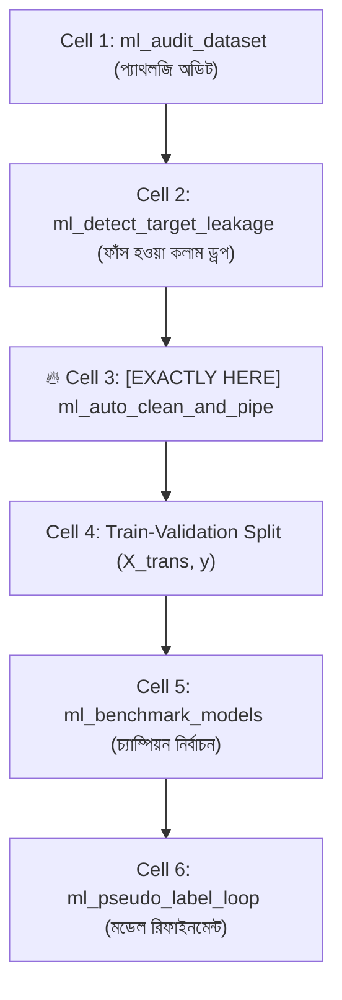
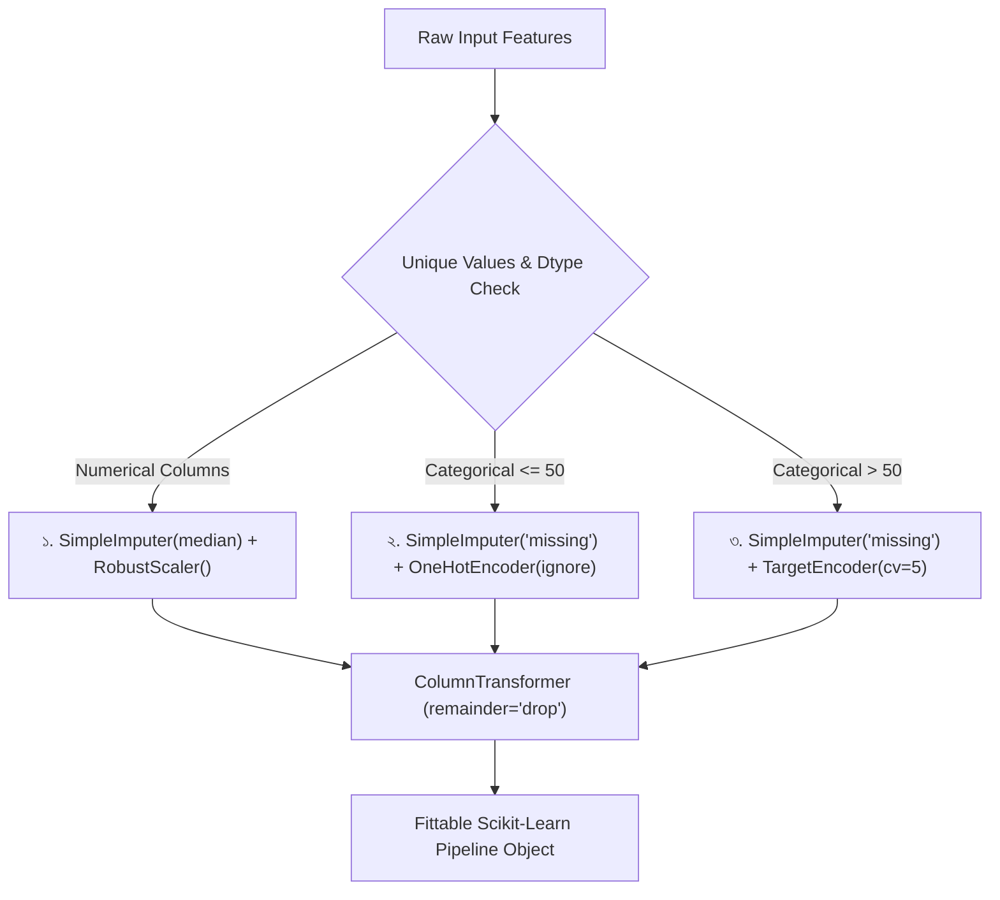

# ml_auto_clean_and_pipe: Deep-Dive Architectural Guide & Reference

> **Tool Name:** `ml_auto_clean_and_pipe`  
> **Module Source:** `src/ml_mcp/engine/pipeline_builder.py` / `src/ml_mcp/tools.py`  
> **Class Implementation:** `DefensivePipelineBuilder`  
> **Layer:** Phase 2: Feature Engineering & Preprocessing

---

## ১. মানুষের গল্পের মতো পেছনের ইতিহাস (The Human Story: "The Manual Preprocessing Hell")

মেশিন লার্নিং ইঞ্জিনিয়ারদের প্রতিদিনের কাজের ৮০% সময় নষ্ট হয় একটি বিরক্তিকর কাজে—**ম্যানুয়াল ডেটা ক্লিনিং**।

বাস্তব জীবনের চিত্রটি দেখুন:
আপনার ডেটাসেটে একসঙ্গে রয়েছে:
- সংখ্যামূলক ডেটা (`price`, `weight`)—যার মধ্যে কিছু ঘর ফাঁকা (`NaN`) এবং কিছু অস্বাভাবিক বড় সংখ্যা (Outliers)।
- ছোট ক্যাটাগরি (`category`: beauty, groceries)—যেগুলোতে ওয়ান-হট এনকোডিং করা সহজ।
- বিশাল ক্যাটাগরি (`brand`: ৫০০টি আলাদা ব্র্যান্ডের নাম)—যেখানে ওয়ান-হট করতে গেলে ৫০০টি নতুন কলাম তৈরি হয়ে মেমোরি ব্লাস্ট হয়ে যাবে (**Curse of Dimensionality**)।

**ডেভেলপাররা সাধারণত কী ভুল করে?**  
নোটবুকে তারা টুকরো টুকরো করে `df.fillna()`, `pd.get_dummies()` চালায়।  
এর ফলে দুটি মারাত্মক সমস্যা তৈরি হয়:
1. **Data Leakage (তথ্য চুরি):** ট্রেইন এবং টেস্ট স্প্লিট করার আগেই পুরো ডেটার গড় বা মিডিয়ান দিয়ে নাল পূরণ করলে টেস্ট ডেটার তথ্য ট্রেইনিংয়ে ফাঁস হয়ে যায়।
2. **Train-Serve Skew (প্রোডাকশন ক্র্যাশ):** প্রোডাকশনে যখন কোনো নতুন কাস্টমার এমন একটি নতুন ব্র্যান্ডের নাম পাঠায় যা ট্রেইনিংয়ে ছিল না, পান্ডাসের কোড সাথে সাথে ক্র্যাশ করে বলে: `ValueError: Shape mismatch`!

এই ম্যানুয়াল ঝামেলা এবং প্রোডাকশন ক্র্যাশ চিরতরে দূর করতে তৈরি হয়েছে **`ml_auto_clean_and_pipe`**। এটি কোনো আলগা কোড নয়—এটি ডেটাকে একটি **স্বয়ংক্রিয়, ত্রিমুখী ডিফেন্সিভ পাইপলাইনে (Zero-Leakage Pipeline)** সিলগালা করে দেয়।

---

## ২. এটা আসলে কী কাজ করে? (Core Mission)

সহজ কথায়: **এটি কাঁচা ডেটাকে এক ক্লিকে সম্পূর্ণ নিরাপদ ও মডেলিং-উপযোগী ভেক্টরে রূপান্তর করে।**

এটি একটি স্বয়ংক্রিয় ৩-ধাপের আর্কিটেকচারাল কাজ করে:
1. **কলামের চরিত্র বিভাজন (3-Way Triage):** ডেটাসেটের কলামগুলোকে স্ক্যান করে স্বয়ংক্রিয়ভাবে ৩ ভাগে ভাগ করে: সংখ্যা, ছোট ক্যাটাগরি ($\le ৫০$) এবং বিশাল ক্যাটাগরি ($> ৫০$)।
2. **বিশেষায়িত ডিফেন্সিভ রূপান্তর (Specialized Transformers):** 
   - সংখ্যার জন্য: মিডিয়ান ইম্পিউটার + আউটলায়ার-প্রতিরোধী `RobustScaler`।
   - ছোট ক্যাটাগরির জন্য: আনসিন ক্যাটাগরি-প্রতিরোধী `OneHotEncoder`।
   - বিশাল ক্যাটাগরির জন্য: লিকেজহীন ৫-ফোল্ড `TargetEncoder`।
3. **সিলগালা পাইপলাইন তৈরি (Pipeline Sealing):** পুরো প্রসেসটিকে একটি একক `sklearn.pipeline.Pipeline` অবজেক্টে মুড়িয়ে দেয়, যাতে ট্রেইনিং এবং লাইভ সার্ভারের মাঝে কোনো পার্থক্য না থাকে।

---

## ৩. নোটবুকের ঠিক কোন কোড সেলের পর এটি কাজ করবে? (Pipeline Placement)

এটি পাইপলাইনের ডাটা প্রিপারেশন স্টেজের কেন্দ্রবিন্দু।



### 🎯 সুনির্দিষ্ট নিয়ম:
> **এটি সবসময় Cell 2 (টার্গেট লিকেজ স্ক্যান ও খারাপ কলাম ড্রপ)-এর ঠিক পরে এবং Cell 4/5 (স্প্লিট ও মডেল ট্রেইনিং)-এর ঠিক আগে বসবে।**

### কেন এখানে বসবে? (Engineering Reason)
যদি আপনি পাইপলাইন তৈরির আগেই ডেটা স্প্লিট করেন, তবে প্রতিটা স্প্লিটে আপনাকে আলাদা করে ম্যানুয়াল এনকোডিং কোড লিখতে হবে। আবার যদি লিকেজ চেক করার আগে পাইপলাইন বানান, তবে ফাঁস হওয়া বিষাক্ত কলামগুলো পাইপলাইনের ভেতরে ঢুকে যাবে।  
তাই লিকেজ কলাম বাদ যাওয়ার **ঠিক পরেই** এই ডিফেন্সিভ পাইপলাইনটি তৈরি করে ডেটাকে ট্রেইনিংয়ের জন্য প্রস্তুত করতে হয়।

---

## ৪. প্যারামিটার পরিচিতি (The Exact Parameters)

| প্যারামিটার | টাইপ | রিকোয়ার্ড? | ডিফল্ট | বিবরণ |
| :--- | :---: | :---: | :---: | :--- |
| **`csv_path`** | `string` | **হ্যাঁ** | - | যে কাঁচা ডেটাসেটের ওপর পাইপলাইন তৈরি হবে তার পাথ। |
| **`target_column`** | `string` | না | `null` | টার্গেট কলামের নাম (যাতে পাইপলাইন টার্গেটকে ফিচারের সাথে না গুলায়)। |

---

## ৫. টুলের ভেতরের গভীর ইঞ্জিনিয়ারিং ফিচার (Internal Engine Secrets)

`DefensivePipelineBuilder` ক্লাসের ভেতরের আর্কিটেকচারাল ফ্লো:



### প্রধান ফিচারসমূহ:

#### ১. আউটলায়ার-প্রতিরোধী স্কেলিং (`RobustScaler`)
সাধারণ `StandardScaler` গড় (Mean) ব্যবহার করে, যা চরম আউটলায়ার থাকলে ডেটা নষ্ট করে দেয়।  
এই টুল ব্যবহার করে **`RobustScaler`**, যা মিডিয়ান এবং IQR (Interquartile Range) দিয়ে স্কেল করে—ফলে ডাটায় অস্বাভাবিক বড় বা ছোট সংখ্যা থাকলেও স্কেলিং সম্পূর্ণ সুরক্ষিত থাকে।

#### ২. প্রোডাকশন ক্র্যাশ গার্ড (`handle_unknown="ignore"`)
```python
OneHotEncoder(handle_unknown="ignore", sparse_output=False)
```
এই প্যারামিটারটি লাইভ সার্ভারের লাইফসেভার। প্রোডাকশনে নতুন কোনো অপরিচিত ক্যাটাগরি ইনপুটে এলে সিস্টেম ক্র্যাশ না করে স্বয়ংক্রিয়ভাবে সেটিকে সব-শূন্য ভেক্টর বানিয়ে নিরাপদ রাখে।

#### ৩. ডাইমেনশন রক্ষা ও ৫-ফোল্ড টার্গেট এনকোডার (`TargetEncoder`)
```python
TargetEncoder(cv=5, smooth="auto")
```
যদি কোনো কলামে ৫০টির বেশি ইউনিক ক্যাটাগরি থাকে (যেমন শত শত ব্র্যান্ড), এটি ওয়ান-হট এনকোডিং না করে টার্গেট এনকোডিং ব্যবহার করে। ফলে শত শত কলাম তৈরি না হয়ে মাত্র ১টি নিউমেরিক কলামে রূপান্তর হয়, এবং ৫-ফোল্ড ক্রস-ভ্যালিডেশন থাকায় কোনো টার্গেট লিকেজ হয় না।

#### ৪. আনসিন নাল প্রোটেকশন (`SimpleImputer`)
সংখ্যার ঘরে যদি কোনো ফাঁকা থাকে তবে মেডিয়ান দিয়ে পূরণ হয়, আর ক্যাটাগরির ঘরে ফাঁকা থাকলে `"missing"` লেবেল দিয়ে পূরণ হয়। ফলে কোনো অবস্থাতেই পাইপলাইনে নাল ভ্যালু টিকে থাকতে পারে না।

---

## ৬. প্রোডাকশন ব্যবহারবিধি (Usage Example via MCP)

```json
{
  "csv_path": "e:/ML Testing/data/dataset.csv",
  "target_column": "price"
}
```

---

### এক লাইনে সারমর্ম:
`ml_auto_clean_and_pipe` হলো আপনার ডেটার জন্য একটি **স্বয়ংক্রিয় ডিফেন্সিভ শিল্ড**—যা নাল ভ্যালু, আউটলায়ার ও ক্যাটাগরিগুলোকে নিখুঁত ৩টি লাইনে ভাগ করে এমন এক পাইপলাইনে প্যাক করে, যা ট্রেইনিং থেকে প্রোডাকশন পর্যন্ত কখনোই কোনো এরর দিয়ে ক্র্যাশ করে না!
