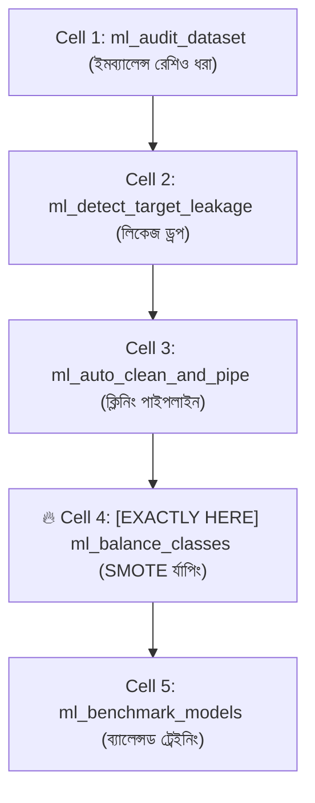
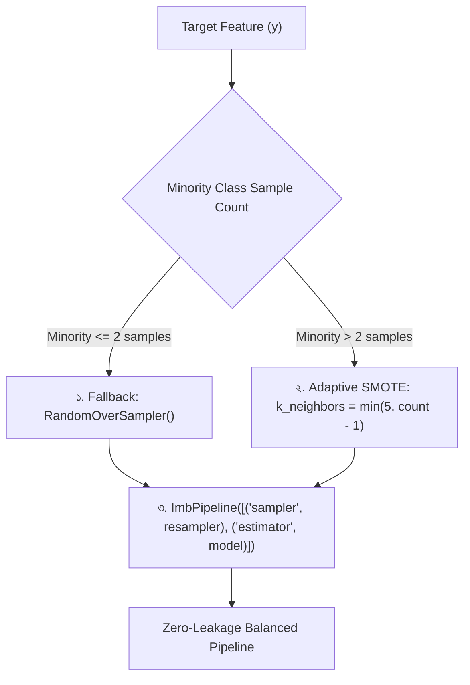

# ml_balance_classes: Deep-Dive Architectural Guide & Reference

> **Tool Name:** `ml_balance_classes`  
> **Module Source:** `src/ml_mcp/engine/balancer.py` / `src/ml_mcp/tools.py`  
> **Class Implementation:** `ClassBalancer`  
> **Layer:** Phase 2: Feature Engineering & Preprocessing

---

## ১. মানুষের গল্পের মতো পেছনের ইতিহাস (The Human Story: "The 99% Fraud Paradox")

মেশিন লার্নিংয়ে ক্লাসিফিকেশন প্রজেক্টগুলোর সবচেয়ে বড় অভিশাপ হলো **ইমব্যালেন্সড ডেটাসেট (Imbalanced Dataset)**।

বাস্তব জীবনের দৃশ্যপট:
- আপনি একটি ব্যাংকের ক্রেডিট কার্ড ফ্রড ডিটেকশন বা হাসপাতালের বিরল ক্যান্সার ডিটেকশন মডেল বানাচ্ছেন।
- আপনার কাছে ১,০০,০০০ কাস্টমারের ডেটা আছে।
- এর মধ্যে **৯৯,৮০০ জন সৎ কাস্টমার**, আর মাত্র **২০০ জন ফ্রড** (মাত্র ০.২%)!

**মডেলের সাধারণ প্রবণতা ও ডেভেলপারদের ভুল:**  
যেহেতু ফ্রডের সংখ্যা খুবই কম, মেশিন লার্নিং অ্যালগরিদম অলসতা করে একটি অন্ধ ট্রিক ধরে নেয়: *"আমি সবাইকে সৎ বলে দেই!"*  
খাতাকলমে মডেলের এক্যুরেসি আসে **৯৯.৮%**, কিন্তু বাস্তব জীবনে সে একটিও ফ্রড ধরতে পারে না।

এই সমস্যা সমাধানে ডেটা সায়েন্টিস্টরা **SMOTE (Synthetic Minority Over-sampling Technique)** ব্যবহার করে ফ্রডের মতো দেখতে কৃত্রিম ডেটা বানিয়ে অনুপাত সমান করতে চায়।  
কিন্তু সেখানে তারা দুটি মারাত্মক ভুল করে:
1. **স্মোট লিকেজ (The SMOTE Leakage Trap):** স্প্লিট করার আগেই পুরো ডেটাতে SMOTE চালিয়ে দেয়। ফলে টেস্ট সেটের ডেটা ট্রেইনিংয়ে ফাঁস হয়ে গিয়ে মডেল ফেক ১০০% স্কোর দেখায়।
2. **স্মোট ক্র্যাশ (Sample Size Crash):** ফ্রডের সংখ্যা যদি খুব কম থাকে (যেমন মাত্র ৩টি স্যাম্পল), তখন ডিফল্ট SMOTE ক্র্যাশ করে বলে: `ValueError: Expected n_neighbors <= n_samples`!

এই সব জটিলতা সমাধান করার জন্য তৈরি হয়েছে **`ml_balance_classes`**। এটি একটি **অ্যাডাপ্টিভ ও লিকেজ-প্রুফ রি-স্যাম্পলার**, যা ডেটার সাইজ বুঝে নিজে নিজে প্যারামিটার ঠিক করে এবং সুরক্ষিত পাইপলাইনে মডেলকে ট্রেইন করায়।

---

## ২. এটা আসলে কী কাজ করে? (Core Mission)

সহজ কথায়: **এটি সংখ্যালঘু (Minority) ক্লাসের ডেটাকে বৈজ্ঞানিকভাবে বাড়িয়ে মডেলকে সমান চোখে দেখার ক্ষমতা দেয়।**

এটি একটি সুনির্দিষ্ট ৩-ধাপের আর্কিটেকচারাল কাজ করে:
1. **সংখ্যালঘু সাইজ অডিট (Minority Size Check):** সংখ্যালঘু ক্লাসে মোট কয়টি নমুনা আছে তা গুনে দেখে।
2. **অ্যাডাপ্টিভ অ্যালগরিদম সিলেকশন:**
   - যদি সংখ্যালঘু নমুনা $\le ২$ টি হয়: ক্র্যাশ এড়াতে স্বয়ংক্রিয়ভাবে `RandomOverSampler`-এ ফলব্যাক করে।
   - যদি নমুনা $> ২$ টি হয়: ডাইনামিক নেবার ক্যালকুলেশন ($k = \min(5, \text{count} - 1)$) করে **SMOTE** তৈরি করে।
3. **লিকেজহীন পাইপলাইন এনক্যাপসুলেশন (`ImbPipeline`):** রি-স্যাম্পলার এবং অ্যালগরিদমকে `imblearn.pipeline.Pipeline`-এ এমনভাবে বাঁধে, যাতে শুধু ট্রেইনিং ফোল্ডে ডেটা বাড়ে—ভ্যালিডেশন বা টেস্ট ডেটা কখনোই দূষিত হয় না।

---

## ৩. নোটবুকের ঠিক কোন কোড সেলের পর এটি কাজ করবে? (Pipeline Placement)

এটি প্রিপ্রসেসিং পাইপলাইনের ঠিক শেষে এবং মডেল ট্রেইনিংয়ের মুখে বসে।



### 🎯 সুনির্দিষ্ট নিয়ম:
> **এটি সবসময় Cell 3 (`ml_auto_clean_and_pipe`)-এর পরে এবং Cell 5 (`ml_benchmark_models`)-এ যাওয়ার ঠিক আগে বসবে।**

### কেন এখানে বসবে? (Engineering Reason)
কারণ SMOTE কোনো কাঁচা টেক্সট বা নাল ভ্যালুর ওপর কাজ করতে পারে না। তাকে সব কলাম সংখ্যায় রূপান্তর করে দিতে হয় (যা Cell 3-এর `ml_auto_clean_and_pipe` করে দেয়)। আবার মডেল ট্রেইনিং শুরু হওয়ার আগেই রি-স্যাম্পলারটি পাইপলাইনের সাথে যুক্ত করতে হয়, যেন প্রতিটি ক্রস-ভ্যালিডেশন ফোল্ডে মডেল ব্যালেন্সড ডেটা পায়।

---

## ৪. প্যারামিটার পরিচিতি (The Exact Parameters)

টুলটির প্যারামিটার মাত্র ২টি:

| প্যারামিটার | টাইপ | রিকোয়ার্ড? | ডিফল্ট | বিবরণ |
| :--- | :---: | :---: | :---: | :--- |
| **`csv_path`** | `string` | **হ্যাঁ** | - | যে ডেটাসেটে ক্লাস ইমব্যালেন্স ব্যালেন্স করতে হবে তার পাথ। |
| **`target_column`** | `string` | **হ্যাঁ** | - | যে ক্লাসিফিকেশন টার্গেট কলামটি ইমব্যালেন্সড (যেমন: `"is_fraud"` বা `"churn"`). |

---

## ৫. টুলের ভেতরের গভীর ইঞ্জিনিয়ারিং ফিচার (Internal Engine Secrets)

`ClassBalancer` ক্লাসের ভেতরের আর্কিটেকচারাল ফ্লো:



### প্রধান ফিচারসমূহ:

#### ১. স্মোট ক্র্যাশ প্রতিরোধ ও অটো-ফলব্যাক
```python
if minority_count <= 2:
    return RandomOverSampler(random_state=self.random_state)
```
যখন সংখ্যালঘু ক্লাসে মাত্র ১টি বা ২টি স্যাম্পল থাকে, তখন হাইপার-ডাইমেনশনাল স্পেসে নেইবার (Neighbor) পাওয়া যায় না বলে SMOTE ক্র্যাশ করে। এই টুল ক্র্যাশ না করে স্বয়ংক্রিয়ভাবে `RandomOverSampler`-এ সুইচ করে পাইপলাইন বাঁচিয়ে রাখে।

#### ২. ডাইনামিক অ্যাডাপ্টিভ নেইবারস (`k_neighbors`)
```python
k_neighbors = min(5, max(1, minority_count - 1))
return SMOTE(k_neighbors=k_neighbors, random_state=self.random_state)
```
সাধারণ SMOTE-এ $k=5$ ফিক্সড থাকে। ফলে সংখ্যালঘু স্যাম্পল ৪টি হলে কোড ভেঙে যায়। এই টুলটি স্বয়ংক্রিয়ভাবে $k$-এর মান অ্যাডাপ্ট করে নেয়, যাতে কখনোই এরর না আসে।

#### ৩. জিরো-লিকেজ `ImbPipeline` এনক্যাপসুলেশন
এটি সাধারণ Scikit-learn পাইপলাইন নয়, এটি ব্যবহার করে **`imblearn.pipeline.Pipeline`**।  
এর আসল জাদু হলো: `pipeline.fit()` চালানোর সময় এটি শুধু **ট্রেইনিং ডেটাকে ওভারস্যাম্পল করে**, কিন্তু `pipeline.predict()` বা টেস্ট ডাটায় এটি কোনো হাত দেয় না। ফলে কোনো তথ্য ফাঁসের সুযোগ থাকে না।

---

## ৬. প্রোডাকশন ব্যবহারবিধি (Usage Example via MCP)

```json
{
  "csv_path": "data/credit_card_transactions.csv",
  "target_column": "is_fraud"
}
```

---

### এক লাইনে সারমর্ম:
`ml_balance_classes` হলো আপনার ডেটার জন্য একটি **স্মার্ট স্কেল বা পাল্লা**—যা সংখ্যালঘু বা দুর্লভ ঘটনাগুলোকে (যেমন ফ্রড বা রোগ) কৃত্রিম বুদ্ধিমত্তার মাধ্যমে ব্যালেন্স করে মডেলকে অন্ধ অ্যাকুরেসির ফাঁদ থেকে বাঁচিয়ে আসল অপরাধী শনাক্ত করতে বাধ্য করে!
