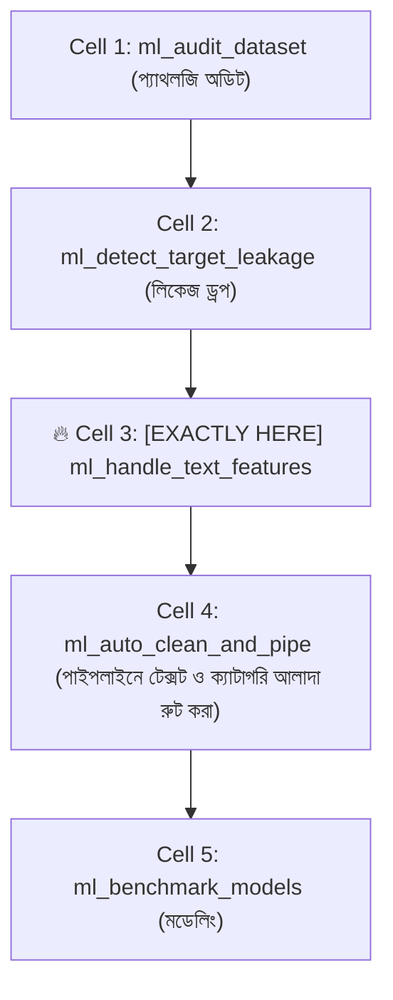

# ml_handle_text_features: Deep-Dive Architectural Guide & Reference

> **Tool Name:** `ml_handle_text_features`  
> **Module Source:** `src/ml_mcp/engine/text_handler.py` / `src/ml_mcp/tools.py`  
> **Class Implementation:** `TextFeatureHandler`  
> **Layer:** Phase 2: Feature Engineering & Preprocessing

---

## ১. মানুষের গল্পের মতো পেছনের ইতিহাস (The Human Story: "The High-Entropy Hash Trap")

মেশিন লার্নিংয়ে টেক্সট ডাটা প্রসেস করতে গিয়ে ইঞ্জিনিয়াররা সবচেয়ে অদ্ভুত এক ফাঁদে পড়ে।

বাস্তব জীবনের চিত্রটি দেখুন:
একটি ই-কমার্স বা ফিনটেক ডেটাসেটে ১৫টি কলাম আছে যার সবগুলোই পাইথনে `object` (বা স্ট্রিং) টাইপ:
- কিছু কলামে আছে মানুষের লেখা আসল টেক্সট: প্রডাক্টের নাম (*"Essence Mascara Lash Princess"*), ডেসক্রিপশন বা কাস্টমার রিভিউ।
- কিছু কলামে আছে ছোট লেবেল: `"active"`, `"pending"`।
- আর কিছু কলামে আছে মেশিনের তৈরি হেক্স হ্যাশ বা আইডি: `session_token` (`a1b2c3d4e5f6...`) বা `user_uuid` (`550e8400-e29b-41d4-a716-446655440000`)।

**অজ্ঞাত ডেভেলপাররা কী মারাত্মক ভুল করে?**  
তারা সব স্ট্রিং কলামকে একসাথে ধরে ন্যাচারাল ল্যাঙ্গুয়েজ ভেক্টরাইজার (যেমন: TF-IDF বা BERT)-এ পাঠিয়ে দেয়!

ফলাফল কী হয়?
1. **ভোকাবুলারি ব্লাস্ট ও র‍্যাম ক্র্যাশ (OOM Crash):** হেক্স কোড এবং UUID-এর মতো কোটি কোটি ইউনিক এলোমেলো ক্যারেক্টারকে সে "শব্দ" মনে করে ডিকশনারিতে ঢুকিয়ে ফেলে। ফলে কয়েক লক্ষ অর্থহীন কলাম তৈরি হয়ে সার্ভারের র‍্যাম সাথে সাথে ব্লাস্ট করে!
2. **ছোট ক্যাটাগরি নষ্ট হওয়া:** `"active"` বা `"pending"` ছিল সাধারণ ক্যাটাগরি, যেগুলোকে ওয়ান-হট এনকোডিং করার কথা ছিল। সেগুলোকেও টেক্সট মনে করে এনএলপিতে ফেলে দেওয়া হয়।

এই মারাত্মক বিভ্রান্তি দূর করতে সৃষ্টি হয়েছে **`ml_handle_text_features`**। এটি কোনো সাধারণ স্ক্রিপ্ট নয়—এটি একটি **ফরেনসিক টেক্সট ডিটেকটিভ**, যা হেক্স হ্যাশ ও আইডিগুলোকে আলাদা করে শুধুমাত্র মানুষের লেখা আসল ইংরেজি/প্রাকৃতিক বাক্যগুলোকে চিহ্নিত করে।

---

## ২. এটা আসলে কী কাজ করে? (Core Mission)

সহজ কথায়: **এটি ডেটাসেট স্ক্যান করে মেশিনের আইডি বনাম মানুষের ভাষার মধ্যে স্পষ্ট সীমারেখা টানে।**

এটি একটি সুনির্দিষ্ট ৩-ধাপের বৈজ্ঞানিক কাজ করে:
1. **হেক্স ও ইউইউআইডি ফিল্টারিং (Entropy Filter):** রেগুলার এক্সপ্রেশন দিয়ে ক্রিপ্টোগ্রাফিক হ্যাশ (`SHA-256`, `MD5`) ও UUID-4 শনাক্ত করে বাদ দেয়।
2. **প্রাকৃতিক বাক্য শনাক্তকরণ (Prose Detection):** গড় ক্যারেক্টার দৈর্ঘ্য ($\ge ৩০$) এবং গড় শব্দ সংখ্যা ($\ge ৩$) মেপে নিশ্চিত হয় যে এটি আসলেই মানুষের লেখা কোনো টাইটেল, রিভিউ বা ডেসক্রিপশন।
3. **সাবলিনিয়ার টিএফ-আইডিএফ রেকমেন্ডেশন:** প্রতিটি টেক্সট কলামের ইউনিক শব্দভাণ্ডার মেপে স্বয়ংক্রিয়ভাবে `tfidf_sublinear` স্ট্র্যাটেজি রেকমেন্ড করে (যাতে স্প্যাম শব্দ মডেলকে বিভ্রান্ত না করে)।

---

## ৩. নোটবুকের ঠিক কোন কোড সেলে এটি কাজ করবে? (Pipeline Placement)

এটি পাইপলাইনের ডাটা ক্লিনিংয়ের একদম অগ্রভাগে বসে।



### 🎯 সুনির্দিষ্ট নিয়ম:
> **এটি সবসময় Cell 2 (লিকেজ কলাম বাদ দেওয়ার পর) এবং Cell 4 (`ml_auto_clean_and_pipe` বানানোর ঠিক পূর্বে) বসবে।**

### কেন এখানে বসবে? (Engineering Reason)
কারণ `ml_auto_clean_and_pipe` তৈরি করার সময় আপনাকে জানতে হবে কোন কলামগুলোকে ওয়ান-হট/টার্গেট এনকোডারে পাঠাবেন, আর কোন কলামগুলোকে TF-IDF টেক্সট পাইপলাইনে পাঠাবেন। এই টুল যদি আগে থেকেই টেক্সট কলামগুলোকে চিনে আলাদা তালিকা না দেয়, তবে পাইপলাইন বিল্ডার সব স্ট্রিংকে সাধারণ ক্যাটাগরি ভেবে মেমোরি নষ্ট করে ফেলবে।

---

## ৪. প্যারামিটার পরিচিতি (The Exact Parameters)

টুলটির প্যারামিটার মাত্র ১টি এবং এটি চালানো সবচেয়ে সহজ:

| প্যারামিটার | টাইপ | রিকোয়ার্ড? | ডিফল্ট | বিবরণ |
| :--- | :---: | :---: | :---: | :--- |
| **`csv_path`** | `string` | **হ্যাঁ** | - | যে ডেটাসেটে টেক্সট ফিচার স্ক্যান চলবে তার ফাইল পাথ। |

---

## ৫. টুলের ভেতরের গভীর ইঞ্জিনিয়ারিং ফিচার (Internal Engine Secrets)

`TextFeatureHandler` ক্লাসের ভেতরের আর্কিটেকচারাল ফ্লো:

```mermaid
flowchart TD
    A["String / Object Columns"] --> B{"১. UUID & Hex Regex Check (first 20 rows)"}
    
    B -->|>50% Matches| C["🚫 Reject as Machine Hash / Identifier"]
    B -->|Passed| D{"২. Natural Language Prose Thresholds"}
    
    D -->|Avg Length >= 30 chars & Avg Words >= 3| E["✅ Approved Text Feature"]
    D -->|Failed (Short Label)| F["Categorical Feature (Handled by OneHot)"]
    
    E --> G["৩. Unique Vocabulary Estimation (Head 100)"]
    G --> H["TextFeatureReportDTO (Strategy: 'tfidf_sublinear')"]
```

### প্রধান ফিচারসমূহ:

#### ১. ক্রিপ্টোগ্রাফিক হ্যাশ ও UUID গার্ড (`is_hex_or_uuid`)
সোর্স কোডের এই রেগুলার এক্সপ্রেশনটি দেখুন:
```python
UUID_REGEX = re.compile(r"^[0-9a-fA-F]{8}-[0-9a-fA-F]{4}-[0-9a-fA-F]{4}-[0-9a-fA-F]{4}-[0-9a-fA-F]{12}$")
HEX_HASH_REGEX = re.compile(r"^[0-9a-fA-F]{24,64}$")
```
প্রথম ২০টি রোর মধ্যে ৫০%-এর বেশি যদি হ্যাশ বা UUID ফরম্যাট পায়, তবে টুলটি সেটিকে সাথে সাথে বাদ দেয়। ফলে মেমোরি ব্লাস্ট হওয়া থেকে সার্ভার বাঁচে।

#### ২. প্রস ও সেন্টেন্স রুল (`min_avg_char_length` & `min_avg_words`)
- **গড় ক্যারেক্টার দৈর্ঘ্য:** $\ge ৩০$ ক্যারেক্টার।
- **গড় শব্দ সংখ্যা:** $\ge ৩$ টি শব্দ।
- এর ফলে `"male"`, `"female"`, `"paid"`, `"unpaid"`-এর মতো ১-২ শব্দের ছোট ক্যাটাগরিগুলো ভুলবশত টেক্সট প্রসেসরে যায় না। শুধু প্রোডাক্ট টাইটেল বা রিভিউয়ের মতো আসল বাক্যগুলোই প্রবেশাধিকার পায়।

#### ৩. সাবলিনিয়ার টিএফ-আইডিএফ রেকমেন্ডেশন (`tfidf_sublinear`)
এটি সাধারণ TF (Term Frequency)-র বদলে $1 + \log(\text{TF})$ ফর্মুলা রেকমেন্ড করে। এর সুবিধা হলো: কোনো রিভিউতে কেউ যদি একই শব্দ ১০ বার রিপিট করে (যেমন: *"Good good good good"*), সাবলিনিয়ার স্কেলিং সেই শব্দের অতিরিক্ত প্রভাব কমিয়ে দিয়ে বাস্তব ভারসাম্য বজায় রাখে।

#### ৪. স্ট্রাকচার্ড DTO আউটপুট (`TextFeatureReportDTO`)
টুলটি রান শেষে এই ফরম্যাটে স্পষ্ট রিপোর্ট দেয়:
```json
{
  "text_columns": ["title", "description"],
  "avg_char_lengths": { "title": 32.4, "description": 142.8 },
  "unique_token_counts": { "title": 412, "description": 1850 },
  "recommended_strategy": "tfidf_sublinear"
}
```

---

## ৬. প্রোডাকশন ব্যবহারবিধি (Usage Example via MCP)

```json
{
  "csv_path": "e:/ML Testing/data/dataset.csv"
}
```

---

### এক লাইনে সারমর্ম:
`ml_handle_text_features` হলো আপনার ডেটার জন্য একটি **স্মার্ট এনএলপি ফিল্টার**—যা এলোমেলো মেশিন হ্যাশ আর ছোট ক্যাটাগরির ভিড় থেকে আসল মানুষের ভাষা ও বাক্যের কলামগুলোকে নিখুঁতভাবে উদ্ধার করে এনে মডেলকে ভাষা বোঝার ক্ষমতা দেয়!
