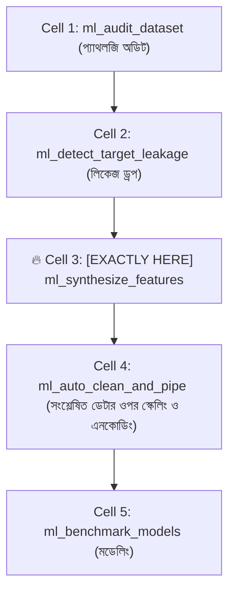

# ml_synthesize_features: Deep-Dive Architectural Guide & Reference

> **Tool Name:** `ml_synthesize_features`  
> **Module Source:** `src/ml_mcp/engine/feature_synthesizer.py` / `src/ml_mcp/tools.py`  
> **Class Implementation:** `RatioFeatureTransformer` & `CyclicalFeatureTransformer`  
> **Layer:** Phase 2: Feature Engineering & Preprocessing

---

## ১. মানুষের গল্পের মতো পেছনের ইতিহাস (The Human Story: "The Midnight Dilemma")

মেশিন লার্নিং অ্যালগরিদমগুলো আপাতদৃষ্টিতে খুব চালাক মনে হলেও গণিতের সাধারণ কিছু ধারণায় তারা ভীষণ বোকা।

বাস্তব জীবনের দুটি অদ্ভুত সমস্যা দেখুন:

#### সমস্যা ১: রাত ১১:৫৯ বনাম রাত ১২:০১ (The 23:59 vs 00:01 Midnight Problem)
রাইড শেয়ারিং (Uber/Pathao), ফুড ডেলিভারি বা ফ্রড ডিটেকশনের ক্ষেত্রে মধ্যরাতে সবচেয়ে বেশি অপরাধ বা অর্ডার ঘটে।
- ঘড়ির কাঁটায় রাত ১১:৫৯ মানে ঘণ্টা হিসেবে **`23`**।
- আর রাত ১২:০১ মানে ঘণ্টা হিসেবে **`0`**।
- একজন সাধারণ মানুষ জানে যে ২৩ আর ০ আসলে পরস্পর থেকে মাত্র **২ মিনিটের ব্যবধানে দাঁড়িয়ে আছে**।
- কিন্তু একটি মেশিন লার্নিং মডেল যখন সাধারণ সংখ্যা দেখে, সে মনে করে ২৩ এবং ০ হলো দুনিয়ার দুই বিপরীত প্রান্ত ($23 - 0 = 23$)! সে বুঝতেই পারে না যে ঘড়ির কাঁটা একটি গোল বৃত্ত (Cycle)।

#### সমস্যা ২: কাঁচা সংখ্যা বনাম ব্যবসায়িক অনুপাত (The Ratio Multiplier)
আপনার [dataset.csv](file:///e:/ML%20Testing/data/dataset.csv)-এর দিকে তাকান:
- কোনো প্রডাক্টের শুধু `price` ($100) বা শুধু `weight` (5 kg) দিয়ে কাস্টমারের কেনার সিদ্ধান্ত বোঝা যায় না।
- আসল সিদ্ধান্ত তৈরি হয় এদের অনুপাতে: **$\text{Price per Weight} = \frac{\text{price}}{\text{weight}} = \$20/\text{kg}$**।
- কিন্তু ডেটাতে কোনো প্রডাক্টের `weight = 0` পেলেই পাইথনে লাল কালিতে ক্র্যাশ করে: `ZeroDivisionError: division by zero`!

এই দুটি চিরন্তন গাণিতিক সীমাবদ্ধতা জয় করতেই সৃষ্টি হয়েছে **`ml_synthesize_features`**। এটি সময়ের গোলকধাঁধাঁকে বৃত্তাকার তরঙ্গে রূপান্তর করে এবং ০ দিয়ে ভাগ হওয়া ঠেকিয়ে নতুন শক্তিশালী সুপার-ফিচার সংশ্লেষণ করে।

---

## ২. এটা আসলে কী কাজ করে? (Core Mission)

সহজ কথায়: **এটি বিদ্যমান ডেটার ভেতর থেকে লুকানো সম্পর্ক (Ratios) এবং সময়ের বৃত্তাকার চক্র (Sine/Cosine Waves) তৈরি করে ডেটার শক্তি দ্বিগুণ করে দেয়।**

এটি একটি সুনির্দিষ্ট ৩-ধাপের গাণিতিক কাজ করে:
1. **বৃত্তাকার সময় প্রজেকশন (Cyclical Trigonometric Projection):** ২৪ ঘণ্টার সময় বা ১২ মাসের ক্যালেন্ডারকে সাধারণ সংখ্যা থেকে ত্রিকোণমিতিক **Sine ($\sin$) এবং Cosine ($\cos$)** তরঙ্গে রূপান্তর করে, যাতে রাত ১১:৫৯ এবং ১২:০১ গাণিতিকভাবে একদম কাছাকাছি চলে আসে।
2. **এপসাইলন সেফ ডিভিশন (Epsilon-Guarded Safe Division):** দুটি কলামের ভাগফল বের করার সময় হর (Denominator) যদি ০ বা ০-এর খুব কাছাকাছি হয়, সেটিতে একটি ক্ষুদ্র মান ($\epsilon = 10^{-6}$) যোগ করে এবং অসীম মানগুলোকে ক্লিয়ার করে নিরাপদে অনুপাত কলাম তৈরি করে।
3. **ফিচার সংশ্লেষণ:** মডেলের বোঝার সুবিধার্থে একক ফিচারের বদলে ক্রস-ফিচার ভ্যালু জেনারেট করে।

---

## ৩. নোটবুকের ঠিক কোন কোড সেলে এটি কাজ করবে? (Pipeline Placement)

এটি প্রিপ্রসেসিং পাইপলাইনের একদম শুরুতে বসে।



### 🎯 সুনির্দিষ্ট নিয়ম:
> **এটি সবসময় Cell 2 (লিকেজ কলাম বাদ দেওয়ার পর) এবং Cell 4 (`ml_auto_clean_and_pipe` চালানোর ঠিক আগে) বসবে।**

### কেন এখানে বসবে? (Engineering Reason)
কারণ নতুন তৈরি হওয়া সাইন/কস কলাম এবং রেশিও কলামগুলোও তো সংখ্যা! তাই এগুলো আগে তৈরি হতে হবে, যেন ঠিক পরের সেলে `ml_auto_clean_and_pipe` সেগুলোকে নিজের ভেতরে নিয়ে `RobustScaler` দিয়ে সুন্দরভাবে স্কেলিং করে নিতে পারে।

---

## ৪. প্যারামিটার পরিচিতি (The Exact Parameters)

টুলটির প্যারামিটার মাত্র ৩টি:

| প্যারামিটার | টাইপ | রিকোয়ার্ড? | ডিফল্ট | বিবরণ |
| :--- | :---: | :---: | :---: | :--- |
| **`csv_path`** | `string` | **হ্যাঁ** | - | যে ডেটাসেটে ফিচার সংশ্লেষণ হবে তার ফাইল পাথ। |
| **`time_column`** | `string` | না | `null` | যে কলামটিতে সময় বা পর্যায়ক্রমিক সাইকেল আছে (যেমন: `"hour"`, `"month"`). |
| **`period`** | `number` | না | `24.0` | চক্রের পূর্ণ পর্যায়কাল (যেমন: দিনের ঘণ্টার জন্য ২৪, সপ্তাহের জন্য ৭, মাসের জন্য ১২). |

---

## ৫. টুলের ভেতরের গভীর ইঞ্জিনিয়ারিং ফিচার (Internal Engine Secrets)

`RatioFeatureTransformer` & `CyclicalFeatureTransformer` ক্লাসের ভেতরের আর্কিটেকচারাল ফ্লো:

```mermaid
flowchart TD
    A["Raw Feature"] --> B{"ফিচার ক্যাটাগরি"}
    
    B -->|Time / Periodic Feature| C["১. Circular Projection:<br/>rad = 2*pi*t / period<br/>sin(rad) & cos(rad)"]
    B -->|Numeric Feature Pair (X1, X2)| D["২. Epsilon-Guarded Safe Ratio:<br/>safe_den = den + (den==0)*1e-6<br/>ratio = num / safe_den"]
    
    C --> E["np.nan_to_num (posinf=1e8, neginf=-1e8)"]
    D --> E
    E --> F["Synthesized Feature Matrix"]
```

### প্রধান ফিচারসমূহ:

#### ১. ট্রাইগোনোমেট্রিক সার্কুলার প্রজেকশন (`CyclicalFeatureTransformer`)
সোর্স কোডের এই গাণিতিক সূত্রটি দেখুন:
```python
radians = 2.0 * np.pi * series / float(period)
X_out[f"{col}_sin"] = np.sin(radians)
X_out[f"{col}_cos"] = np.cos(radians)
```
- যখন সময় রাত ২৩:০০, $\sin$ এবং $\cos$-এর মান যা হয়, রাত ০০:০০ সময়ে তা প্রায় সমান থাকে।
- এর ফলে একটি ২-মাত্রিক বৃত্তাকার স্থানাঙ্ক তৈরি হয়, যা মডেলকে সময়ের নিরবচ্ছিন্ন প্রবাহ বুঝতে সাহায্য করে।

#### ২. এপসাইলন জিরো-ডিভিশন শিল্ড (`RatioFeatureTransformer`)
```python
safe_den = np.where(np.abs(den) < self.epsilon, np.sign(den) * self.epsilon + (den == 0) * self.epsilon, den)
ratio_val = num / safe_den
```
যদি কোনো কলামের মান $০$ থাকে, এটি সেটিকে সাথে সাথে ক্ষুদ্রতম মান $\epsilon = 10^{-6}$ দিয়ে প্রতিস্থাপন করে ভাগ সম্পন্ন করে। ফলে সিস্টেমে কখনোই `ZeroDivisionError` আসতে পারে না।

#### ৩. ইনফিনিটি ক্লিপিং গার্ড (`np.nan_to_num`)
```python
ratio_val = np.nan_to_num(ratio_val, nan=0.0, posinf=1e8, neginf=-1e8)
```
ভাগ করার পর কোনো মান যদি মহাবিশ্বের সমান বিশাল হয়ে যায় ($+\infty$), এটি স্বয়ংক্রিয়ভাবে সেটিকে $10^8$-এ ক্লিপ করে দেয়, যাতে কোনো গ্রেডিয়েন্ট এক্সপ্লোশন (Gradient Explosion) না ঘটে।

---

## ৬. প্রোডাকশন ব্যবহারবিধি (Usage Example via MCP)

```json
{
  "csv_path": "e:/ML Testing/data/dataset.csv",
  "time_column": "hour",
  "period": 24.0
}
```

---

### এক লাইনে সারমর্ম:
`ml_synthesize_features` হলো আপনার ডেটার জন্য একটি **গাণিতিক অনুঘটক (Alchemist)**—যা ঘড়ির কাঁটার মতো সাইক্লিক সময়কে বৃত্তাকার তরঙ্গে এবং সাধারণ সংখ্যাগুলোকে ঝুঁকিমুক্ত রেশিওতে রূপান্তর করে অ্যালগরিদমকে বাস্তব দুনিয়ার লুকানো প্যাটার্ন দেখার চোখ উপহার দেয়!
