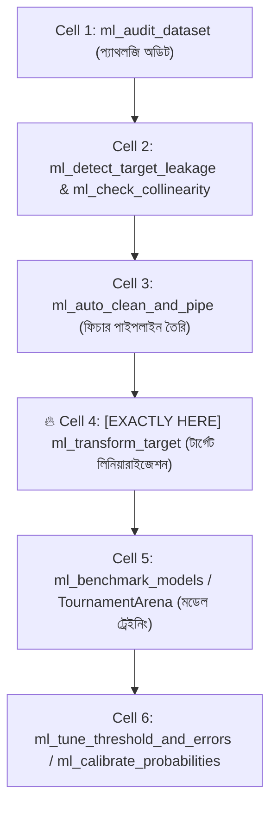
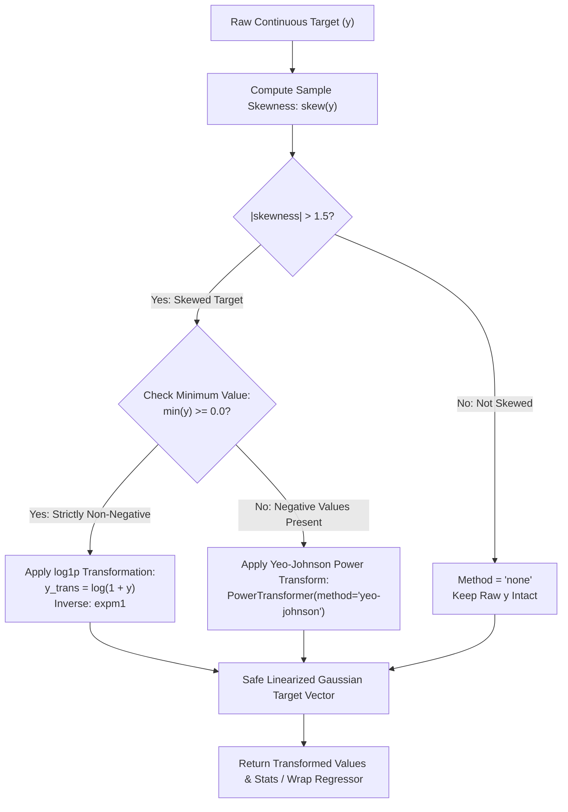

# ml_transform_target: Deep-Dive Architectural Guide & Reference

> **Tool Name:** `ml_transform_target`  
> **Module Source:** `src/ml_mcp/engine/target_transformer.py` / `src/ml_mcp/tools.py`  
> **Class Implementation:** `SkewedTargetTransformer`  
> **Layer:** Phase 2: Feature Engineering & Preprocessing

---

## ১. মানুষের গল্পের মতো পেছনের ইতিহাস (The Human Story: "The Curse of the Fat-Tailed Target")

বাস্তব জগতের ৯৫% রিগ্রেশন ডেটাসেটে টার্গেট ভ্যারিয়েবল (যেমন: বাড়ি বা গাড়ির দাম, কর্মচারীর বেতন, হাসপাতালের বিল, ইন্স্যুরেন্স ক্লেম, ই-কমার্স ট্রানজ্যাকশন) কখনো সুন্দর ঘণ্টার মতো স্বাভাবিক নরমাল ডিস্ট্রিবিউশন মেনে চলে না।

বাস্তব ডেটার চিত্রটি দেখুন:
- ৯৫% সাধারণ বাড়ি বিক্রি হয় ৫০ লাখ থেকে ১ কোটি টাকার মধ্যে।
- কিন্তু হাতে গোনা কয়েকটি আল্ট্রা-লাক্সারি পেন্টহাউস বা রাজপ্রাসাদ বিক্রি হয় ৫০ কোটি বা ১০০ কোটি টাকায়!

এর ফলে ডেটাসেটের টার্গেটে তৈরি হয় এক বিশাল **লম্বা ডানহাতি লেজ (Right-Skewed / Fat-Tailed Distribution)**।

### কাঁচা স্কিউড টার্গেটে রিগ্রেশন চালালে কী বিপর্যয় ঘটে?
1. **ক্ষতির রাজত্ব (Loss Domination by Outliers):** স্ট্যান্ডার্ড রিগ্রেশন অ্যালগরিদমগুলো Mean Squared Error ($MSE = (y - \hat{y})^2$) মিনিমাইজ করার চেষ্টা করে। একটি ৫০ কোটি টাকার বাড়ির প্রেডিকশনে সামান্য ১০% ভুলের পেনাল্টি ($\{5\text{ কোটি}\}^2 = 25\text{ কোটি}^2$) সাধারণ বাড়ির কোটি কোটি ভুলের সমান হয়ে যায়! ফলে মডেলটি সাধারণ ৯৫% কাস্টমারের ডেটা শেখা বাদ দিয়ে শুধু ঐ দুই-চারটি অতি-ধনী আউটলায়ারদের খুশি করতে ব্যস্ত হয়ে পড়ে।
2. **হেটারোস্কেডাস্টিসিটি (Heteroscedasticity):** টার্গেটের মান যত বড় হয়, ভুলের বিস্তার (Residual Variance) তত বিশালাকার ধারণ করে—যা ওএলএস, রিজ বা লিনিয়ার মডেলের ফান্ডামেন্টাল স্ট্যাটিস্টিক্যাল এজাম্পশন ভেঙে গুঁড়িয়ে দেয়।
3. **ঋণাত্মক প্রেডিকশনের উদ্ভট ফাঁদ (Negative Prediction Trap):** কোনো বাড়ির দাম বা বেতন কখনো ঋণাত্মক ($-10,000$) হতে পারে না। কিন্তু আন-ট্রান্সফর্মড লিনিয়ার মডেলগুলো এমন ঋণাত্মক সংখ্যা প্রেডিক্ট করে বসে!

### নোটবুকে ইঞ্জিনিয়াররা সাধারণত কী ভুল করে?
তারা তাড়াহুড়ো করে `np.log(y)` চালায়। কিন্তু প্রোডাকশনে গিয়ে তিনটি মারাত্মক গর্তে পড়ে:
- **গর্ত ১ ($y = 0$ ক্র্যাশ):** কোনো অর্ডারের দাম $0$ হলে $\log(0) = -\infty$ হয়ে সম্পূর্ণ মডেল পাইপলাইন ক্র্যাশ করে।
- **গর্ত ২ (নেগেটিভ ভ্যালু থাকলে NaN):** প্রফিট/লস বা তাপমাত্রার ডেটাতে ঋণাত্মক সংখ্যা থাকলে $\log(\text{negative})$ ক্র্যাশ করে `NaN` উপহার দেয় (কারণ লগারিদম নেগেটিভ সংখ্যার ওপর সংজ্ঞায়িত নয়)।
- **গর্ত ৩ (ইনভার্স ট্রান্সফর্মের স্মৃতিভ্রম):** টেস্ট সেটে মডেল লগ স্কেলে প্রেডিক্ট করে, কিন্তু ইঞ্জিনিয়ার সেটাকে এক্সপোনেনশিয়াল ইনভার্স ($e^{\hat{y}} - 1$) করতে ভুলে গিয়ে লগ-স্কেলের মান সরাসরি কাঁচা টাকার সাথে তুলনা করে সম্পূর্ণ ভুল বিজনেস মেট্রিক রিপোর্ট করে!

এই সমস্ত বিপর্যয় চিরতরে নির্মূল করতে তৈরি হয়েছে **`ml_transform_target`**।

---

## ২. এটা আসলে কী কাজ করে? (Core Mission)

সহজ কথায়: **এটি রিগ্রেশন টার্গেটের অতিরিক্ত স্কিউনেস বা বাঁকাভাব স্বয়ংক্রিয়ভাবে মেপে গাণিতিক পাওয়ার ট্রান্সফর্মেশন দিয়ে ডেটাকে ঘণ্টার মতো সোজা (Gaussian Normal) করে দেয়—নেগেটিভ সংখ্যার স্বয়ংক্রিয় প্রতিরক্ষাসহ।**

এটি একটি স্বয়ংক্রিয় ৩-ধাপের আর্কিটেকচারাল কাজ করে:
1. **ফিশার-পিয়ারসন স্কিউনেস স্ক্যান (Skewness Audit):** টার্গেট ভেক্টরের স্যাম্পল স্কিউনেস ($|\text{Skewness}|$) গণনা করে। স্কিউনেস যদি থ্রেশহোল্ড ($1.5$) অতিক্রম না করে, তবে টার্গেটকে বিকৃত না করে সম্পূর্ণ স্বাভাবিক রাখে।
2. **পজিটিভিটি ও সাইন গার্ড (Zero & Negative Scale Protection):** 
   - যদি ডেটার সর্বনিম্ন মান $\min(y) \ge 0.0$ হয়: এটি নিরাপদে `log1p` ($\log(1+y)$) প্রয়োগ করে, যা শূন্য ($0$) কেও নিরাপদে হ্যান্ডল করে।
   - যদি ডেটাতে নেগেটিভ ভ্যালু থাকে ($\\min(y) < 0.0$): লগারিদম নিষিদ্ধ করে এটি স্বয়ংক্রিয়ভাবে সর্বাধুনিক **Yeo-Johnson Power Transform** প্রয়োগ করে।
3. **এস্টিমেটর র‍্যাপার ও ট্রান্সফর্মেশন মোড (Zero-Inversion-Risk Wrapping):** 
   - স্ট্যান্ডঅ্যালোন টুল হিসেবে রূপান্তরিত ভ্যালু ও পরিসংখ্যান প্রদান করে।
   - ইঞ্জিনের ভেতরে এটি মডেলকে `TransformedTargetRegressor`-এ মুড়িয়ে দেয়, যাতে মডেল ট্রেনিং হয় লগ স্কেলে কিন্তু প্রেডিকশন আউটপুট দেওয়ার সময় স্বয়ংক্রিয়ভাবে আসল টাকার স্কেলে ফিরে আসে!

---

## ৩. নোটবুকের ঠিক কোন কোড সেলের পর এটি কাজ করবে? (Pipeline Placement)



### 🎯 সুনির্দিষ্ট নিয়ম:
> **এটি সবসময় Cell 3 (ফিচার ক্লিনিং ও পাইপলাইন তৈরি)-এর পরে এবং Cell 5 (মডেল বেঞ্চমার্কিং ও ট্রেনিং)-এর ঠিক আগে বসবে।**

### কেন এখানে বসবে? (Engineering Reason)
ইনপুট ফিচার $X$ এবং টার্গেট $y$ আলাদাভাবে প্রসেস হতে হয়। ফিচার পাইপলাইন ইনপুট ম্যাট্রিক্সকে প্রস্তুত করার পর, রিগ্রেশন অ্যালগরিদমগুলো চালানোর আগে টার্গেট ভেক্টর $y$-এর ডিস্ট্রিবিউশন ঠিক করা আবশ্যক, যাতে অপটিমাইজার কনভার্জেন্স দ্রুত হয় এবং মডেল আউটলায়ার দিয়ে বিভ্রান্ত না হয়।

---

## ৪. প্যারামিটার পরিচিতি (The Exact Parameters)

| প্যারামিটার | টাইপ | রিকোয়ার্ড? | ডিফল্ট | বিবরণ |
| :--- | :---: | :---: | :---: | :--- |
| **`csv_path`** | `string` | না | `None` | যে ডেটাসেট থেকে টার্গেট কলাম পড়া হবে তার পাথ। |
| **`target_column`** | `string` | না | `None` | যে কলামের স্কিউনেস রূপান্তর করতে হবে। |
| **`values`** | `list[float]` | না | `None` | সরাসরি সংখ্যার লিস্ট দিলে তা ট্রান্সফর্ম করা হবে (`csv_path` না থাকলে)। |
| **`skew_threshold`** | `float` | না | `1.5` | স্কিউনেস কাটঅফ (এর বেশি বাঁকা হলেই ট্রান্সফর্মেশন কার্যকর হয়)। |
| **`method`** | `string` | না | `"auto"` | `"auto"` (অটো-ডিটেকশন), `"log1p"` (লগ), অথবা `"yeo-johnson"` (পাওয়ার)। |

---

## ৫. টুলের অভ্যন্তরীণ আর্কিটেকচার ও ইঞ্জিন ফিচার (Internal Engine Mechanics)



### প্রধান ৩টি গাণিতিক ও ইঞ্জিন সুবিধা:

#### ১. ফিশার-পিয়ারসন স্কিউনেস কো-এফিশিয়েন্ট
ইঞ্জিনটি তৃতীয় সেন্ট্রাল মোমেন্ট ব্যবহার করে স্কিউনেসের দিক ও তীব্রতা পরিমাপ করে:
$$\text{Skewness} = \frac{m_3}{m_2^{3/2}} = \frac{\frac{1}{n} \sum_{i=1}^n (y_i - \bar{y})^3}{\left(\frac{1}{n} \sum_{i=1}^n (y_i - \bar{y})^2\right)^{3/2}}$$
- $\text{Skewness} > 0$: রাইট-স্কিউড (ডানহাতি লম্বা লেজ—অধিকাংশ বাড়ির দাম কম, কিছু আকাশচুম্বী)।
- $|\text{Skewness}| \le 1.5$: গ্রহণযোগ্য পরিসীমা—এখানে কৃত্রিমভাবে ট্রান্সফর্ম করলে ডেটা অহেতুক ডিস্টোর্ট হতে পারে, তাই ইঞ্জিন এটিকে অপরিবর্তিত রাখে।

#### ২. বক্স-কক্স (Box-Cox) বনাম ইয়েও-জনসন (Yeo-Johnson) গার্ড
ঐতিহ্যবাহী Box-Cox ট্রান্সফর্মেশন শুধুমাত্র কঠোরভাবে পজিটিভ সংখ্যার ($y > 0$) জন্য কাজ করে; শূন্য ($0$) বা ঋণাত্মক সংখ্যায় এটি মুখ থুবড়ে পড়ে।  
আমাদের ইঞ্জিন নেগেটিভ ভ্যালু দেখলেই স্বয়ংক্রিয়ভাবে আধুনিক **Yeo-Johnson** রূপান্তর গ্রহণ করে:
$$\psi(\lambda, y) = \begin{cases} \frac{(y + 1)^\lambda - 1}{\lambda} & \text{if } \lambda \neq 0, y \ge 0 \\[6pt] \log(y + 1) & \text{if } \lambda = 0, y \ge 0 \\[6pt] -\frac{(-y + 1)^{2 - \lambda} - 1}{2 - \lambda} & \text{if } \lambda \neq 2, y < 0 \\[6pt] -\log(-y + 1) & \text{if } \lambda = 2, y < 0 \end{cases}$$
এর ফলে ডেটাতে ঋণাত্মক ব্যালেন্স বা লস থাকলেও কোনো ম্যাথমেটিক্যাল এরর বা NaN তৈরি হয় না।

#### ৩. TransformedTargetRegressor লিকেজহীন সিলিং
যখন এই ট্রান্সফরমারটি `TournamentArena` বা মডেল ট্রেনিংয়ে যুক্ত হয়, এটি স্কাইকিট-লার্নের `TransformedTargetRegressor`-এর মাধ্যমে কাজ করে:
- **Fit সময়:** $y$-কে ট্রান্সফর্ম করে লিনিয়ার স্পেসে অপটিমাইজ করে।
- **Predict সময়:** ইনফারেন্সের পর স্বয়ংক্রিয়ভাবে `inverse_func` ($e^{\hat{y}} - 1$) চালিয়ে ফলাফল আসল এককে ফিরিয়ে দেয়। ফলে ডেভেলপারকে কখনো ম্যানুয়াল ইনভার্স ক্যালকুলেশন নিয়ে ভাবতে হয় না।

---

## ৬. প্রোডাকশন ব্যবহারবিধি (Usage Example via MCP)

### ইনপুট রিকোয়েস্ট:
```json
{
  "csv_path": "e:/ML Testing/data/dataset.csv",
  "target_column": "price",
  "skew_threshold": 1.5,
  "method": "auto"
}
```

### প্রত্যাশিত আউটপুট রেসপন্স:
```json
{
  "method": "log1p",
  "skewness": 3.8421,
  "is_skewed": true,
  "min_value": 0.0,
  "max_value": 15000000.0,
  "count": 21613,
  "transformed_values": [
    12.3098,
    13.1956,
    12.1007,
    11.9829
  ]
}
```

যেকোনো প্রোডাকশন রিগ্রেশন পাইপলাইনে মডেলের আর-স্কয়ার্ড ($R^2$) বাড়ানো, আউটলায়ারের অযাচিত প্রভাব কমানো এবং ঋণাত্মক প্রেডিকশন রোধ করতে এই টুলটি Phase 2-এর অপরিহার্য অস্ত্র।
