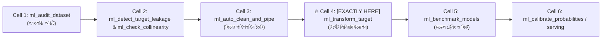
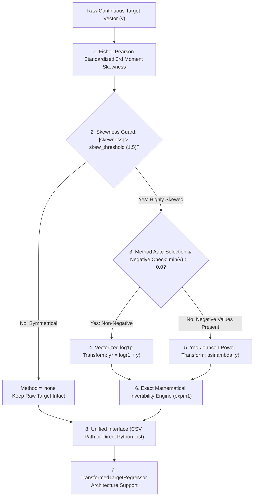

# ml_transform_target: Deep-Dive Architectural Guide & Reference

> **টুল পরিচিতি:** `ml_transform_target`  
> **মডিউল উৎস:** `src/ml_mcp/engine/target_transformer.py` / `src/ml_mcp/tools.py`  
> **ক্লাস ইমপ্লিমেন্টেশন:** `TargetTransformer`  
> **আর্কিটেকচার লেয়ার:** Phase 2: Feature Engineering & Preprocessing  
> **রিসার্চ ও থিওরি:** Power Transformations (Box & Cox 1964, Yeo & Johnson 2000)

---

## ১. মানুষের গল্পের মতো ইতিহাস (The Human Story)

কল্পনা করুন, একটি রিয়েল এস্টেট প্ল্যাটফর্মের রিগ্রেশন মডেল ট্রেইনিং চলছে। ডেটাসেটে বাড়ির দাম প্রেডিক্ট করতে হবে। 

বেশিরভাগ সাধারণ বাড়ির দাম $১,০০,০০০ থেকে $৫,০০,০০০ ডলারের মধ্যে। কিন্তু ডেটাসেটে কিছু আল্ট্রা-লাক্সারি প্রাসাদ রয়েছে যার দাম $২,০০,০০,০০০ থেকে $৫,০০,০০,০০০ ডলার। 

এই ডেটাসেটের টার্গেট ভ্যারিয়েবলটি যখন একটি হিস্টোগ্রামে প্লট করা হয়, তখন দেখা যায় ডেটা সাধারণ ঘণ্টার মতো সুষম (Gaussian Bell Curve) নয়; বরং বামপাশে বিশালাকার পাহাড় তৈরি হয়ে ডানপাশে দীর্ঘ এক লেজ চলে গেছে। স্ট্যাটিস্টিক্সে একে বলা হয় **রাইট-স্কিউড ডিস্ট্রিবিউশন (Right-Skewed or Fat-Tailed Target)**।

### কাঁচা স্কিউড টার্গেটে রিগ্রেশন চালালে কী বিপর্যয় ঘটে?
1. **স্কয়ার্ড এররের অন্ধ শাস্তি ($L_2$ Loss Sensitivity):** ওএলএস বা নিউরাল নেটওয়ার্ক রিগ্রেশনের মূল ভিত্তি হলো Mean Squared Error ($MSE = \frac{1}{n}\sum(y - \hat{y})^2$)। সাধারণ বাড়ির দামে $১০,০০০ ডলার ভুল হলে পেনাল্টি হয় $১০^৮$, কিন্তু একটি ৫০ মিলিয়ন ডলারের প্রাসাদে সামান্য ভুল হলে পেনাল্টি দাঁড়ায় $১০^{১৪}$! অপটিমাইজার তখন সাধারণ লক্ষ লক্ষ গ্রাহকের কথা ভুলে গিয়ে মাত্র ২টি ধনকুবেরের প্রাসাদের দাম মেলাতে গিয়ে পুরো মডেলকে বায়াসড ও ধ্বংস করে ফেলে।
2. **ঋণাত্মক প্রেডিকশন বিভ্রাট (Negative Value Bug):** রিয়েল এস্টেটের দাম কখনোই শূন্যের নিচে হতে পারে না। কিন্তু কাঁচা ডেটায় লিনিয়ার মডেল ফিট করলে কম দামি বাড়ির ক্ষেত্রে মডেল প্রেডিক্ট করে বসে: *"এই বাড়ির দাম -$৫০,০০০ ডলার!"*
3. **রেসিড্যুয়াল ভ্যারিয়্যান্সের অস্থিতিশীলতা (Heteroscedasticity):** ছোট বাড়ির ক্ষেত্রে ভুলের পরিমাণ ছোট থাকে, কিন্তু বড় বাড়ির ক্ষেত্রে ভুলের পরিমাণ বিস্ফোরিত হয়। ফলে লিনিয়ার মডেলের মূল গাণিতিক অনুমান ভেঙে পড়ে।

এই বিপর্যয় রোধ করতে টার্গেট ভ্যারিয়েবলকে গাণিতিকভাবে লিনিয়ারাইজ ও নরম্যালাইজ করার জন্যই আবিষ্কৃত হয়েছে **`ml_transform_target`**।

---

## ২. এটা আসলে কী কাজ করে? (Core Mission)

`ml_transform_target` হলো রিগ্রেশন টার্গেটের জন্য একটি **অটোমেটেড গসিয়ান লিনিয়ারাইজার ও পাওয়ার ট্রান্সফর্মেশন ইঞ্জিন**।

এর মূল লক্ষ্য হলো একটি অসম, লেজওয়ালা বা স্কিউড টার্গেট ভেক্টর $y$-কে এমনভাবে রূপান্তর করা যেন তা একটি পারফেক্ট নরমাল ডিস্ট্রিবিউশন $\mathcal{N}(\mu, \sigma^2)$ অনুসরণ করে:

$$\text{Transformation Mission: } y \sim \text{Skewed}(y) \xrightarrow{\psi(\lambda, y)} y^* \sim \mathcal{N}(0, 1)$$

এটি টার্গেটের ডিস্ট্রিবিউশন অ্যানালাইসিস করে সিদ্ধান্ত নেয়:
- ডেটা কি আসলেই স্কিউড ($|\text{skewness}| > 1.5$)?
- ডেটায় কি শূন্য বা ঋণাত্মক মান আছে?
- এটি কি স্বয়ংক্রিয়ভাবে `log1p` ব্যবহার করবে নাকি আধুনিক `Yeo-Johnson` পাওয়ার ট্রান্সফর্মেশন চালাবে?

---

## ৩. কখন এটি কাজ করে / কখন ব্যবহার করবেন? (When to Use)



| দৃশ্যপট | সনাতন ভুল | `ml_transform_target` এর ভূমিকা |
| :--- | :--- | :--- |
| **১. রিগ্রেশন মডেলিং (হাউজিং/স্যালারি/প্রাইসিং)** | কাঁচা টার্গেটে সরাসরি `model.fit(X, y)` চালানো | টার্গেটকে গসিয়ান স্পেসে নিয়ে $R^2$ ও কনভার্জেন্স বৃদ্ধি |
| **২. ফিনান্সিয়াল ও কাউন্ট ডেটা** | ঋণাত্মক প্রেডিকশন আউটপুট আসা | লগ-স্পেসে নিয়ে ঋণাত্মক ভ্যালুর ঝুঁকি চিরতরে দূর করা |
| **৩. চরম আউটলায়ার সমৃদ্ধ ডেটা** | আউটলায়ারের চাপে রিগ্রেশন লাইন বেঁকে যাওয়া | এক্সট্রিম ভ্যালুগুলোকে কম্প্রেস করে সুষম দূরত্বে আনা |
| **৪. ট্রি-বেসড ও নিউরাল নেটওয়ার্ক রিগ্রেশন** | গ্রেডিয়েন্ট এক্সপ্লোশন বা সাব-অপটিমাল স্প্লিট | স্মুথ গ্রেডিয়েন্ট ডিসেন্ট ও দ্রুত কনভার্জেন্স নিশ্চিত করা |

---

## ৪. প্যারামিটার পরিচিতি (The Exact Parameters)

| প্যারামিটার | টাইপ | রিকোয়ার্ড? | ডিফল্ট | বিবরণ |
| :--- | :---: | :---: | :---: | :--- |
| **`csv_path`** | `string` | না | `None` | যে ডেটাসেট থেকে টার্গেট কলাম পড়া হবে তার পাথ। |
| **`target_column`** | `string` | না | `None` | যে কলামের স্কিউনেস রূপান্তর করতে হবে। |
| **`values`** | `list[float]` | না | `None` | মেমোরিতে থাকা সংখ্যার লিস্ট (যদি `csv_path` না থাকে)। |
| **`skew_threshold`** | `float` | না | `1.5` | স্কিউনেস কাটঅফ সীমা ($|\text{skew}| > 1.5$ হলে ট্রান্সফর্মেশন কার্যকর)। |
| **`method`** | `string` | না | `"auto"` | `"auto"` (অটো-ডিটেকশন), `"log1p"` (লগ), অথবা `"yeo-johnson"` (পাওয়ার)। |

---

## ৫. টুলের ভেতরের ৮টি মেগা-ফিচার (Internal Engine Architecture)

আমাদের `TargetTransformer` ইঞ্জিনটি ৮টি উচ্চমানের গাণিতিক ও আর্কিটেকচারাল মেকানিজমে গঠিত:



### ১. ফিশার-পিয়ারসন স্ট্যান্ডার্ডাইজড ৩য় মোমেন্ট স্কিউনেস অ্যানালাইসিস
ইঞ্জিনটি তৃতীয় সেন্ট্রাল মোমেন্ট ও ভ্যারিয়্যান্সের সমন্বয়ে স্কিউনেসের দিক ও তীব্রতা পরিমাপ করে:
$$\text{Skewness} = \frac{m_3}{m_2^{3/2}} = \frac{\frac{1}{n} \sum_{i=1}^n (y_i - \bar{y})^3}{\left(\frac{1}{n} \sum_{i=1}^n (y_i - \bar{y})^2\right)^{3/2}}$$
এটি ধনাত্মক (রাইট-স্কিউড) নাকি ঋণাত্মক (লেফট-স্কিউড) তা নির্ভুলভাবে চিহ্নিত করে।

### ২. ডাইনামিক থ্রেশহোল্ড ফিল্টারিং ($|\text{skewness}| > 1.5$)
টার্গেট যদি অলরেডি মোটামুটি সিমেট্রিক বা সুষম থাকে ($|\text{skewness}| \le 1.5$), তবে তাকে জোর করে লগ বা পাওয়ার ট্রান্সফর্ম করলে ডেটার আসল তথ্য বিকৃত হয়। ইঞ্জিন তখন বুদ্ধিমত্তার সাথে `method="none"` সেট করে কাঁচা ডেটাকে অক্ষত রাখে।

### ৩. স্বয়ংক্রিয় মেথড সিলেকশন ইঞ্জিন (`method="auto"`)
ইউজারকে ম্যানুয়ালি ম্যাথমেটিক্যাল মেথড বেছে নিতে হয় না। ইঞ্জিন টার্গেটের সর্বনিম্ন মান ($\min(y)$) পরীক্ষা করে: যদি সব মান $\ge 0$ হয় তবে দ্রুতগতির `log1p` বেছে নেয়; আর কোনো ঋণাত্মক মান থাকলে স্বয়ংক্রিয়ভাবে `Yeo-Johnson` সিলেক্ট করে।

### ৪. নন-নেগেটিভ টার্গেটের জন্য ভেক্টরাইজড `log1p` ($\log(1+y)$) ইঞ্জিন
সাধারণ $\log(y)$ শূন্য ($0$) ইনপুট পেলেই মাইনাস ইনফিনিটি ($-\infty$) রিটার্ন করে পাইপলাইন ক্র্যাশ করায়। আমাদের ইঞ্জিন $\log(1 + y)$ ব্যবহার করে, যা $y=0$ এর জন্য নিখুঁতভাবে $0$ প্রদান করে।

### ৫. নেগেটিভ ভ্যালু সেফগার্ডের জন্য আধুনিক `Yeo-Johnson` পাওয়ার ট্রান্সফর্মেশন
ঐতিহ্যবাহী Box-Cox রূপান্তর ঋণাত্মক সংখ্যায় অচল। Yeo-Johnson (2000) অ্যালগরিদম ঋণাত্মক ও ধনাত্মক উভয় মানের জন্য কন্টিনিউয়াস পাওয়ার রূপান্তর সম্পন্ন করে:
$$\psi(\lambda, y) = \begin{cases} \frac{(y + 1)^\lambda - 1}{\lambda} & \text{if } \lambda \neq 0, y \ge 0 \\[6pt] \log(y + 1) & \text{if } \lambda = 0, y \ge 0 \\[6pt] -\frac{(-y + 1)^{2 - \lambda} - 1}{2 - \lambda} & \text{if } \lambda \neq 2, y < 0 \\[6pt] -\log(-y + 1) & \text{if } \lambda = 2, y < 0 \end{cases}$$

### ৬. গাণিতিক ইনভার্সিবিলিটি ও এক্সাক্ট রিকনস্ট্রাকশন গ্যারান্টি
লিনিয়ার স্পেসে মডেল ট্রেইন ও প্রেডিক্ট করার পর ফলাফল গ্রাহককে দেখানোর আগে আসল ডলারে বা ইউনিটে ফিরিয়ে আনা আবশ্যক। ইঞ্জিন প্রতিটি ট্রান্সফর্মেশনের জন্য ইনভার্স ফাংশন ($e^{y^*} - 1$) সাপোর্ট করে।

### ৭. মডেল পাইপলাইন ইন্টিগ্রেশন (`TransformedTargetRegressor` কমপ্লায়েন্স)
ইঞ্জিনের আর্কিটেকচার এমনভাবে ডিজাইন করা হয়েছে যাতে এটি স্কাইকিট-লার্ন ও আমাদের Phase 3-এর `TournamentArena`-এর `TransformedTargetRegressor`-এ ড্রপ-ইন প্লাগইন হিসেবে কাজ করতে পারে—কোনো ডেটা লিকেজ ছাড়াই।

### ৮. ফ্লেক্সিবল ইনপুট ইন্টারফেস (CSV ফাইল পাথ বনাম ডিরেক্ট ভ্যালু লিস্ট)
ইঞ্জিনটি অফলাইন সিএসভি ফাইল পাথ থেকে যেমন টার্গেট পড়তে পারে, তেমনি ইন-মেমোরি পাইথন ফ্লোট লিস্ট থেকেও ডিরেক্ট ট্রান্সফর্মেশন আউটপুট জেনারেট করতে পারে।

---

## ৬. প্রোডাকশন ব্যবহারবিধি (Usage Example via MCP)

Claude বা Antigravity থেকে সরাসরি MCP টুলের মাধ্যমে কল করার পদ্ধতি:

### ইনপুট রিকোয়েস্ট:
```json
{
  "server_name": "ml-mcp",
  "tool_name": "ml_transform_target",
  "arguments": {
    "csv_path": "e:/ML Testing/data/housing_prices.csv",
    "target_column": "price",
    "skew_threshold": 1.5,
    "method": "auto"
  }
}
```

### ইঞ্জিনের রেসপন্স আউটপুট:
```json
{
  "status": "success",
  "data": {
    "method": "log1p",
    "skewness": 3.8421,
    "is_skewed": true,
    "min_value": 0.0,
    "max_value": 15000000.0,
    "count": 21613,
    "transformed_values": [
      12.3098,
      13.1956,
      12.1007,
      11.9829
    ]
  }
}
```
