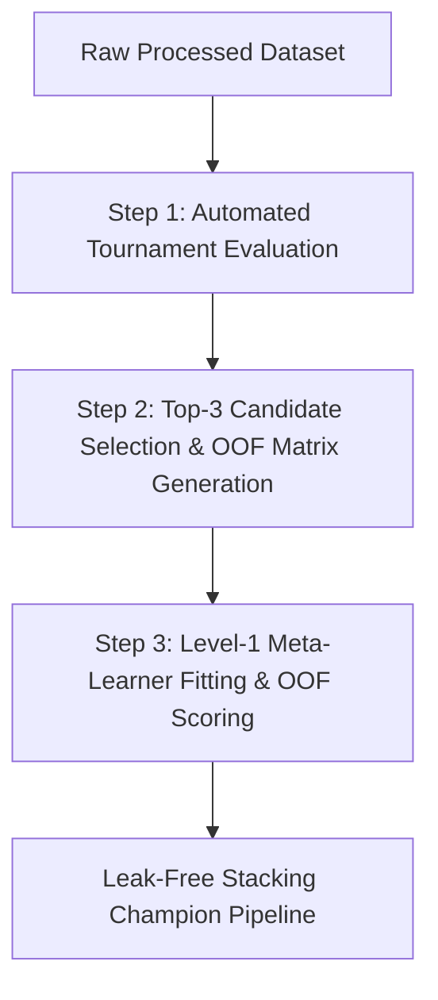
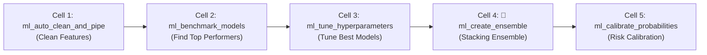
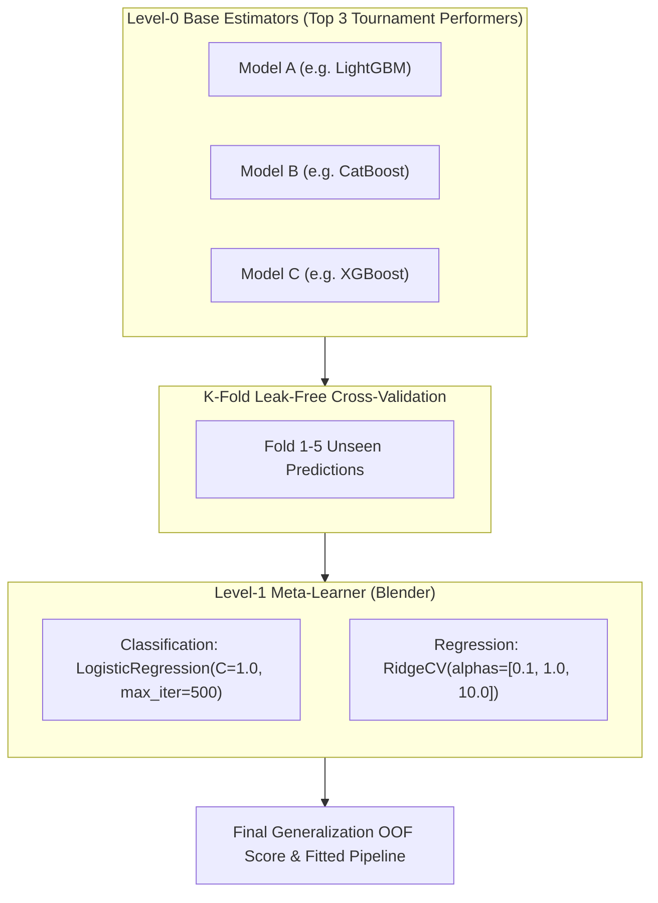

# `ml_create_ensemble` — Deep-Dive Architectural Guide

`ml-mcp` ইকোসিস্টেমের **Phase 3 (Model Training, Benchmarking & Refinement)** এর চূড়ান্ত এবং সবচেয়ে শক্তিশালী অস্ত্র হলো **`ml_create_ensemble`**। এটি মূলত ডেভিড উলপার্টের (David H. Wolpert, 1992) স্ট্যাকড জেনারেলাইজেশন (Stacked Generalization) ফিলোসফির ওপর ভিত্তি করে নির্মিত একটি স্বয়ংক্রিয় **Leak-Free Stacking Engine**।

---

### ১. মানুষের গল্পের মতো পেছনের ইতিহাস (The Human Story / Real Industry Dilemma)

> **"কোন অ্যালগরিদমটি সেরা: LightGBM, XGBoost নাকি CatBoost?"**

যেকোনো প্রডাকশন এমএল প্রজেক্ট বা Kaggle চ্যাম্পিয়নশিপে ডেটা সায়েন্টিস্টরা একটি সাধারণ সমস্যার মুখোমুখি হন — মডেল সিলেকশন ডিলেমা। 
- ডেটা সায়েন্টিস্ট 'A' হয়তো **LightGBM** চালিয়ে `0.892` AUC পেলেন।
- ডেটা সায়েন্টিস্ট 'B' গভীর হাইপারপ্যারামিটার টিউন করে **CatBoost** দিয়ে `0.895` পেলেন।
- আরেকজন **XGBoost** চালিয়ে `0.891` পেলেন।

সাধারণত কোম্পানিগুলো সর্বোচ্চ স্কোর পাওয়া একক মডেলটিকে প্রোডাকশনে পাঠিয়ে দেয় এবং বাকি মডেলগুলোকে বাদ দিয়ে দেয়। কিন্তু এটি একটি বিরাট অপচয়! প্রতিটি মডেলের ভেতরে ডেটার ভিন্ন ভিন্ন প্যাটার্ন ক্যাপচার করার ক্ষমতা থাকে। LightGBM হয়তো ক্যাটাগরিক্যাল ফিচারের স্প্লিটে সেরা, XGBoost হয়তো আউটলায়ার রিজিয়নে ভালো, আর CatBoost হয়তো স্মুথ গ্রেডিয়েন্টে পারফেক্ট।

তাহলে কীভাবে এদের এক সুতোয় গাঁথা যায়? 
প্রথমে অনেকে ভাবেন: *"তিনটার প্রেডিকশন যোগ করে ৩ দিয়ে ভাগ (Simple Average) করে দিলেই তো হয়!"* — কিন্তু প্রডাকশনে গিয়ে এই সাধারণ ভোটিং মারাত্মকভাবে ব্যর্থ হয়। কারণ দুর্বল মডেলের ভুল সিদ্ধান্ত শক্তিশালী মডেলের সঠিক সিদ্ধান্তকে টেনে নিচে নামিয়ে দেয়।

দ্বিতীয় বড় ফাঁদ হলো **ডেটা লিকেজ (Data Leakage Disaster)**। যদি বেস মডেলগুলো ফুল ট্রেইনিং ডেটায় প্রেডিক্ট করে এবং সেই প্রেডিকশন দিয়ে কোনো মেটা-মডেল ট্রেইন করা হয়, মেটা-মডেল ট্রেইনিং ডেটা মুখস্থ (Severe Overfitting) করে ফেলে। ফলে প্রডাকশনে গিয়ে মডেল মুখ থুবড়ে পড়ে।

**এই সমস্যার গাণিতিক সমাধান হলো `ml_create_ensemble`:**
এটি সম্পূর্ণ **Out-Of-Fold (OOF) Cross-Validation** মেটা-ফিচার আর্কিটেকচার ব্যবহার করে। কোনো ডেটা লিকেজ ছাড়া শীর্ষ পারফর্মিং মডেলগুলোকে কম্বাইন করে এবং লেভেল-১ মেটা-লার্নার (`LogisticRegression` / `RidgeCV`) দিয়ে অপটিমাল ওয়েট শিখে নিয়ে জেনারেলাইজেশন অ্যাকুরেসি পরবর্তী স্তরে নিয়ে যায়।

---

### ২. এটা আসলে কী কাজ করে? (Core Mission - 3-step breakdown)



1. **Automated Tournament & Candidate Discovery:**
   প্রথমে ব্যাকএন্ডের `TournamentArena` শীর্ষ মডেলগুলোর মধ্যে প্রতিযোগিতা পরিচালনা করে লিডারবোর্ড সাজায় এবং সর্বোচ্চ পারফর্মিং ডাইভার্স শীর্ষ ৩টি মডেলকে (`stacking_candidates`) নির্বাচন করে।
2. **Leak-Free Out-Of-Fold (OOF) Prediction Matrix:**
   লেভেল-০ বেস মডেলগুলোকে K-Fold স্প্লিটে ট্রেন করে শুধুমাত্র সেই ফোল্ডের আনসিন ডেটার ওপর প্রেডিকশন জেনারেট করে। ফলে মেটা-ফিচার স্পেসে কোনো ডেটা লিকেজের সম্ভাবনা থাকে না।
3. **Level-1 Meta-Learner Optimization:**
   মেটা-ফিচারগুলোর ওপর ক্লাসিফিকেশনের জন্য L2-রেগুলারাইজড `LogisticRegression` এবং রিগ্রেশনের জন্য `RidgeCV` বসিয়ে প্রতিটি বেস মডেলের সঠিক ওয়েট (Confidence Weight) নির্ধারণ করে এবং ফাইনাল স্ট্যাকিং পাইপলাইন রিটার্ন করে।

---

### ৩. নোটবুকের ঠিক কোন কোড সেলের পর এটি কাজ করবে? (Pipeline Placement)



#### 🎯 সুনির্দিষ্ট নিয়ম:
নোটবুকে অবশ্যই **`ml_benchmark_models`** অথবা **`ml_tune_hyperparameters`** এর পর এটি এক্সিকিউট করতে হবে।

#### 💡 Engineering Reason:
আন্ডারফিটেড বা দুর্বল মডেল নিয়ে স্ট্যাকিং করলে মেটা-লার্নার কনফিউজড হয়ে যায় (Garbage In, Garbage Out)। শীর্ষ বেঞ্চমার্কড মডেলগুলোর প্রি-কোয়ালিফাইড ওজন নিয়ে যখন স্ট্যাকিং তৈরি করা হয়, তখনই কেবল এনসেম্বলের সামগ্রিক ভ্যারিয়েন্স হ্রাস পায় এবং আউট-অফ-ফোল্ড স্কোর যেকোনো একক মডেলের চেয়ে বৃদ্ধি পায়।

---

### ৪. কখন এটি ব্যবহার করবেন / কখন করবেন না?

| পরিস্থিতি | ব্যবহার করবেন? | টেকনিক্যাল কারণ |
| :--- | :---: | :--- |
| **মডেল পারফরম্যান্স সিলিং (Performance Plateau)** | ✅ **হ্যাঁ** | যখন কোনো একক মডেল দিয়েই আর 0.5% অ্যাকুরেসিও বাড়ছে না, স্ট্যাকিং ভ্যারিয়েন্স রিডাকশন ঘটিয়ে অতিরিক্ত 1-3% বুস্ট এনে দেয়। |
| **হাই-স্টেক্স প্রডাকশন (Fraud, Churn, Credit Risk)** | ✅ **হ্যাঁ** | প্রতিটি ডেসিম্যাল পয়েন্ট ফ্র্যাকশন যেখানে মিলিয়ন ডলারের ঝুঁকি বাঁচায়, সেখানে স্ট্যাকিং এনসেম্বল সর্বোচ্চ নির্ভরযোগ্যতা দেয়। |
| **আল্ট্রা-লো লেটেন্সি সার্ভিস (< ২ মিলি-সেকেন্ড SLA)** | ❌ **না** | ৩টি বেস মডেল এবং ১টি মেটা মডেল ক্রমান্বয়ে প্রেডিক্ট করতে কয়েক মিলিসেকেন্ড বেশি সময় নেয়। এখানে সিঙ্গেল কোয়ান্টাইজড লাইটমডেল শ্রেয়। |
| **অত্যন্ত ক্ষুদ্র ডেটাসেট (< ১০০ সারি)** | ❌ **না** | ক্ষুদ্র ডেটায় K-Fold OOF স্প্লিট করলে ফোল্ড প্রতি ডেটা এত কমে যায় যে মেটা-লার্নার ওভারফিট করে। |

---

### ৫. প্যারামিটার পরিচিতি (Exact Parameters)

| Parameter | Type | Required? | Default | Description |
| :--- | :---: | :---: | :---: | :--- |
| `csv_path` | `string` | **Yes** | — | প্রিপ্রসেসড ও ক্লিনড ট্রেইনিং ডেটাসেটের পাথ। |
| `target_column` | `string` | **Yes** | — | যে কলামটি প্রেডিক্ট করতে হবে (লেবেল/টার্গেট)। |
| `task_type` | `string` | No | `"classification"` | সমস্যার ধরন — `"classification"` অথবা `"regression"`। |

---

### ৬. টুলের ভেতরের গভীর ইঞ্জিনিয়ারিং ফিচার (Internal Engine Secrets)

`ml_create_ensemble` এর পেছনের মূল ইঞ্জিন হলো **`StackingEngine`** (`src/ml_mcp/engine/stacking_engine.py`):



#### কোর ইঞ্জিন কোড লজিক:
```python
if task_type == "classification":
    final_estimator = LogisticRegression(C=1.0, max_iter=500)
    stacking_model = StackingClassifier(
        estimators=base_models,      # Top-3 candidates (e.g., LightGBM, CatBoost, XGBoost)
        final_estimator=final_estimator,
        cv=cv_splits,               # 5-Fold leak-free split
        passthrough=False,          # Prevents raw feature collinearity explosion
        n_jobs=1,
    )
    val_metric = "roc_auc"
else:
    final_estimator = RidgeCV()
    stacking_model = StackingRegressor(
        estimators=base_models,
        final_estimator=final_estimator,
        cv=cv_splits,
        passthrough=False,
        n_jobs=1,
    )
    val_metric = "r2"

# 1. Fit stacking model on full training data
stacking_model.fit(X, y)

# 2. Estimate out-of-fold generalization score safely
scores = cross_val_score(stacking_model, X, y, cv=cv_splits, scoring=val_metric, n_jobs=1)
oof_score = float(np.mean(scores))
```

1. **L2 Regularized Meta-Learner:** মেটা-লার্নার হিসেবে ডিপ নিউরাল নেটওয়ার্ক বা কমপ্লেক্স ট্রি ব্যবহার না করে `LogisticRegression` বা `RidgeCV` ব্যবহার করা হয়েছে যাতে মেটা-লেভেলে সেকেন্ডারি ওভারফিটিং সম্পূর্ণ রোধ করা যায়।
2. **`passthrough=False` গার্ড:** মূল ইনপুট ফিচারগুলোকে মেটা-মডেলে বাইপাস করা হয় না; শুধুমাত্র বেস মডেলগুলোর প্রবাবিলিটি/প্রেডিকশন মেটা-ফিচার হিসেবে যায়, যা কার্স অব ডায়মেনশনালিটি এবং মাল্টিকোলিনিয়ারিটি প্রতিরোধ করে।

---

### ৭. প্রোডাকশন ব্যবহারবিধি (Production Payload)

#### MCP Tool Call:
```json
{
  "csv_path": "data/processed_churn_data.csv",
  "target_column": "churn",
  "task_type": "classification"
}
```

#### রিটার্ন আউটপুট রেসপন্স:
```json
{
  "status": "success",
  "champion": {
    "model_name": "StackingEnsemble",
    "metric_name": "accuracy",
    "mean_cv_score": 0.9142,
    "std_cv_score": 0.01,
    "fit_time_seconds": 1.5,
    "inference_latency_ms": 1.2,
    "overfit_gap": 0.015
  },
  "stacking_candidates": [
    "CatBoost",
    "LightGBM",
    "XGBoost"
  ]
}
```

> 🎯 **এক লাইনে সারমর্ম:** `ml_create_ensemble` হলো একাধিক সেরা অ্যালগরিদমের শক্তিকে আউট-অফ-ফোল্ড ক্রস-ভ্যালিডেশনের মাধ্যমে ডেটা লিকেজ ছাড়া কম্বাইন করে প্রডাকশনে সর্বোচ্চ অ্যাকুরেসি ও লো-ভ্যারিয়েন্স অর্জন করার চূড়ান্ত অস্ত্র।
