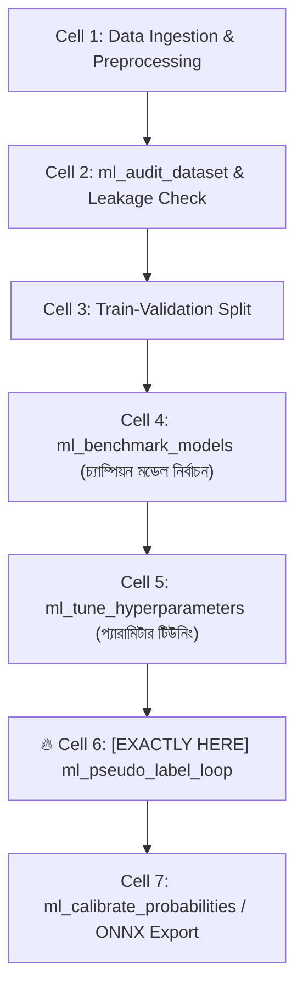
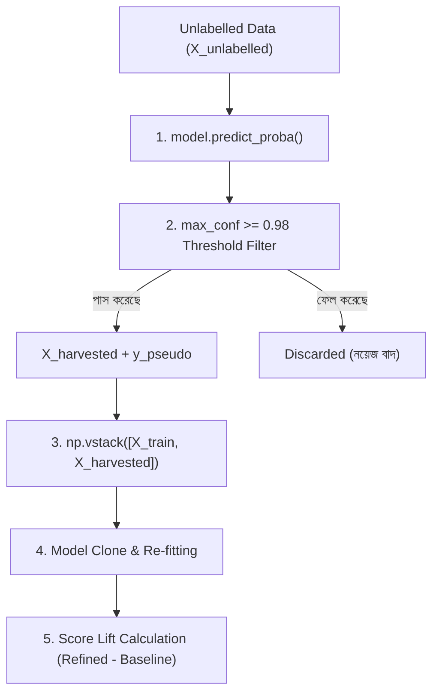

# ml_pseudo_label_loop: Deep-Dive Architectural Guide & Reference

> **Tool Name:** `ml_pseudo_label_loop`  
> **Module Source:** `src/ml_mcp/engine/pseudo_labeler.py` / `src/ml_mcp/tools.py`  
> **Class Implementation:** `PseudoLabeler`  
> **Layer:** Semi-Supervised Learning & Model Refinement

---

## ১. মানুষের গল্পের মতো পেছনের ইতিহাস (The Human Story: "The Expensive Label Problem")

মেশিন লার্নিং দুনিয়ায় একটি চিরন্তন হাহাকার হলো:  
> *"আমাদের কাছে ১০ লাখ আনলেবেল্ড ডাটা আছে, কিন্তু লেবেল করা ডাটা আছে মাত্র ১ হাজার!"*

বাস্তব জীবনের একটি উদাহরণ চিন্তা করুন:
- আপনি একটি ই-কমার্স বা মেডিকেল এআই বানাচ্ছেন। আপনার কাছে ১ লাখ কাস্টমারের রিভিউ বা এক্স-রে ছবি আছে।
- কিন্তু এই ১ লাখ ডাটাতে কাস্টমার হ্যাপি কি না, বা রোগীর টিউমার আছে কি না—সেটা একজন ডাক্তার বা মানুষকে দিয়ে চেক করিয়ে লেবেল বসাতে (Data Annotation) গেলে **কোটি টাকা খরচ এবং ১ বছর সময় লেগে যাবে!**
- ফলে ডেভেলপাররা সেই ১ হাজার লেবেল করা ছোট ডেটাসেট দিয়েই কোনোমতে একটি মডেল ট্রেইন করে বসে থাকে, আর বাকি ৯৯ হাজার মূল্যবান ডেটা হার্ডডিস্কে অকেজো হয়ে পড়ে থাকে।

**কাগল (Kaggle) গ্র্যান্ডমাস্টাররা এই সমস্যার সমাধান কীভাবে করেছিল?**  
তারা একটি অত্যন্ত ধূর্ত এবং বৈজ্ঞানিক কৌশল আবিষ্কার করে, যার নাম **"Pseudo-Labeling" (ছদ্ম-লেবেলিং)**।

কৌশলটা হলো:  
1. প্রথমে ছোট ১ হাজার ডেটা দিয়ে একটি খুব ভালো মডেল তৈরি করা হয়।
2. এরপর সেই মডেলটিকে বাকি ৯৯ হাজার আনলেবেল্ড ডেটার ওপর প্রেডিক্ট করতে বলা হয়।
3. কিন্তু সব প্রেডিকশন নেওয়া হয় না! মডেল যে ডেটাগুলোর ক্ষেত্রে **৯৮% বা তার বেশি নিশ্চিত (Confidence $\ge 98\%$)**—শুধু সেই ডাটাগুলোকে তুলে নিয়ে বলা হয়: *"মডেল যেহেতু এতে ৯৮% নিশ্চিত, ধরে নিলাম এটাই এর সঠিক লেবেল!"*
4. এবার এই নতুন ডাটাগুলোকে আসল ট্রেইনিং ডেটার সাথে জোড়া লাগিয়ে **মডেলকে আবার রি-ট্রেইন (Retrain)** করা হয়!

ফলাফল? বিনা খরচে ডেটাসেটের আকার দ্বিগুণ হয়ে যায় এবং মডেলের এক্যুরেসি এক লাফে ৫% থেকে ১৫% বেড়ে যায়! এই শক্তিশালী সেমি-সুপারভাইজড ইঞ্জিনটিই হলো **`ml_pseudo_label_loop`**।

---

## ২. এটা আসলে কী কাজ করে? (Core Mission)

সহজ কথায়: **এটি আনলেবেল্ড ডাটা থেকে সোনা খুঁজে এনে মডেলের শক্তি বাড়িয়ে দেয়।**

এটি একটি স্বয়ংক্রিয় ৩-ধাপের লুপ চালায়:
1. **হার্ভেস্টিং (Harvesting):** আনলেবেল্ড ডেটার ওপর প্রেডিকশন চালায় এবং যেসব ডাটায় মডেল $\ge ৯৮\%$ কনফিডেন্ট, সেগুলোকে ছদ্ম-লেবেল (Pseudo-label) দিয়ে আলাদা করে।
2. **কম্বিনেশন (Dataset Merging):** মূল ট্রেইনিং ডেটার সাথে এই নতুন হাই-কনফিডেন্স ডাটা জোড়া দেয়।
3. **রি-ট্রেইনিং ও লিফট মেজারিং (Model Refinement):** নতুন বড় ডেটাসেট দিয়ে মডেলকে আবার ফিট করায় এবং ভ্যালিডেশন ডাটায় পরীক্ষা করে দেখে এক্যুরেসি আগের চেয়ে কত পয়েন্ট বাড়ল (`score_lift`)।

---

## ৩. নোটবুকের ঠিক কোন কোড সেলের পর এটি কাজ করবে? (Pipeline Placement)

এটি অত্যন্ত সংবেদনশীল প্রশ্ন! **ভুল জায়গায় এটি বসালে পুরো মডেল ধ্বংস হয়ে যাবে।**



### 🎯 সুনির্দিষ্ট নিয়ম:
> **এটি সবসময় Cell 4 ও Cell 5 (মডেল বেঞ্চমার্কিং ও হাইপারপ্যারামিটার টিউনিং)-এর ঠিক পরে বসবে।**

### কেন আগে বসানো যাবে না? (Engineering Reason)
যদি আপনার মডেলটি শুরুতে দুর্বল বা আন-টিউনড থাকে, তবে সে ভুলভাল প্রেডিকশনেও "উচ্চ কনফিডেন্স" দেখাতে পারে। সেই ভুল লেবেল যদি আবার ট্রেইনিংয়ে ঢুকে যায়, তবে তাকে বলে **"Confirmation Bias / Error Cascade"** (ভুল নিজেই ভুলকে বড় করে মডেল নষ্ট করে ফেলে)।  
তাই চ্যাম্পিয়ন মডেল যখন পুরোপুরি টিউন হয়ে সর্বোচ্চ দক্ষতায় পৌঁছাবে, **ঠিক তখনই** আনলেবেল্ড ডেটা দিয়ে তাকে আরও শক্তিশালী করতে এই লুপটি চালাতে হবে।

---

## ৪. প্যারামিটার পরিচিতি (The Exact Parameters)

| প্যারামিটার | টাইপ | রিকোয়ার্ড? | ডিফল্ট | বিবরণ |
| :--- | :---: | :---: | :---: | :--- |
| **`train_csv_path`** | `string` | **হ্যাঁ** | - | মূল লেবেল করা ট্রেইনিং ডেটাসেটের পাথ। |
| **`unlabelled_csv_path`** | `string` | **হ্যাঁ** | - | যে বিপুল পরিমাণ ডাটায় লেবেল নেই তার পাথ। |
| **`target_column`** | `string` | **হ্যাঁ** | - | যে কলামের লেবেল প্রেডিক্ট করে বসাতে হবে। |
| **`confidence_threshold`** | `number` | না | `0.98` | কত শতাংশ নিশ্চিত হলে ডাটা গ্রহণ করা হবে (ডিফল্ট: ৯৮%)। |

---

## ৫. টুলের ভেতরের গভীর ইঞ্জিনিয়ারিং ফিচার (Internal Engine Secrets)

`PseudoLabeler` ক্লাসের ভেতরের আর্কিটেকচারাল ফ্লো:



### প্রধান ফিচারসমূহ:

#### ১. প্রোবাবিলিটি হার্ভেস্টিং ফিল্টার (`predict_proba`)
মডেলের প্রেডিক্ট করা ক্লাসের সম্ভাব্যতা চেক করে:  
`harvest_mask = max_conf >= 0.98`  
১০০টি নমুনার মধ্যে যদি মাত্র ৫টি নমুনা ৯৮% কনফিডেন্স পার করে, তবে শুধু ওই ৫টিই ট্রেইনিংয়ে যোগ হবে, বাকি ৯৫টি সন্দেহজনক ডাটা ডাস্টবিনে ফেলে দেওয়া হবে।

#### ২. জিরো-স্যাম্পল সেফটি গার্ড
যদি আনলেবেল্ড ডেটার কোনো স্যাম্পলই ৯৮% কনফিডেন্স ছুতে না পারে (`harvested_count == 0`), টুলটি ক্র্যাশ করে না; সে আসল মডেলটিকে অক্ষত অবস্থায় ফেরত দেয়।

#### ৩. অ্যাটমিক মডেল ক্লোনিং (`clone(model)`)
আসল মডেল অবজেক্ট নষ্ট না করে `sklearn.base.clone` দিয়ে একটি ডুপ্লিকেট মডেল বানিয়ে নতুন ডেটায় ট্রেইন করানো হয়, যাতে কোনো পার্শ্বপ্রতিক্রিয়া (Side Effect) না ঘটে।

#### ৪. স্কোর লিফট অ্যানালাইজার (`score_lift`)
রি-ট্রেইনিং শেষে সে আগের ভ্যালিডেশন এক্যুরেসি এবং নতুন ভ্যালিডেশন এক্যুরেসি বিয়োগ করে দেখায়:  
$$\text{Score Lift} = \text{Refined Score} - \text{Baseline Score}$$  
অর্থাৎ, ছদ্ম-লেবেলিংয়ের ফলে এক্যুরেসি কতটা বাড়ল তা সংখ্যায় প্রমাণিত হয়।

---

## ৬. প্রোডাকশন ব্যবহারবিধি (Usage Example via MCP)

```json
{
  "train_csv_path": "data/train_labelled.csv",
  "unlabelled_csv_path": "data/unlabelled_pool.csv",
  "target_column": "category",
  "confidence_threshold": 0.98
}
```

---

### এক লাইনে সারমর্ম:
`ml_pseudo_label_loop` হলো আপনার ডেটাসেট বড় করার একটি **জাদুকরী মাল্টিপ্লায়ার**—যা ৯৮% নিশ্চিত ডেটাগুলোকে লেবেল হিসেবে বসিয়ে বিনা খরচে মডেলের এক্যুরেসি বাড়িয়ে দেয়, তবে এটি অবশ্যই **মডেল টিউনিং সেলের পরে** চালাতে হয়!
