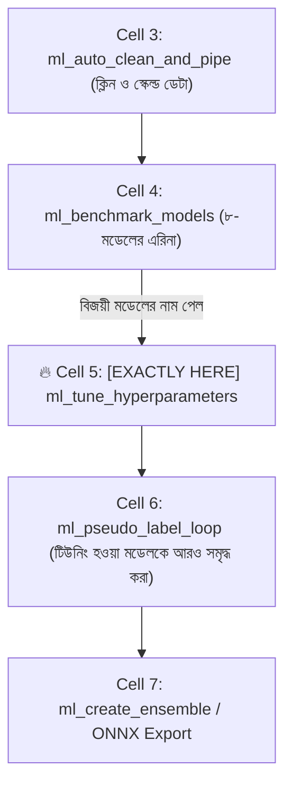
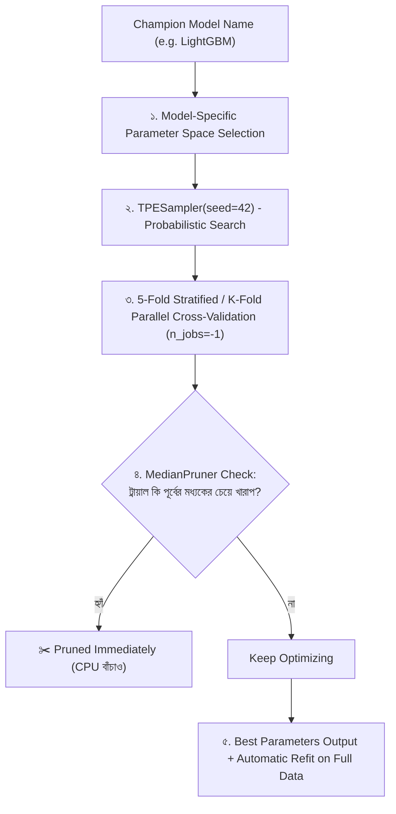

# ml_tune_hyperparameters: Deep-Dive Architectural Guide & Reference

> **Tool Name:** `ml_tune_hyperparameters`  
> **Module Source:** `src/ml_mcp/engine/tuner.py` / `src/ml_mcp/tools.py`  
> **Class Implementation:** `BayesianTuner`  
> **Layer:** Phase 3: Model Training, Benchmarking & Refinement

---

## ১. মানুষের গল্পের মতো পেছনের ইতিহাস (The Human Story: "The GridSearch Nightmare")

মেশিন লার্নিং ইঞ্জিনিয়ারিংয়ে সবচেয়ে বেশি বিদ্যুৎ ও সময় অপচয় হয় একটি প্রাচীন ভুলের কারণে—**গ্রিড সার্চ (GridSearchCV)**।

বাস্তব জীবনের চিত্রটি দেখুন:
`ml_benchmark_models` চালিয়ে আপনি দেখলেন **LightGBM** চ্যাম্পিয়ন হয়েছে। কিন্তু তার ডিফল্ট সেটিংসে এক্যুরেসি এসেছে ৮২%। আপনি জানেন এর হাইপারপ্যারামিটারগুলো (যেমন: `learning_rate`, `max_depth`, `num_leaves`) ফাইন-টিউন করলে এক্যুরেসি ৯০% পার হয়ে যাবে।

**আগে ইঞ্জিনিয়াররা কী বোকামি করত?**  
তারা `GridSearchCV`-তে প্রতিটা প্যারামিটারের ৫টি করে মান দিয়ে বসিয়ে রাখত:
- ৭টি প্যারামিটারের জন্য কম্বিনেশন সংখ্যা দাঁড়ায়: $৫^৭ = ৭৮,১২৫$ টি!
- ৫-ফোল্ড ক্রস-ভ্যালিডেশন করলে মডেল রান করতে হবে: **৩,৯০,৬২৫ বার!**
- ল্যাপটপের ফ্যান বিমানের ইঞ্জিনের মতো গর্জন শুরু করে, আর ট্রেইনিং শেষ হতে ৩ সপ্তাহ লেগে যায়!
- আর `RandomSearchCV` হলো অন্ধকারে ঢিল ছোঁড়ার মতো—ভাগ্য ভালো হলে ভালো, না হলে পুরো সময় নষ্ট।

**কাগল (Kaggle) গ্র্যান্ডমাস্টাররা কীভাবে কয়েক মিনিটে টিউন করে?**  
তারা ব্যবহার করে **বায়েসিয়ান অপটিমাইজেশন (Bayesian Optimization via Optuna TPE)**।  
এটি কোনো অন্ধ অনুমান নয়; এটি একটি বুদ্ধিমান গাণিতিক অ্যালগরিদম।  
- সে প্রতিটি ট্রায়ালের ফলাফল পর্যবেক্ষণ করে শেখে: *"আচ্ছা, যখন `learning_rate` ০.০৩ এর কাছাকাছি ছিল, তখন স্কোর দারুণ এসেছিল। চলো এই এলাকায় আরও গভীর অনুসন্ধান করি, বাকি খারাপ এলাকাগুলো বাদ দিই!"*
- সাথে থাকে **MedianPruner**: কোনো ট্রায়াল শুরুতেই খারাপ ফলাফল দেওয়া শুরু করলে মাঝপথেই তাকে কেটে (Prune) বাদ দিয়ে দেয়, ফলে ১ সেকেন্ডও অযথা সময় নষ্ট হয় না।

মাত্র ২০টি স্মার্ট ট্রায়ালে (২ মিনিটে) এটি সেই রেজাল্ট বের করে আনে, যা গ্রিড সার্চ ১ সপ্তাহেও পেত না! এই শক্তিশালী ইঞ্জিনটিই হলো **`ml_tune_hyperparameters`**।

---

## ২. এটা আসলে কী কাজ করে? (Core Mission)

সহজ কথায়: **এটি বিজয়ী মডেলের সেরা নাট-বল্টু (Hyperparameters) সবচেয়ে কম সময়ে খুঁজে বের করে এক্যুরেসি সর্বোচ্চ পর্যায়ে নিয়ে যায়।**

এটি একটি সুনির্দিষ্ট ৩-ধাপের বৈজ্ঞানিক কাজ করে:
1. **মডেল ভিত্তিক সার্চ-স্পেস সিলেকশন (Custom Search Space):** মডেলটির জাত দেখে (LightGBM, XGBoost, CatBoost নাকি Random Forest)—তার জন্য নিখুঁত গাণিতিক রেঞ্জ ঠিক করে নেয়।
2. **বায়েসিয়ান TPE সার্চ ও আর্লি প্রুনিং (Optuna TPE & MedianPruner):** সম্ভাব্যতা তত্ত্ব ($P(x|y)$) ব্যবহার করে সেরা প্যারামিটার খোঁজে এবং খারাপ ট্রায়ালগুলোকে তাৎক্ষণিক থামিয়ে দেয়।
3. **স্বয়ংক্রিয় রি-ফিট ও চ্যাম্পিয়ন ডেলিভারি:** সেরা প্যারামিটারগুলো পেয়ে যাওয়ার পর পুরো ট্রেইনিং ডেটায় মডেলটিকে স্বয়ংক্রিয়ভাবে পুনরায় ফিট করে প্রোডাকশনের জন্য প্রস্তুত করে দেয়।

---

## ৩. নোটবুকের ঠিক কোন কোড সেলের পর এটি কাজ করবে? (Pipeline Placement)

এটি মডেল বেঞ্চমার্কিংয়ের ঠিক পরে বসে।



### 🎯 সুনির্দিষ্ট নিয়ম:
> **এটি সবসময় Cell 4 (`ml_benchmark_models`)-এর ঠিক পরে বসবে।**

### কেন এখানে বসবে? (Engineering Reason)
কারণ কোনো বুদ্ধিমান ইঞ্জিনিয়ার ৮টি মডেলকে আলাদা আলাদাভাবে টিউন করতে গিয়ে নিজের সময় নষ্ট করে না।  
আগে Cell 4-এ সব মডেলের ট্রায়াল চালিয়ে **একক সেরা মডেলটিকে (যেমন: CatBoost বা LightGBM)** খুঁজে নেওয়া হয়। এরপর শুধুমাত্র সেই বিজয়ী মডেলটির ওপর এই টিউনিং লেজার চালানো হয়।

---

## ৪. প্যারামিটার পরিচিতি (The Exact Parameters)

টুলটির প্যারামিটার মাত্র ৫টি:

| প্যারামিটার | টাইপ | রিকোয়ার্ড? | ডিফল্ট | বিবরণ |
| :--- | :---: | :---: | :---: | :--- |
| **`csv_path`** | `string` | **হ্যাঁ** | - | যে প্রসেসড ডেটাসেটে টিউনিং হবে তার পাথ। |
| **`target_column`** | `string` | **হ্যাঁ** | - | যে কলামটি প্রেডিক্ট করতে হবে (যেমন: `"price"`). |
| **`model_name`** | `string` | না | `"lightgbm"` | যে মডেলটিকে টিউন করতে চান (`"lightgbm"`, `"catboost"`, `"xgboost"`, `"random_forest"`). |
| **`n_trials`** | `integer` | না | `10` | অপটুনা কতগুলো বায়েসিয়ান ট্রায়াল চালাবে (ডিফল্ট: ১০-২০টি). |
| **`task_type`** | `string` | না | `"classification"` | প্রেডিকশন সংখ্যা হলে `"regression"`, ক্যাটাগরি হলে `"classification"`. |

---

## ৫. টুলের ভেতরের গভীর ইঞ্জিনিয়ারিং ফিচার (Internal Engine Secrets)

`BayesianTuner` ক্লাসের ভেতরের আর্কিটেকচারাল ফ্লো:



### প্রধান ফিচারসমূহ:

#### ১. ট্রি-স্ট্রাকচার্ড পারজেন এস্টিমেটর (`TPESampler`)
```python
sampler = TPESampler(seed=self.random_state)
```
এটি র‍্যান্ডম সার্চের মতো অন্ধ নয়। এটি পূর্ববর্তী ভালো ট্রায়ালগুলোর ডেনসিটি ফাংশন তৈরি করে এবং পরবর্তী ট্রায়ালে সেই দিকে অনুসন্ধান চালায় যেখান থেকে সর্বোচ্চ স্কোর পাওয়ার সম্ভাবনা গাণিতিকভাবে বেশি।

#### ২. মিডিয়ান প্রুনার শিল্ড (`MedianPruner`)
```python
pruner = MedianPruner(n_startup_trials=2, n_warmup_steps=1)
```
যদি কোনো ট্রায়াল প্রথম বা দ্বিতীয় ফোল্ডেই বাজে স্কোর পেতে শুরু করে, প্রুনার সাথে সাথে সেই ট্রায়ালটিকে মাঝপথেই জবাই করে দেয়। ফলে ঘণ্টার পর ঘণ্টা নিরর্থক কোড রান হওয়া বন্ধ হয়।

#### ৩. প্যারালাল মাল্টি-কোর এক্সিকিউশন (`n_jobs=-1`)
```python
cross_val_score(estimator, X_arr, y_arr, cv=cv, scoring=scoring_metric, n_jobs=-1)
```
পিসির সমস্ত সিপিইউ কোর একসাথে ব্যবহার করে ৫-ফোল্ড ক্রস-ভ্যালিডেশন চালায়, ফলে ট্রায়ালগুলো চোখের পলকে শেষ হয়।

#### ৪. অটোমেটিক ফুল রি-ফিট ও রেডি-মডেল রিটার্ন
টিউনিং শেষে এটি শুধু প্যারামিটারের ডিকশনারি ফেরত দেয় না; সেরা প্যারামিটারগুলো দিয়ে মূল ডেটাসেটের ওপর মডেলটিকে নিজে থেকেই ট্রেইন করে একটি সম্পূর্ণ প্রস্তুত **`best_estimator`** অবজেক্ট ফেরত দেয়।

#### ৫. স্ট্রাকচার্ড অপটুনা DTO (`OptunaStudyDTO`)
```json
{
  "study_name": "optuna_lightgbm_roc_auc",
  "best_trial_number": 7,
  "best_params": {
    "n_estimators": 120,
    "num_leaves": 45,
    "max_depth": 6,
    "learning_rate": 0.0345,
    "subsample": 0.85
  },
  "best_value": 0.9341,
  "total_trials": 20,
  "pruned_trials": 6
}
```

---

## ৬. প্রোডাকশন ব্যবহারবিধি (Usage Example via MCP)

```json
{
  "csv_path": "e:/ML Testing/data/dataset.csv",
  "target_column": "price",
  "model_name": "catboost",
  "n_trials": 15,
  "task_type": "regression"
}
```

---

### এক লাইনে সারমর্ম:
`ml_tune_hyperparameters` হলো আপনার মডেলের **গ্র্যান্ড প্রিক্স রেস-ইঞ্জিনিয়ার**—যা অন্ধ ট্রায়াল ও কম্পিউটার গরম করার দিন শেষ করে বায়েসিয়ান অপটিমাইজেশনের মাধ্যমে মাত্র কয়েক মিনিটে মডেলের লুকানো এক্যুরেসি পিক লেভেলে নিয়ে আসে!
