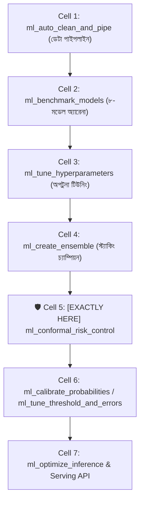
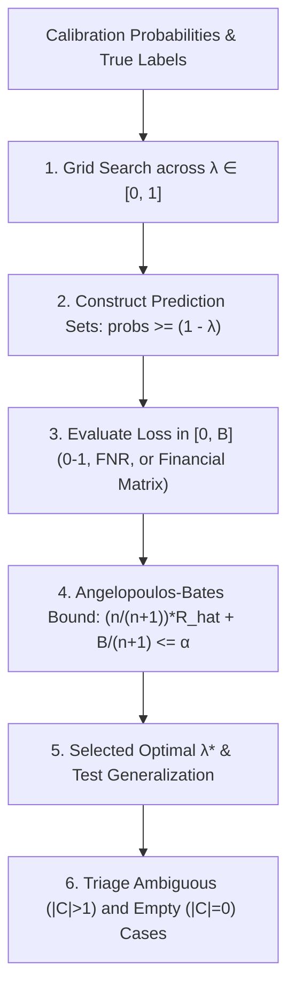

# ml_conformal_risk_control: Deep-Dive Architectural Guide & Reference

> **Tool Name:** `ml_conformal_risk_control`  
> **Module Source:** `src/ml_mcp/engine/conformal_risk_control.py` / `src/ml_mcp/tools.py`  
> **Class Implementation:** `ConformalRiskControlEngine`  
> **Layer:** AI Safety, Mathematical Risk Guarantees & Uncertainty Quantification

---

## ১. মানুষের গল্পের মতো পেছনের ইতিহাস (The Human Story: "The 99% Confident Disaster")

বাস্তব জীবনের একটি চরম সংকট চিন্তা করুন:
- একটি শীর্ষস্থানীয় ক্যান্সার হাসপাতালে একটি অত্যাধুনিক ডিপ লার্নিং ভিশন মডেল বসানো হলো।
- মডেলটি একজন রোগীর ফুসফুসের এক্স-রে দেখে অত্যন্ত দৃঢ়তার সাথে প্রেডিক্ট করল:  
  > `Diagnosis: Normal (Confidence: 99.1%)`
- ডাক্তার মডেলের ৯৯.১% কনফিডেন্স দেখে আশ্বস্ত হলেন এবং রোগীকে বাড়ি পাঠিয়ে দিলেন। কিন্তু মাত্র ৩ মাস পর সেই রোগীর স্টেজ-৩ ক্যান্সার ধরা পড়ল এবং তিনি মৃত্যুমুখে পতিত হলেন।

**মডেলটি যেখানে ৯৯% নিশ্চিত ছিল, সেখানে এমন মারাত্মক ভুল কেন হলো?**  
মেশিন লার্নিং ও ডিপ লার্নিংয়ের সফটম্যাক্স (Softmax) বা প্রেডিক্টেড প্রবাবিলিটি আসলে **"True Statistical Probability" নয়**। মডেলগুলো প্রচণ্ড রকম ওভার-কনফিডেন্ট থাকে। ট্রেনিং ডিস্ট্রিবিউশনের বাইরে সামান্য নয়েজ পেলেই তারা ভুল উত্তরকে ৯৯% কনফিডেন্সে উপস্থাপন করে। 

হাসপাতালের চিফ মেডিকেল অফিসার এবং ব্যাংকের চিফ রিস্ক অফিসারদের একটাই দাবি:  
> *"আমরা মডেলের সিঙ্গেল উত্তরের মিথ্যা আশ্বাস চাই না। এমন কোনো গাণিতিক পদ্ধতি কি আছে—যা শতভাগ নিশ্চয়তা দেবে যে প্রডাকশনে মডেলের সার্বিক ভুলের হার কখনোই আমাদের দেওয়া সীমার (যেমন ৫% বা ১%) বেশি হবে না?"*

**ইউসি বার্কলির (UC Berkeley) গবেষক আনাসতাসিওস অ্যাঞ্জেলোপোলোস (Anastasios Angelopoulos) এবং স্টিফেন বেটস (Stephen Bates, 2022) এই সমস্যার বৈজ্ঞানিক সমাধান দেন:**  
যার নাম **"Conformal Risk Control" (CRC)**।

CRC মডেলের মিথ্যা অহংকার ভেঙে দেয়:
1. এটি মডেলকে সিঙ্গেল উত্তর (যেমন: "Normal") দিতে বাধ্য করে না। বরং এটি একটি **Prediction Set** তৈরি করে (যেমন: `["Normal", "Early Stage Tumor"]`)।
2. সবচেয়ে বড় বৈপ্লবিক বিষয় হলো—এটি বিশুদ্ধ গণিতের সাহায্যে গ্যারান্টি দেয় যে:
   $$\mathbb{E}[\text{Loss}] \le \alpha$$
   যদি আপনি বলেন সর্বোচ্চ ৫% রিস্ক মেনে নেবেন ($\alpha = 0.05$), তবে ৯৫% ক্ষেত্রে সত্য উত্তরটি এই সেটের ভেতরে **থাকবেই থাকবে**!
3. আর মডেল যদি কোনো জটিল স্যাম্পল দেখে অতিরিক্ত বিভ্রান্ত হয়, তবে ভুল অনুমান না করে সেটিকে মানুষের সিদ্ধান্তের জন্য **Human-in-the-Loop Triage** হিসেবে পাঠিয়ে দেয়।

---

## ২. এটা আসলে কী কাজ করে? (Core Mission)

সহজ কথায়: **এটি কোনো অনুমান নয়, মডেলের ভুলের ওপর কঠোর গাণিতিক বাউন্ডারি (Statistical Safety Net) পরিয়ে দেয়।**

এটি একটি স্বয়ংক্রিয় ৩-ধাপের পাইপলাইন চালায়:
1. **ক্যালিব্রেশন স্প্লিট ও বাউন্ডেড লস ক্যালকুলেশন:** মূল ট্রেনিং ডেটার বাইরের একটি নিরপেক্ষ ক্যালিব্রেশন সেটে মডেলের প্রতিটি স্যাম্পলের বাউন্ডেড লস ($[0, B]$) পরিমাপ করে।
2. **ফাইনাইট-স্যাম্পল রিস্ক অপটিমাইজেশন:** ইউসি বার্কলির CRC থিওরেম সমাধান করে এমন একটি অপটিমাল কাটঅফ ($\lambda^*$) খুঁজে বের করে, যা নিশ্চিত করে টেস্ট ডেটাতেও গড় ক্ষতি $\alpha$ সীমার নিচে থাকবে।
3. **প্রেডিকশন সেট ও হিউম্যান ট্রায়াজ জেনারেশন:** প্রতিটি ডেটা পয়েন্টের জন্য প্রেডিকশন সেট $C_\lambda(x)$ তৈরি করে এবং অস্পষ্ট (একাধিক ক্লাস) বা শূন্য সেটের কেসগুলোকে স্বয়ংক্রিয়ভাবে বিশেষজ্ঞের পর্যালোচনার জন্য আলাদা করে।

---

## ৩. নোটবুকের ঠিক কোন কোড সেলের পর এটি কাজ করবে? (Pipeline Placement)



### 🎯 সুনির্দিষ্ট নিয়ম:
> **এটি সবসময় Phase 3-এর মডেল ট্রেইনিং ও এনসেম্বলিং (Cell 4)-এর ঠিক পরে এবং অন্যান্য প্রোডাকশন ক্যালিব্রেশন/সার্ভিংয়ের পূর্বে বসবে।**

### কেন আগে বসানো যাবে না? (Engineering Reason)
যদি আপনার মডেলটি আগে থেকেই অপটিমাইজড এবং ফিট করা না থাকে, তবে তার ক্যালিব্রেশন সেটে অপ্রয়োজনীয় বড় প্রেডিকশন সেট তৈরি হবে (মডেল কনফিউজড হয়ে সব ক্লাসকেই সেটের ভেতর ঢুকিয়ে দেবে)।  
চ্যাম্পিয়ন মডেল যখন ট্রেইন হয়ে সর্বোচ্চ ডিসক্রিমিনেটিভ পাওয়ার অর্জন করবে, **ঠিক তখনই** কনফরমাল রিস্ক কন্ট্রোল বসিয়ে তার রিয়েল-ওয়ার্ল্ড এরর রেটের ওপর গাণিতিক সিলমোহর দিতে হবে।

---

## ৪. প্যারামিটার পরিচিতি (The Exact Parameters)

| প্যারামিটার | টাইপ | রিকোয়ার্ড? | ডিফল্ট | বিবরণ |
| :--- | :---: | :---: | :---: | :--- |
| **`csv_path`** | `string` | **হ্যাঁ** | - | প্রিপ্রসেসড ও ক্লিনড ডেটাসেটের পাথ। |
| **`target_column`** | `string` | **হ্যাঁ** | - | যে কলামের ওপর রিস্ক বাউন্ড কন্ট্রোল করতে হবে। |
| **`loss_type`** | `string` | না | `"misclassification"` | লস ফাংশনের ধরন: `"misclassification"`, `"fnr"`, অথবা `"asymmetric_cost"`। |
| **`target_risk`** | `number` | না | `0.05` | ব্যবহারকারীর নির্ধারিত সর্বোচ্চ সহনীয় রিস্ক বাউন্ড ($\alpha$, ডিফল্ট: ৫% এরর / ৯৫% কনফিডেন্স)। |
| **`test_size`** | `number` | না | `0.3` | ক্যালিব্রেশন ও টেস্ট সেটের জন্য ডেটা ভাগ করার অনুপাত। |
| **`mondrian`** | `boolean` | না | `false` | `true` দিলে প্রতি ক্লাসের জন্য আলাদা আলাদা থ্রেশহোল্ড (Class-Conditional) ক্যালিব্রেট করে। |

---

## ৫. টুলের ভেতরের গভীর ইঞ্জিনিয়ারিং ফিচার (Internal Engine Secrets)

`ConformalRiskControlEngine` ক্লাসের ভেতরের আর্কিটেকচারাল ফ্লো:



### প্রধান ফিচারসমূহ:

#### ১. ফাইনাইট-স্যাম্পল কারেকশন (`Angelopoulos-Bates Theorem`)
সাধারণ মেশিন লার্নিংয়ে $\hat{R}(\lambda) \le \alpha$ দেখে থ্রেশহোল্ড ধরলে টেস্ট ডেটাতে ওভারফিটিং হয়। এই ইঞ্জিনে ক্যালিফোর্নিয়া বার্কলির থিওরেম প্রয়োগ করা হয়েছে:
$$\text{Corrected Risk} = \left(\frac{n}{n+1}\right)\hat{R}_n(\lambda) + \frac{B}{n+1} \le \alpha$$
এখানে $n$ হলো ক্যালিব্রেশন স্যাম্পল সংখ্যা এবং $B$ হলো লসের সর্বোচ্চ বাউন্ড। স্যাম্পল সংখ্যা কম হলেও এই সমীকরণ নিশ্চিত করে যে আনসিন টেস্ট ডেটাতে রিস্ক কখনোই $\alpha$ অতিক্রম করবে না।

#### ২. ৩টি স্পেশালাইজড লস ফাংশন কন্ট্রোল
- **`misclassification` (0-1 Coverage):** ক্লাসিক্যাল কভারেজ গ্যারান্টি ($1 - \alpha$)। সত্য ক্লাসটি সেটে না থাকলে লস = ১.০, থাকলে ০.০।
- **`fnr` (False Negative Rate Control):** মেডিকেল ও ফ্রড ডিটেকশনের জন্য। পজিটিভ রোগীদের (Class 1) যাতে কোনোভাবেই মিস না করা হয় ($FNR \le \alpha$)।
- **`asymmetric_cost` (ফাইন্যান্সিয়াল লস ম্যাট্রিক্স):** ফ্রড মিস করলে ক্ষতি ১.০, আর সাধারণ কাস্টমারকে ফ্ল্যাগ করলে ক্ষতি ০.২। আর্থিক ক্ষতির পরিমাণ বেঁধে দেওয়ার জন্য কাস্টম পেনাল্টি ম্যাট্রিক্স।

#### ৩. মন্ড্রিয়ান (Class-Conditional) ক্যালিব্রেশন
ইমব্যালান্সড ডেটায় মেজরিটি ক্লাস খুব সহজে ৯৫% কভারেজ পেয়ে যায়, কিন্তু মাইনরিটি ক্লাস অবহেলিত থাকে। `mondrian=True` দিলে প্রতিটি ক্লাসের জন্য আলাদা আলাদা $\lambda_k$ থ্রেশহোল্ড ক্যালিব্রেট করা হয়, যাতে প্রতিটি ক্লাস সমান গাণিতিক সুরক্ষা পায়।

#### ৪. হিউম্যান-ইন-দ্য-লুপ ট্রায়াজ রিপোর্টার (`predict_and_triage`)
যদি কোনো স্যাম্পলে প্রেডিকশন সেটের সাইজ শূন্য হয় (`is_empty`) অথবা একাধিক কনফ্লিক্টিং ক্লাস থাকে (`is_ambiguous`), ইঞ্জিন কোনো ঝুঁকিপূর্ণ সিদ্ধান্ত না নিয়ে সেটিকে স্বয়ংক্রিয়ভাবে `needs_human_review=True` দিয়ে ফ্ল্যাগ করে এবং আলাদা অডিট লগ তৈরি করে।

---

## ৬. প্রোডাকশন ব্যবহারবিধি (Usage Example via MCP)

### ইনপুট পেলোড:
```json
{
  "csv_path": "data/patient_diagnostics.csv",
  "target_column": "diagnosis",
  "loss_type": "fnr",
  "target_risk": 0.02,
  "mondrian": true
}
```

### রিটার্ন আউটপুট রেসপন্স:
```json
{
  "loss_function": "fnr",
  "target_risk": 0.02,
  "empirical_risk": 0.0158,
  "calibrated_lambda": 0.742,
  "guarantee_satisfied": true,
  "total_cal_samples": 450,
  "average_set_size": 1.14,
  "ambiguity_rate": 0.082,
  "empty_set_rate": 0.0,
  "human_triage_count": 37,
  "mondrian_conditional": true,
  "per_class_thresholds": {
    "0": 0.685,
    "1": 0.792
  }
}
```

---

### এক লাইনে সারমর্ম:
`ml_conformal_risk_control` হলো আপনার মডেলের জন্য একটি **গাণিতিক সেফটি লাইসেন্স**—যা মডেলের অন্ধ আত্মবিশ্বাস দূর করে প্রেডিকশন সেট ও হিউম্যান ট্রায়াজের মাধ্যমে প্রমাণ করে যে বাস্তব দুনিয়ায় আপনার সিস্টেমের এরর কখনোই আপনার নির্ধারিত ঝুঁকির সীমাকে ছাড়িয়ে যাবে না!
