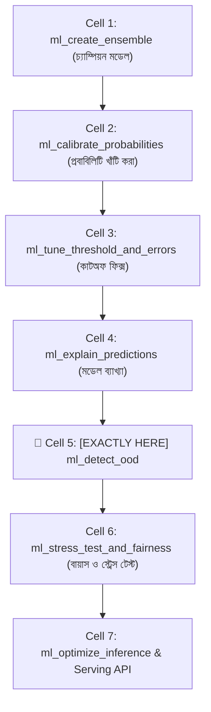
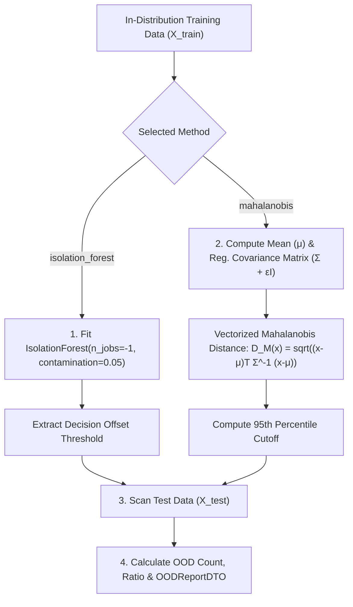

# ml_detect_ood: Deep-Dive Architectural Guide & Reference

> **Tool Name:** `ml_detect_ood`  
> **Module Source:** `src/ml_mcp/engine/ood_detector.py` / `src/ml_mcp/tools.py`  
> **Class Implementation:** `OODDetector`  
> **Layer:** AI Safety, Anomaly Detection & Production Input Gatekeeper

---

## ১. মানুষের গল্পের মতো পেছনের ইতিহাস (The Human Story: "The Alien Input Disaster")

বাস্তব জীবনের একটি চরম রোমহর্ষক স্বায়ত্তশাসিত গাড়ির (Self-Driving Car) দুর্ঘটনা চিন্তা করুন:
- ফ্লোরিডার একটি রৌদ্রোজ্জ্বল দিনে একটি সেলফ-ড্রাইভিং কার হাইওয়ে দিয়ে ৬০ মাইল বেগে চলছিল।
- হঠাৎ সামনে একটি সাদা রঙের বিশাল ১৮-হুইলার ট্রেলার আড়াআড়িভাবে রাস্তা পার হচ্ছিল।
- গাড়ির এআই ভিশন মডেলটি আমেরিকার হাইওয়ের লাখ লাখ সাধারণ গাড়ি ও ট্রাকের ওপর ট্রেইন করা ছিল। কিন্তু এমন সাদা রঙের বিশাল আড়াআড়ি ট্রেলার সে তার ট্রেইনিং লাইফে **কখনোই দেখেনি**!
- মডেল কিন্তু থমকে দাঁড়িয়ে ডাক্তার বা ড্রাইভারের মতো বলেনি: *"আমি এটা চিনি না, গাড়ি থামাও!"*  
  বরং সে অদ্ভুত আত্মবিশ্বাসে ধরে নিল এটি একটি **"উন্মুক্ত আকাশ" (Clear Sky)** এবং ব্রেক না কষে ফুল স্পিডে ট্রেলারে গিয়ে আছড়ে পড়ল!

**কেন এই মহাবিপর্যয় ঘটল?**  
মেশিন লার্নিংয়ের প্রথম এবং প্রধানতম শর্ত হলো: **I.I.D Assumption (Independent and Identically Distributed)**। অর্থাৎ, মডেল যে ডিস্ট্রিবিউশনের ডেটা দিয়ে ট্রেইন হয়েছে, বাস্তব দুনিয়ায় তাকে ঠিক সেই একই ডিস্ট্রিবিউশনের ডেটা দিতে হবে।

কিন্তু বাস্তব প্রডাকশন এক নির্মম জায়গা! 
- লোন অ্যাপ্লিকেশনে কোনো ইউজার হয়তো টাইপো করে বয়স লিখে দিল `-২৫` অথবা ইনকাম লিখে দিল `$৯৯৯,৯৯৯,৯৯৯`।
- ইকমার্স ফ্রড সিস্টেমে কোনো বট হয়তো কারাপ্টেড কুকিজ বা অচেনা নেটওয়ার্ক প্যাকেট পাঠাল।

মডেল কখনোই স্বীকার করে না যে সে অন্ধ। সে অদ্ভুত এলিয়েন ডেটা পেলেও সম্পূর্ণ ভুল একটি প্রেডিকশন আউটপুট দিয়ে আপনার কোম্পানিকে বিপদে ফেলে দেবে।

**এই সমস্যার একমাত্র সেফটি গার্ড হলো `ml_detect_ood`:**  
এটি মডেলের সামনে একটি **"ডিজিটাল বাউন্সার বা সিকিউরিটি গার্ড"** হিসেবে কাজ করে। মডেল প্রেডিকশন চালানোর আগেই এটি আনলেবেল্ড প্রোডাকশন ডেটা স্ক্যান করে ট্রেনিং ডিস্ট্রিবিউশনের সাথে তুলনা করে। যদি কোনো ডেটা অচেনা বা আউট-অব-ডিস্ট্রিবিউশন (OOD) হয়, এটি মডেলকে স্পর্শ করতে না দিয়ে সাথে সাথে অ্যালার্ম বাজিয়ে স্যাম্পলটিকে কোয়ারেন্টাইনে পাঠিয়ে দেয়!

---

## ২. এটা আসলে কী কাজ করে? (Core Mission)

সহজ কথায়: **এটি অচেনা, অস্বাভাবিক বা বিপজ্জনক ডেটা থেকে আপনার মডেলকে রক্ষা করার একটি ডিজিটাল বাউন্সার।**

এটি একটি স্বয়ংক্রিয় ৩-ধাপের পাইপলাইন চালায়:
1. **ইন-ডিস্ট্রিবিউশন ফিটিং (Training Profile):** মূল ট্রেইনিং ডেটাসেটের বৈশিষ্ট্য এবং ডিস্ট্রিবিউশন স্পেস শিখে নেয় (গড় ভেক্টর, কোভ্যারিয়েন্স ম্যাট্রিক্স অথবা আইসোলেশন ট্রি স্প্লিট)।
2. **ডিস্ট্রিবিউশন শিফট ও অ্যানোমালি স্ক্যান:** নতুন আনলেবেল্ড টেস্ট ডেটা বা লাইভ প্রোডাকশন ট্রাফিকের প্রতিটি সারি বিশ্লেষণ করে এবং দেখে স্যাম্পলটি ট্রেইনিং ডিস্ট্রিবিউশন থেকে কতটা দূরে ছিটকে পড়েছে।
3. **ওওডি রেশিও ও কোয়ারেন্টাইন ফ্ল্যাগ:** ব্যবহারকারীর নির্ধারিত কনটামিনেশন সীমা (যেমন: ৫%) অনুযায়ী একটি নির্দিষ্ট অ্যানোমালি থ্রেশহোল্ড নির্ধারণ করে এবং মোট কতটি স্যাম্পল OOD হিসেবে ধরা পড়ল (`ood_ratio`) তার পূর্ণাঙ্গ অডিট রিপোর্ট দেয়।

---

## ৩. নোটবুকের ঠিক কোন কোড সেলের পর এটি কাজ করবে? (Pipeline Placement)



### 🎯 সুনির্দিষ্ট নিয়ম:
> **এটি সবসময় মডেলের ইন্টারপ্রিটেবিলিটি (Cell 4)-এর পরে এবং স্ট্রেস টেস্টিং ও সার্ভিং এপিআইতে মডেল পাঠানোর ঠিক পূর্বে বসবে।**

### কেন আগে বা পরে বসানো যাবে না? (Engineering Reason)
- **প্রোডাকশন সার্ভিংয়ের আগে কেন বাধ্যতামূলক?** আপনি যদি ইনফ্যারেন্স এপিআই তৈরির আগে OOD ডিটেক্টর ফিট করে না রাখেন, তবে লাইভ সার্ভারে ইউজাররা যখন কারাপ্টেড বা অ্যাটাকার ডেটা পাঠাবে, এপিআই সেই ট্র্যাশ ডেটা দিয়েই মডেলের প্রেডিকশন চালাতে থাকবে।
- **মডেল ট্রেনিংয়ের আগে কেন নয়?** কারণ এটি ট্রেনিং ডেটা ফিল্টার করার জন্য নয়, বরং ট্রেনিং ডেটাকে রেফারেন্স হিসেবে ব্যবহার করে টেস্ট/প্রোডাকশন ট্রাফিকের অ্যানোমালি ধরার জন্য তৈরি।

---

## ৪. প্যারামিটার পরিচিতি (The Exact Parameters)

| প্যারামিটার | টাইপ | রিকোয়ার্ড? | ডিফল্ট | বিবরণ |
| :--- | :---: | :---: | :---: | :--- |
| **`train_csv_path`** | `string` | **হ্যাঁ** | - | মূল ক্লিনড ইন-ডিস্ট্রিবিউশন ট্রেইনিং ডেটাসেটের পাথ। |
| **`test_csv_path`** | `string` | **হ্যাঁ** | - | স্ক্যান করার জন্য নতুন আনলেবেল্ড টেস্ট ডেটা বা লাইভ ব্যাচ ফাইলের পাথ। |
| **`method`** | `string` | না | `"isolation_forest"` | অ্যানোমালি ডিটেকশন অ্যালগরিদম: `"isolation_forest"` অথবা `"mahalanobis"`। |

---

## ৫. টুলের ভেতরের গভীর ইঞ্জিনিয়ারিং ফিচার (Internal Engine Secrets)

`OODDetector` ক্লাসের অভ্যন্তরীণ আর্কিটেকচারাল ফ্লো:



### প্রধান ফিচারসমূহ:

#### ১. মাহালানোবিস দূরত্ব (Mahalanobis Distance) ইঞ্জিন
সাধারণ ইউক্লিডিয়ান দূরত্ব শুধু বৃত্তাকার দূরত্ব দেখে এবং ফিচারের মধ্যকার কোরিলেশন বুঝতে পারে না। মাহালানোবিস দূরত্ব কোভ্যারিয়েন্স ম্যাট্রিক্স ($\Sigma$) ব্যবহার করে উপবৃত্তাকার ডিস্ট্রিবিউশন তৈরি করে:
$$D_M(x) = \sqrt{(x - \mu)^T \Sigma^{-1} (x - \mu)}$$
এটি কোলিনিয়ার ফিচারের সূক্ষ্ম কোরিলেশন ভেঙে যাওয়া অস্বাভাবিক স্যাম্পলকেও মুহূর্তের মধ্যে ধরে ফেলে।

#### ২. সিঙ্গুলার ম্যাট্রিক্স ক্র্যাশ গার্ড ($\epsilon$-Regularization)
যদি দুটি ফিচার ১০০% কোলিনিয়ার হয়, তবে সাধারণ ইনভার্স $\Sigma^{-1}$ করতে গিয়ে কোড `LinAlgError: Singular matrix` দিয়ে ক্র্যাশ করে। এই ইঞ্জিনে ডায়াগোনালে ড্যাম্পিং ফ্যাক্টর ($\epsilon = 10^{-6}$) এবং `np.linalg.pinv` (Pseudo-inverse) ব্যবহার করা হয়েছে, যা ম্যাথমেটিক্যালি কখনো ক্র্যাশ করতে পারে না।

#### ৩. আইসোলেশন ফরেস্ট (Isolation Forest) স্কেলিং
হাই-ডাইমেনশনাল নন-প্যারামেট্রিক ডেটার জন্য এটি সেরা। স্বাভাবিক ডেটা পয়েন্টগুলো আইসোলেট করতে অনেকগুলো ট্রি-স্প্লিট লাগে ($h(x)$ অনেক বড় হয়), কিন্তু বহিরাগত অ্যানোমালি স্যাম্পলগুলো মাত্র ২-৩টি স্প্লিটেই আলাদা হয়ে যায়। ইঞ্জিন এই পাথ লেংথ মেপে $-1$ স্কোরধারী OOD রেকর্ডগুলোকে ফিল্টার করে।

#### ৪. নন-নিউমেরিক অটো-ড্রপ গার্ড
ইনপুটে যদি ভুলবশত কোনো আইডি বা টেক্সট কলাম থাকে, টুলটি নিজে থেকেই `.select_dtypes(include=[np.number])` ব্যবহার করে নিউমেরিক ফিচার আলাদা করে নেয়, যাতে স্ক্রিপ্ট কোনো প্রকার ডেটাটাইপ এক্সেপশন না দেয়।

---

## ৬. প্রোডাকশন ব্যবহারবিধি (Usage Example via MCP)

### ইনপুট পেলোড:
```json
{
  "train_csv_path": "data/in_distribution_train.csv",
  "test_csv_path": "data/incoming_batch_traffic.csv",
  "method": "mahalanobis"
}
```

### রিটার্ন আউটপুট রেসপন্স:
```json
{
  "detector_name": "MahalanobisDistance",
  "total_samples": 5000,
  "ood_detected_count": 184,
  "ood_ratio": 0.0368
}
```

---

### এক লাইনে সারমর্ম:
`ml_detect_ood` হলো আপনার এআই মডেলের প্রবেশদ্বারে দাঁড়িয়ে থাকা **ডিজিটাল বাউন্সার**—যা প্রশিক্ষণ ডিস্ট্রিবিউশনের বাইরের যেকোনো অপরিচিত, বিকৃত বা বিপজ্জনক ডেটাকে মডেলে ঢোকার আগেই পাকড়াও করে নিরাপদ এআই নিশ্চিত করে!
