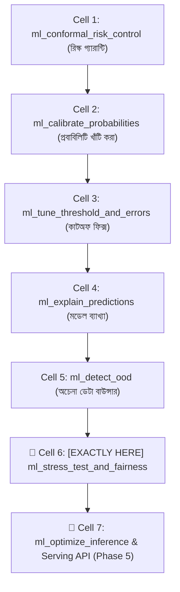

# ml_stress_test_and_fairness: Deep-Dive Architectural Guide & Reference

> **Tool Name:** `ml_stress_test_and_fairness`  
> **Module Source:** `src/ml_mcp/engine/stress_tester.py` & `src/ml_mcp/engine/fairness_auditor.py` / `src/ml_mcp/tools.py`  
> **Class Implementation:** `ModelStressTester` & `SliceFairnessAuditor`  
> **Layer:** AI Safety, Adversarial Robustness & Ethical Fairness Auditing

---

## ১. মানুষের গল্পের মতো পেছনের ইতিহাস (The Human Story: "The Brittle Glass & The Biased Algorithm")

বাস্তব জীবনের দুটি মারাত্মক প্রযুক্তিগত ও সামাজিক বিপর্যয়ের ঘটনা চিন্তা করুন:

#### ঘটনা ১: ভঙ্গুর কাঁচের মডেল (The Brittle Glass Model)
একটি আইওটি ও ম্যানুফ্যাকচারিং প্ল্যান্টে একটি প্রেডিক্টিভ মেইনটেন্যান্স মডেল বসানো হলো। ল্যাবরেটরির টেস্ট ডেটায় মডেলটি **৯৬% নির্ভুলতা** দেখিয়েছিল। কিন্তু প্ল্যান্টে লাইভ ডেপ্লয় করার পর দেখা গেল মেশিনের সেন্সরে সামান্য ধুলোবালি বা ভোল্টেজ ফ্ল্যাকচুয়েশনের কারণে ০.০৫% নয়েজ ঢুকতেই মডেলের এক্যুরেসি এক লাফে **৯৬% থেকে ৩৫%-এ নেমে এলো**! মডেলটি ভেতরে ভেতরে ছিল অত্যন্ত ভঙ্গুর কাঁচের মতো (Brittle Model)—যা বাস্তব জীবনের সামান্য বাস্তব নয়েজও সহ্য করতে পারে না।

#### ঘটনা ২: কুখ্যাত এআই রিক্রুটিং কেলেঙ্কারি (২০১৮)
বিশ্ববিখ্যাত একটি টেক জায়ান্ট তাদের হাজার হাজার ইঞ্জিনিয়ারিং চাকরির সিভি স্ক্রিনিং করার জন্য একটি মেশিন লার্নিং মডেল বানাল। মডেলটির সামগ্রিক অ্যাকুরেসি ছিল চমৎকার। কিন্তু গোপনে অডিট করে দেখা গেল—মডেলটি নারী প্রার্থীদের সিভি পেলেই স্বয়ংক্রিয়ভাবে তাদের স্কোর কমিয়ে রিজেক্ট করে দিচ্ছে!  
কারণ গত ১০ বছরের ঐতিহাসিক ডেটায় ৮০% কর্মী ছিল পুরুষ। ফলে মডেলটি শিখে নিয়েছিল: *"পুরুষ হওয়া মানেই সাফল্যের লক্ষণ!"*  
যুক্তরাষ্ট্রের ফেডারেল সরকারের **EEOC (Equal Employment Opportunity Commission)** তদন্ত শুরু করার আগেই কোম্পানিটি বাধ্য হয়ে তাদের পুরো এআই সিস্টেমটি ডিলিট করে দেয়।

**ইঞ্জিনিয়ারদের শিক্ষা:**
কোনো মডেল ল্যাব টেস্টে ৯৫% পেলেই সে প্রোডাকশনের উপযোগী নয়! 
- সে কি বাস্তব দুনিয়ার নয়েজ বা প্রতিকূল পরিবেশে টিকে থাকতে পারবে (Robustness)?
- সে কি কোনো নির্দিষ্ট লিঙ্গ, বয়স বা সংখ্যালঘু গ্রুপের সাথে বৈষম্য করছে (Disparate Impact)?

**এই দুই মহা-বিপদের পূর্ণাঙ্গ সমাধান হলো `ml_stress_test_and_fairness`:**  
এটি একটি দ্বিমুখী ডিফেন্স প্ল্যাটফর্ম:
১. এটি মডেলের ওপর ইচ্ছাকৃতভাবে কৃত্রিম **গাউসিয়ান নয়েজ, ফিচার অদলবদল (Feature Swap) এবং চরম আউটলায়ার ($\pm 5	imes	ext{IQR}$)** ইনজেক্ট করে মডেলের সহ্যক্ষমতা (Robustness Index) পরিমাপ করে।  
২. এটি মার্কিন সরকারের **EEOC Four-Fifths (৮০%) রুল** অনুযায়ী ডেমোগ্রাফিক স্লাইস অডিট চালায়। কোনো নির্দিষ্ট গ্রুপের ক্ষেত্রে মডেলের অ্যাকুরেসি যদি ৮০%-এর নিচে নেমে যায়, এটি সাথে সাথে সিস্টেমকে লাল পতাকা দেখিয়ে ব্লক করে দেয়!

---

## ২. এটা আসলে কী কাজ করে? (Core Mission)

সহজ কথায়: **এটি মডেলকে চরম প্রতিকূল নয়েজের মুখে ফেলে সহ্যক্ষমতা মাপে এবং কোনো জাতি, বর্ণ বা লিঙ্গের প্রতি বৈষম্য হচ্ছে কি না তা কঠোরভাবে পরীক্ষা করে।**

এটি একটি দ্বৈত ইঞ্জিন চালায়:
1. **অ্যাডভার্সারিয়াল নয়েজ পারটার্বেশন টেস্ট (Adversarial Stress Test):** ইনপুট ফিচারে ১০% গাউসিয়ান নয়েজ বা এক্সট্রিম আউটলায়ার ইনজেক্ট করে দেখে মডেলের এক্যুরেসি ১০%-এর বেশি ড্রপ করে কি না (`is_stress_passed`)।
2. **ডেমোগ্রাফিক স্লাইস ফেয়ারনেস অডিট (Slice Fairness Audit):** প্রটেক্টেড অ্যাট্রিবিউট (যেমন: Gender, Age, Ethnicity) অনুযায়ী ডেটাকে স্লাইস করে প্রতিটি গ্রুপের আলাদা আলাদা পারফরম্যান্স পরিমাপ করে।
3. **ফোর-ফিফথস (৮০%) প্যারিটি ভায়োলেশন ডিটেকশন:** সবচেয়ে খারাপ পারফর্ম করা সাবগ্রুপের সাথে সেরা সাবগ্রুপের অনুপাত হিসাব করে দেখে এটি ০.৮০ এর চেয়ে কম কি না (`disparate_impact_ratio < 0.80`)। কম হলে বৈষম্য প্রমাণিত হয় (`parity_violated = True`)।

---

## ৩. নোটবুকের ঠিক কোন কোড সেলের পর এটি কাজ করবে? (Pipeline Placement)



### 🎯 সুনির্দিষ্ট নিয়ম:
> **এটি Phase 4-এর চূড়ান্ত সেলে (Cell 6) বসবে—প্রোডাকশনে মডেল ডেপ্লয় করার ঠিক আগের ফাইনাল সেফটি গেটওয়ে হিসেবে।**

### কেন আগে বসানো যাবে না? (Engineering Reason)
মডেল যতক্ষণ না পর্যন্ত ক্যালিব্রেটেড এবং অপটিমাইজড হচ্ছে, ততক্ষণ তার ওপর স্ট্রেস টেস্ট বা বায়াস অডিট চালানো অর্থহীন। সব প্রাক-প্রস্তুতি শেষ হওয়ার পর এটি হলো মডেলের **"প্রোডাকশন ড্রাইভিং টেস্ট ও এথিক্যাল ক্লিয়ারেন্স সার্টিফিকেট"**। এই টেস্ট ফেইল করলে মডেল কখনো Phase 5 (Serving API)-এ যেতে পারে না।

---

## ৪. প্যারামিটার পরিচিতি (The Exact Parameters)

| প্যারামিটার | টাইপ | রিকোয়ার্ড? | ডিফল্ট | বিবরণ |
| :--- | :---: | :---: | :---: | :--- |
| **`csv_path`** | `string` | **হ্যাঁ** | - | মূল টেস্ট বা ভ্যালিডেশন ডেটাসেটের পাথ। |
| **`target_column`** | `string` | **হ্যাঁ** | - | যে টার্গেট কলামের ওপর মডেল প্রেডিক্ট করে। |
| **`protected_column`** | `string` বা `null` | না | `null` | যে সংবেদনশীল ডেমোগ্রাফিক কলামের ওপর বায়াস অডিট চালাতে হবে (যেমন: `"gender"`, `"race"`, `"age_group"`)। |

---

## ৫. টুলের ভেতরের গভীর ইঞ্জিনিয়ারিং ফিচার (Internal Engine Secrets)

`ModelStressTester` এবং `SliceFairnessAuditor` এর অভ্যন্তরীণ আর্কিটেকচারাল ফ্লো:

```mermaid
flowchart TD
    subgraph Pillar1 ["Pillar 1: Adversarial Stress Engine"]
        A1["Baseline Test Performance (Acc_base)"]
        A2["Inject Gaussian Noise: X_pert = X + N(0, noise_level * σ)"]
        A3["Stressed Test Performance (Acc_stressed)"]
        A4["Degradation % = ((Acc_base - Acc_stressed) / Acc_base) * 100"]
        A5["Robustness Score = max(0, 100 - Degradation)"]
        A1 --> A2 --> A3 --> A4 --> A5
    end

    subgraph Pillar2 ["Pillar 2: US EEOC Four-Fifths Fairness Engine"]
        B1["Group by Protected Attribute: Slices ∈ {Male, Female, ...}"]
        B2["Compute Metric per Subgroup: Score(g)"]
        B3["Disparate Impact Ratio = min(Score) / max(Score)"]
        B4["Enforce 80% Rule: Parity Violated if Ratio < 0.80"]
        B1 --> B2 --> B3 --> B4
    end
```



### প্রধান ফিচারসমূহ:

#### ১. ৩টি অ্যাডভার্সারিয়াল নয়েজ ইনজেকশন মেকানিজম
- **`gaussian_noise`:** প্রতিটি ফিচারের নিজস্ব স্ট্যান্ডার্ড ডেভিয়েশনের সাথে আনুপাতিক স্কেলে হোয়াইট নয়েজ যোগ করে ($X_{\text{pert}} = X + \mathcal{N}(0, \text{noise\_level} \times \sigma)$)।
- **`feature_swap`:** কলামগুলোর ডেটা নিজেদের মধ্যে এলোমেলো অদলবদল করে নেটওয়ার্ক লেটেন্সি ও সেন্সর ওয়্যারিং গোলযোগ সিমুলেট করে।
- **`extreme_outlier`:** ইন্টার-কোয়ার্টাইল রেঞ্জের ৫ গুণ ($\pm 5 \times \text{IQR}$) বড় চরম আউটলায়ার ইনজেক্ট করে মডেলের সহ্যক্ষমতা পরীক্ষা করে।

#### ২. মডেল ফ্র্যাজিলিটি ও রোবাস্টনেস স্কোর
$$\text{Robustness Score} = \max\left(0, 100 - \text{Degradation Percentage}\right)$$
যদি নয়েজ দেওয়ার পর মডেলের এক্যুরেসি ১০%-এর বেশি ফল না করে (`degradation <= 10.0%`), তবে মডেল স্ট্রেস টেস্টে উত্তীর্ণ হয় (`is_stress_passed = True`)।

#### ৩. ইউএস ফেডারেল EEOC ফোর-ফিফথস (৮০%) রুল অডিট
$$\text{Disparate Impact Ratio} = \frac{\min_{g} \text{Metric}(g)}{\max_{g} \text{Metric}(g)}$$
যদি সেরা গ্রুপের অ্যাকুরেসি হয় ৯০% ($0.90$) এবং অনগ্রসর গ্রুপের অ্যাকুরেসি হয় ৭০% ($0.70$):
$$\text{Ratio} = \frac{0.70}{0.90} = 0.777 < 0.80$$
যেহেতু অনুপাত ৮০%-এর নিচে, তাই মডেল আইনত বৈষম্যমূলক হিসেবে দোষী সাব্যস্ত হবে এবং `parity_violated = True` ফ্ল্যাগ উঠবে!

#### ৪. নন-নিউমেরিক ডেটায় অটো ডিফেন্সিভ পাইপলাইন
যদি ইনপুটে ক্যাটাগরিক্যাল বা স্ট্রিং ফিচার থাকে, ইঞ্জিন স্বয়ংক্রিয়ভাবে `DefensivePipelineBuilder` ব্যবহার করে ডেটা এনকোড করে নেয়, যাতে স্ট্রেস টেস্ট কোনো রানটাইম এরর ছাড়াই সম্পন্ন হয়।

---

## ৬. প্রোডাকশন ব্যবহারবিধি (Usage Example via MCP)

### ইনপুট পেলোড:
```json
{
  "csv_path": "data/hiring_assessment_test.csv",
  "target_column": "hired",
  "protected_column": "gender"
}
```

### রিটার্ন আউটপুট রেসপন্স:
```json
{
  "stress_test": {
    "perturbation_type": "gaussian_noise",
    "robustness_score": 94.25,
    "degradation_percentage": 5.75,
    "is_stress_passed": true
  },
  "slice_fairness": {
    "protected_attribute": "gender",
    "subgroup_scores": {
      "female": 0.8842,
      "male": 0.9125
    },
    "max_disparity": 0.0283,
    "disparate_impact_ratio": 0.9689,
    "parity_violated": false
  }
}
```

---

### এক লাইনে সারমর্ম:
`ml_stress_test_and_fairness` হলো আপনার মডেলের **"ক্র্যাশ টেস্ট ও এথিক্যাল অডিট সার্টিফিকেট"**—যা প্রমাণ করে আপনার এআই বাস্তব দুনিয়ার রূঢ় নয়েজে ভেঙে পড়বে না এবং কোনো মানবিক গ্রুপের প্রতি বৈষম্য করবে না!
