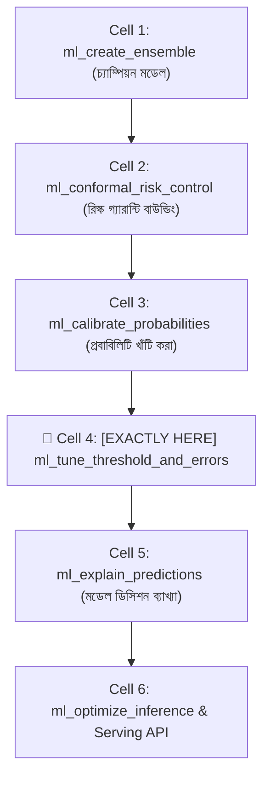
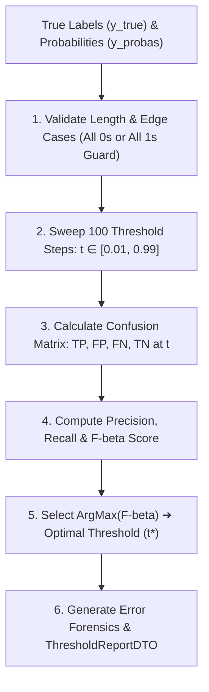

# ml_tune_threshold_and_errors: Deep-Dive Architectural Guide & Reference

> **Tool Name:** `ml_tune_threshold_and_errors`  
> **Module Source:** `src/ml_mcp/engine/threshold.py` / `src/ml_mcp/tools.py`  
> **Class Implementation:** `DecisionThresholdOptimizer`  
> **Layer:** AI Safety, Cost-Sensitive Learning & Error Forensics

---

## ১. মানুষের গল্পের মতো পেছনের ইতিহাস (The Human Story: "The Default 0.5 Fallacy")

বাস্তব জীবনের একটি মারাত্মক আর্থিক বিপর্যয়ের গল্প চিন্তা করুন:
- একটি শীর্ষস্থানীয় আন্তর্জাতিক ব্যাংক তাদের ক্রেডিট কার্ড জালিয়াতি (Fraud Detection) ঠেকানোর জন্য একটি শক্তিশালী মেশিন লার্নিং মডেল বসাল।
- মডেলটি একটি সন্দেহজনক ট্রানজেকশন দেখে প্রেডিক্ট করল: `Fraud Probability = 0.49` (৪৯% সম্ভাবনা)।
- জুনিয়র ডেভেলপার কোডে লিখে রেখেছিলেন:
  ```python
  prediction = 1 if proba >= 0.50 else 0  # মারাত্মক ভুল!
  ```
- যেহেতু `0.49 < 0.50`, সিস্টেম ট্রানজেকশনটিকে "Valid" বলে ছেড়ে দিল। কিন্তু এটি ছিল একজন রাশিয়ান হ্যাকারের $৫০,০০০ ডলারের ভুয়া ট্রানজেকশন! ব্যাংক সম্পূর্ণ টাকা হারাল।

**কেন এই বিপর্যয় ঘটল?**  
মেশিন লার্নিংয়ের পাঠ্যবইগুলোতে অন্ধভাবে শেখানো হয়: *"সম্ভাবনা ০.৫০ এর বেশি হলে ১ ধরো, কম হলে ০ ধরো।"*  
কিন্তু বাস্তব দুনিয়ায় **ভুলের খরচ কখনোই সমান নয় (Asymmetric Cost of Error)**!
- **False Negative (FN - মিসড ফ্রড/রোগী):** একজন হ্যাকারকে ছেড়ে দেওয়া মানে ব্যাংকের ৫০,০০০ ডলার ক্ষতি। একজন ক্যান্সার রোগীকে "সুস্থ" বলা মানে তার মৃত্যু।
- **False Positive (FP - মিথ্যা অ্যালার্ম):** একজন সৎ কাস্টমারকে সাময়িকভাবে আটকে এসএমএস ভেরিফিকেশন পাঠানো বা অতিরিক্ত এক্স-রে করার খরচ মাত্র $১ ডলার।

যেখানে একটি ভুলের ক্ষতি অন্য ভুলের চেয়ে ৫০,০০০ গুণ বেশি, সেখানে আপনি কীভাবে একটি বোকা **০.৫০ কাটঅফ** ব্যবহার করতে পারেন?

অন্যদিকে ইমেইল স্প্যাম ফিল্টারের কথা ভাবুন—একটি গুরুত্বপূর্ণ চাকরির অফার বা পাসওয়ার্ড রিসেট ইমেইলকে স্প্যাম ফোল্ডারে ফেলে দেওয়া (False Positive) ক্ষমার অযোগ্য অপরাধ! সেখানে দরকার অনেক হাই থ্রেশহোল্ড (যেমন: ০.৮৫)।

**এই সংকটের গাণিতিক সমাধান হলো `ml_tune_threshold_and_errors`:**  
এটি অন্ধ ০.৫০ থ্রেশহোল্ড ভেঙে বিজনেস রিস্ক এবং $F_\beta$ অপটিমাইজেশনের মাধ্যমে এমন একটি অপটিমাল ডিসিশন বাউন্ডারি বের করে—যা আপনার বিজনেসের আর্থিক ক্ষতি সর্বনিম্ন করে এবং কনফিউশন ম্যাট্রিক্স দিয়ে এররের ময়না-তদন্ত (Error Forensics) উপহার দেয়!

---

## ২. এটা আসলে কী কাজ করে? (Core Mission)

সহজ কথায়: **এটি বিজনেসের লাভ-ক্ষতির ওপর ভিত্তি করে মডেলের ডিসিশন কাটঅফ নিখুঁতভাবে সমন্বয় করে এবং ভুলের ময়না-তদন্ত করে।**

এটি একটি স্বয়ংক্রিয় ৩-ধাপের পাইপলাইন চালায়:
1. **১০০-স্টেপ থ্রেশহোল্ড সুইপ (Grid Search):** সম্ভাব্য কাটঅফ $0.01$ থেকে $0.99$ পর্যন্ত ১০০টি ধাপে সুইপ করে প্রতিটি কাটঅফের জন্য প্রিসিশন (Precision) এবং রিকল (Recall) ক্যালকুলেট করে।
2. **$F_\beta$ বিজনেস অপটিমাইজেশন:** ব্যবহারকারীর দেওয়া $\beta$ ওয়েট অনুযায়ী এমন একটি কাটঅফ খুঁজে বের করে যা টার্গেট মেট্রিককে সর্বোচ্চ করে (যেমন: $\beta=2$ হলে রিকলকে দ্বিগুণ গুরুত্ব দেওয়া হয়)।
3. **এরর ফরেনসিক্স ও কনফিউশন ম্যাট্রিক্স:** অপটিমাল কাটঅফে মডেল ঠিক কয়টি ট্রু-পজিটিভ (TP), ট্রু-নেগেটিভ (TN), এবং মারাত্মক হার্ড ফলস-নেগেটিভ (FN) তৈরি করছে তার পূর্ণাঙ্গ এক্স-রে রিপোর্ট দেয়।

---

## ৩. নোটবুকের ঠিক কোন কোড সেলের পর এটি কাজ করবে? (Pipeline Placement)



### 🎯 সুনির্দিষ্ট নিয়ম:
> **এটি সবসময় প্রবাবিলিটি ক্যালিব্রেশন (`ml_calibrate_probabilities`)-এর ঠিক পরে এবং ইনফ্যারেন্স সার্ভিংয়ের পূর্বে বসবে।**

### কেন আগে বা পরে বসানো যাবে না? (Engineering Reason)
- **ক্যালিব্রেশনের আগে কেন নয়?** কারণ আন-ক্যালিব্রেটেড মডেলের প্রবাবিলিটি নিজে থেকেই বিকৃত থাকে (Overconfident/Skewed)। বিকৃত প্রবাবিলিটির ওপর থ্রেশহোল্ড কাটলে টেস্ট ডেটায় মডেল চরম আনস্টেবল আচরণ করে।
- **মডেল সার্ভিংয়ের পরে কেন নয়?** আপনি যদি সার্ভিং এপিআইতে এই অপটিমাল কাটঅফ কনফিগার না করেন, তবে আপনার প্রোডাকশন এপিআই ডিফল্ট `0.5` ব্যবহার করে বিজনেসের বিরাট ক্ষতি করতে থাকবে।

---

## ৪. প্যারামিটার পরিচিতি (The Exact Parameters)

| প্যারামিটার | টাইপ | রিকোয়ার্ড? | ডিফল্ট | বিবরণ |
| :--- | :---: | :---: | :---: | :--- |
| **`csv_path`** | `string` | **হ্যাঁ** | - | ফিচার ও টার্গেট ডেটাসেটের পাথ। |
| **`target_column`** | `string` | **হ্যাঁ** | - | যে টার্গেট কলামের ওপর ক্লাসিফায়ার ডিসিশন কাটবে। |
| **`beta`** | `number` | না | `1.0` | রিকলের আপেক্ষিক গুরুত্ব ($\beta=1.0$: স্ট্যান্ডার্ড F1; $\beta=2.0$: রিকল দ্বিগুণ গুরুত্বপূর্ণ; $\beta=0.5$: প্রিসিশন দ্বিগুণ গুরুত্বপূর্ণ)। |

---

## ৫. টুলের ভেতরের গভীর ইঞ্জিনিয়ারিং ফিচার (Internal Engine Secrets)

`DecisionThresholdOptimizer` ক্লাসের অভ্যন্তরীণ আর্কিটেকচারাল ফ্লো:



### প্রধান ফিচারসমূহ:

#### ১. $F_\beta$ গাণিতিক অপটিমাইজেশন সমীকরণ
$$F_\beta = (1 + \beta^2) \cdot \frac{\text{Precision} \times \text{Recall}}{(\beta^2 \times \text{Precision}) + \text{Recall}}$$
- **$\beta = 2.0$ (High-Recall Mode):** মেডিকেল বা ফ্রড ডিটেকশনের জন্য। ইঞ্জিন থ্রেশহোল্ডকে নিচের দিকে (যেমন: $0.22$) নামিয়ে আনে, যাতে একটি ফ্রডও মিস না হয়।
- **$\beta = 0.5$ (High-Precision Mode):** মার্কেটিং বা অটোমেটেড পেমেন্ট প্রসেসিংয়ের জন্য। ইঞ্জিন থ্রেশহোল্ডকে ওপরের দিকে (যেমন: $0.78$) ঠেলে দেয়, যাতে কোনো মিথ্যা অ্যালার্ম না বাজে।

#### ২. এজ-কেস ও ডেটা ক্র্যাশ গার্ড
যদি টেস্ট ডেটাতে কোনো পজিটিভ স্যাম্পল না থাকে (`total_positives == 0`) অথবা সব স্যাম্পলই পজিটিভ হয় (`total_negatives == 0`), সাধারণ স্ক্রিপ্ট `ZeroDivisionError` দিয়ে ক্র্যাশ করে। এই ইঞ্জিন নিখুঁতভাবে এজ-কেস হ্যান্ডেল করে সেফ ফলব্যাক প্রদান করে।

#### ৩. হার্ড এরর ফরেনসিক্স (`confusion_matrix`)
অপটিমাল কাটঅফ নির্ধারণ করার সাথে সাথে ইঞ্জিন ব্যবহারকারীকে কনফিউশন ম্যাট্রিক্সের ভেতরের সত্য জানিয়ে দেয়:
- কয়টি ফ্রড মিস হলো (`false_negative_count`)?
- কয়টি সৎ কাস্টমারকে সন্দেহ করা হলো (`false_positive_count`)?
- এর ফলে ডেটা সায়েন্টিস্টরা বিজনেসের সি-লেভেল এক্সিকিউটিভদের সামনে ডলারের অংকে ক্ষতির হিসাব তুলে ধরতে পারেন।

#### ৪. ডিফেন্সিভ ডেটা পাইপলাইন ফলব্যাক
ইনপুট ডেটাসেটে যদি কোনো স্ট্রিং বা ক্যাটাগরিক্যাল কলাম অথবা মিসিং ভ্যালু থাকে, টুলটি নিজে থেকেই `DefensivePipelineBuilder` ব্যবহার করে ডেটা অটো-এনকোড করে নেয়, যাতে কোনো ডেটা টাইপ এরর ছাড়াই থ্রেশহোল্ড অপটিমাইজেশন সম্পন্ন হয়।

---

## ৬. প্রোডাকশন ব্যবহারবিধি (Usage Example via MCP)

### ইনপুট পেলোড:
```json
{
  "csv_path": "data/fraud_transactions.csv",
  "target_column": "is_fraud",
  "beta": 2.0
}
```

### রিটার্ন আউটপুট রেসপন্স:
```json
{
  "optimal_threshold": 0.2312,
  "f_beta_score": 0.8942,
  "precision": 0.8125,
  "recall": 0.9412,
  "confusion_matrix": {
    "tn": 8420,
    "fp": 140,
    "fn": 12,
    "tp": 192
  }
}
```

---

### এক লাইনে সারমর্ম:
`ml_tune_threshold_and_errors` হলো আপনার মডেলের জন্য একটি **কাস্টম বিজনেস গিয়ারবক্স**—যা ডিফল্ট ০.৫০ এর অন্ধ নিয়ম ভেঙে আপনার বিজনেসের লাভ-ক্ষতির অঙ্ক অনুযায়ী সঠিক ডিসিশন বাউন্ডারি বসিয়ে দেয়!
