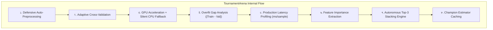

# ml_benchmark_models: Deep-Dive Architectural Guide & Reference

> **Tool Name:** `ml_benchmark_models`  
> **Module Source:** `src/ml_mcp/engine/tournament_arena.py` / `src/ml_mcp/tools.py`  
> **Class Implementation:** `TournamentArena`  
> **Layer:** Competitive Arena & Model Benchmarking

---

## ১. মানুষের গল্পের মতো ইতিহাস (The Human Story)

মেশিন লার্নিং ইঞ্জিনিয়ারদের জীবনে একটি বড় ট্র্যাজেডি আছে। 

ধরুন, অফিসের বস বা ক্লায়েন্ট এসে একটি নতুন ডেটাসেট দিয়ে বলল: *"এই নাও ডেটা, কাল সকালের মধ্যে বলো পণ্যের দাম কীভাবে প্রেডিক্ট করব বা সবচেয়ে নির্ভুল মডেল কোনটা হবে।"*

সাধারণত একজন ডেটা সায়েন্টিস্ট তখন কী করে?
1. সে প্রথমে তার প্রিয় লাইব্রেরি (হয়তো **XGBoost**) ওপেন করে।
2. কোড লিখে: ডেটা লোড করো, ট্রেন-টেস্ট স্প্লিট করো, মডেল ফিট করো, মেট্রিক্স মেপে খাতায় লিখে রাখো।
3. এরপর মনে পড়ে—*"আরে, CatBoost তো ক্যাটাগরিক্যাল ডাটায় ভালো করে!"* আবার ২০ লাইন কোড লিখে CatBoost চালাও।
4. এরপর মনে হয়—*"Random Forest বা LightGBM কি আরও ফাস্ট হবে?"* আবার কোড লেখো।
5. দেখতে দেখতে রাত ২টা বেজে যায়। টেবিলে কফির কাপ জমে, কিন্তু কোনটা আসলেই সেরা আর কোনটা ডাটা মুখস্থ করে বেশি নম্বর দেখাচ্ছে—তা নিশ্চিত হওয়া যায় না।

গণিতে একটি চিরন্তন সত্যি আছে: **"No Free Lunch Theorem"**। কোনো একক অ্যালগরিদম কখনোই পৃথিবীর সব সমস্যার মহৌষধ হতে পারে না। যে ডেটাসেটে XGBoost চ্যাম্পিয়ন, অন্য ডেটাসেটে হয়তো সাধারণ Random Forest বা CatBoost তাকে গোল দিয়ে দেবে।

**ঠিক এই মানবিক ক্লান্তি ও সময় অপচয়কে চিরতরে দূর করার জন্য `ml_benchmark_models`-এর জন্ম।** এটি কোনো সাধারণ স্ক্রিপ্ট নয়—এটি একটি **স্বয়ংক্রিয় রোমান গ্ল্যাডিয়েটর এরিনা**, যেখানে শীর্ষ ৮টি অ্যালগরিদমকে এক খাঁচায় নামিয়ে দেওয়া হয় এবং মাত্র কয়েক মিনিটের মধ্যে নিরপেক্ষ প্রতিযোগিতার মাধ্যমে চ্যাম্পিয়ন নির্ধারিত হয়।

---

## ২. এটা আসলে কী কাজ করে? (Core Mission)

সহজ কথায়: **এটি অ্যালগরিদমদের অলিম্পিক গেমস পরিচালনা করে।**

আপনি শুধু আপনার ডেটা ফাইল আর টার্গেট কলামের নাম দেন। বাকি সব দায়িত্ব এর:
1. সে পুরো ডেটাবেজকে ৫ টুকরো করে নেয় (৫-ফোল্ড ক্রস ভ্যালিডেশন)।
2. বিশ্বের সেরা ৮টি অ্যালগরিদমকে (CatBoost, XGBoost, LightGBM, Random Forest, Extra Trees, Gradient Boosting, Ridge, ElasticNet) মাঠে নামিয়ে দেয়।
3. সবাইকে দিয়ে ট্রেনিং করায় এবং নিরপেক্ষ পরীক্ষা নেয়।
4. কে জিতেছে, কে কত দ্রুত সিদ্ধান্ত নিয়েছে, এবং কার ভেতরে ওভারফিটিংয়ের ঘুণপোকা আছে—তা সাজিয়ে একটি চকচকে **লিডারবোর্ড** তৈরি করে দেয়।

---

## ৩. কখন এটি কাজ করে / কখন ব্যবহার করবেন? (When to Use)

###  ব্যবহারের সঠিক সময়:
1. **বেস্ট অ্যালগরিদম বাছাইয়ের মুহূর্তে:** ডেটাসেট প্রস্তুত, আপনি প্রেডিক্ট করতে চান, কিন্তু জানেন না কোন অ্যালগরিদম সবচেয়ে ভালো কাজ করবে।
2. **হাইপারপ্যারামিটার টিউনিংয়ের আগে:** সব মডেলকে নিয়ে ঘাটাঘাটি করার সময় নেই; আগে দেখতে চান কার মধ্যে সম্ভাবনা সবচেয়ে বেশি, যাতে শুধু সেরা ১-২টি মডেলকে নিয়ে পরের ধাপে ফাইন-টিউনিং করা যায়।
3. **ক্লায়েন্ট বা লিড আর্কিটেক্টকে প্রুফ দেখানোর সময়:** মুখে না বলে গাণিতিক লিডারবোর্ড টেবিল দিয়ে প্রমাণ করার জন্য যে কেন এই প্রজেক্টে অমুক মডেল সিলেক্ট করা হয়েছে।

### ❌ যে সময় এটি চালানো নিষেধ:
- ডেটা যখন একদম কাঁচা, প্রচুর নাল বা করাপ্ট ডেটা আছে (সেক্ষেত্রে আগে ধাপ-১ এর `ml_audit_dataset` চালিয়ে নেওয়া আবশ্যক)।

---

## ৪. প্যারামিটার পরিচিতি (The Exact Parameters)

| প্যারামিটার | টাইপ | রিকোয়ার্ড? | ডিফল্ট | বিবরণ |
| :--- | :---: | :---: | :---: | :--- |
| **`csv_path`** | `string` | **হ্যাঁ** | - | যে CSV ফাইলের ওপর যুদ্ধ হবে তার সম্পূর্ণ পাথ। |
| **`target_column`** | `string` | **হ্যাঁ** | - | আপনি যে কলাম প্রেডিক্ট করতে চান (যেমন: `"price"` বা `"rating"`). |
| **`task_type`** | `string` | না | `"classification"` | প্রেডিকশন সংখ্যা হলে `"regression"`, ক্যাটাগরি হলে `"classification"`. |
| **`cv_splits`** | `integer` | না | `5` | কত টুকরো করে ক্রস-ভ্যালিডেশন পরীক্ষা নেওয়া হবে (ডিফল্ট ৫-ফোল্ড). |
| **`scoring`** | `string` | না | `null` (Auto: `"roc_auc"` বা `"r2"`) | সুনির্দিষ্ট মূল্যায়ন মেট্রিক (যেমন: `"roc_auc"`, `"f1"`, `"f1_macro"`, `"accuracy"`, `"r2"`, `"neg_root_mean_squared_error"`)। `sklearn.metrics.get_scorer` দিয়ে মেট্রিক অ্যালাইনমেন্ট নিশ্চিত করে যাতে ক্লাসিফায়ার ভুলবশত সাধারণ একুরেসি মেপে মডেল র্যাংক না করে। |
| **`group_column`** | `string` | না | `null` | গ্রুপ বা ক্লাস্টার কলামের নাম। প্রদান করা হলে `StratifiedGroupKFold` ব্যবহার করে গ্রুপ লিকেজ প্রতিরোধ করা হয়। |
| **`fast_mode`** | `boolean` | না | `false` | খুব তাড়া থাকলে `true` দিলে দ্রুত কম ট্রিতে কুইক স্কোর এনে দেবে. |
| **`view`** | `string` | না | `"compact"` | `"compact"` দিলে সামারি লিডারবোর্ড দেবে, আর `"detailed"` দিলে গভীরে সব মেট্রিক্স দেখাবে. |

---

## ৫. টুলের ভেতরের ৮টি মেগা-ফিচার (Internal Engine Architecture)

`TournamentArena` ক্লাসের ভেতরের আর্কিটেকচারাল মেকানিজম:



### প্রধান ৮টি ফিচার:

1. **Defensive Preprocessing:** ডেটায় মিসিং বা নন-নিউমেরিক ভ্যালু থাকলে `DefensivePipelineBuilder` দিয়ে স্বয়ংক্রিয়ভাবে ক্লিন করে নেয়।
2. **Adaptive Cross-Validation:** ক্লাসিফিকেশনে `StratifiedKFold`, রিগ্রেশনে `KFold`, এবং গ্রুপ ডেটায় `StratifiedGroupKFold` ব্যবহার করে ডাটা লিকেজ আটকায়।
3. **GPU Fault-Tolerant Auto-Fallback:** GPU-তে প্রথমে চালায়, কোনো ড্রাইভার ফেইল করলে স্ক্রিপ্ট ক্র্যাশ না করে CPU-তে সুইচ করে ট্রেইনিং শেষ করে।
4. **Overfit Gap Analysis (`overfit_gap`):** $\text{Overfit Gap} = |\text{Train Score} - \text{Validation Score}|$ দিয়ে ফাঁকিবাজ বা মুখস্থ করা মডেল শনাক্ত করে।
5. **Inference Latency Profiling (`inference_latency_ms`):** লাইভ সার্ভারে ১টি প্রেডিকশন দিতে কত মিলি-সেকেন্ড লাগে তা পরীক্ষা করে।
6. **Feature Importance Extraction:** কোন মডেল কোন কলামকে বেশি গুরুত্ব দিল তা এক নজরে বের করে আনে।
7. **Diversity-Guarded Stacking Ensemble Engine (Kuncheva & Whitaker 2003):** অন্ধভাবে শীর্ষ ৩টি মডেল না নিয়ে তাদের ওওএফ প্রেডিকশনের Pearson Correlation ($r$) পরীক্ষা করা হয়। $r \ge 0.95$ (অতিরিক্ত সদৃশ/কোলিনিয়ার) মডেলগুলোকে ফিল্টার আউট করে কেবল স্বতন্ত্র ও বৈচিত্র্যময় মডেল দিয়ে `StackingEnsemble` তৈরি করা হয় এবং এর বাস্তব ফিট টাইম ও ইনফারেন্স লেটেন্সি পরিমাপ করা হয়।
8. **Metric Alignment & Zero-Leakage State Isolation (`get_scorer` + `clone`):** প্রতিটি ফোল্ডে মডেল ফিট করার পূর্বে `clone()` করা হয় যাতে কোনো মেমরি বা ক্যাশ লিক না হয়। ক্লাসিফায়ারে `model.score()`-এর একুরেসি ফাঁদ নির্মূল করে ব্যবহারকারীর কাঙ্ক্ষিত মেট্রিক অনুযায়ী র্যাংকিং নিশ্চিত করা হয়।
9. **Champion Estimator Caching:** চ্যাম্পিয়ন মডেলটিকে মেমোরিতে লক করে রাখে যাতে সরাসরি ONNX এক্সপোর্ট বা FastAPI সার্ভিংয়ে ব্যবহার করা যায়।

---

## ৬. প্রোডাকশন ব্যবহারবিধি (Usage Example via MCP)

```json
{
  "csv_path": "e:/ML Testing/data/dataset.csv",
  "target_column": "price",
  "task_type": "regression",
  "cv_splits": 5
}
```
