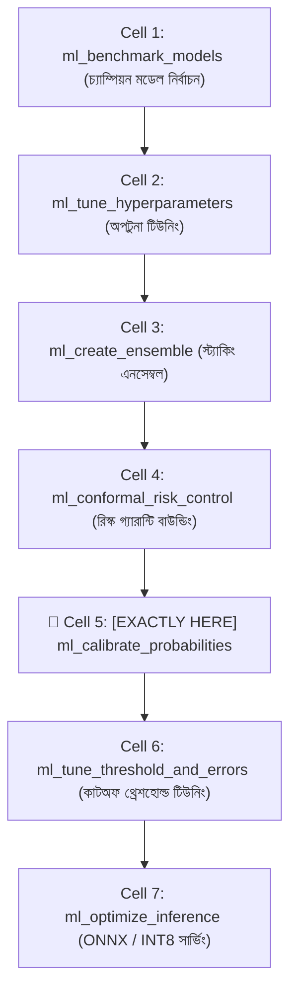
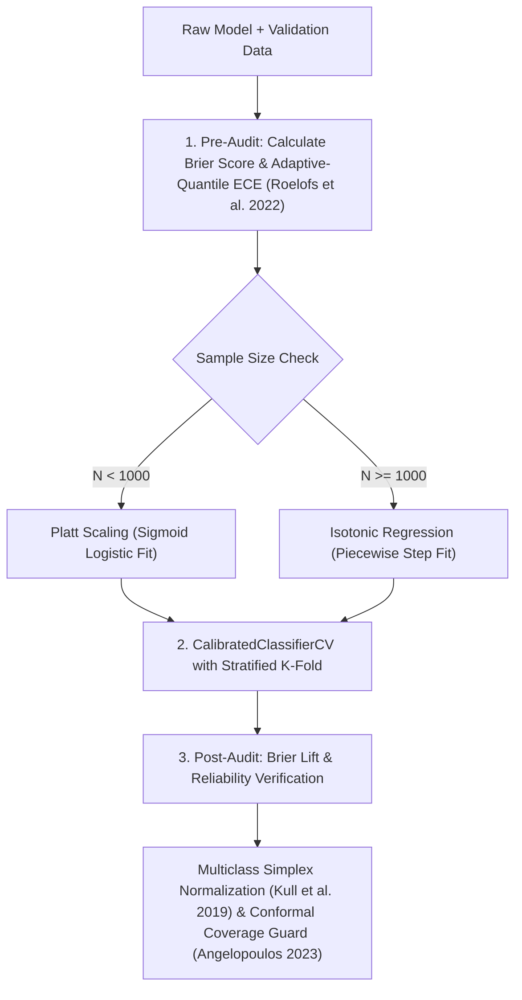

# ml_calibrate_probabilities: Deep-Dive Architectural Guide & Reference

> **Tool Name:** `ml_calibrate_probabilities`  
> **Module Source:** `src/ml_mcp/engine/calibrator.py` / `src/ml_mcp/tools.py`  
> **Class Implementation:** `ProbabilityCalibrator`  
> **Layer:** AI Safety, Probability Calibration & Reliability Engineering

---

## ১. মানুষের গল্পের মতো পেছনের ইতিহাস (The Human Story: "The Overconfident Liar")

আবহাওয়াবিদ ও ব্যাংকের লোন অফিসারের বাস্তব জীবনের একটি দারুণ উদাহরণ চিন্তা করুন:
- একজন আবহাওয়াবিদ টিভিতে এসে বললেন: *"কাল বৃষ্টি হওয়ার সম্ভাবনা ৮০%।"*
- আপনি যদি সারা বছর এমন দিনগুলোকে পর্যবেক্ষণ করেন যেগুলোতে আবহাওয়াবিদ "৮০% সম্ভাবনা" বলেছিলেন—এবং দেখেন যে বাস্তবে সেই ১০০টি দিনের মধ্যে **ঠিক ৮০টি দিনই বৃষ্টি হয়েছে**, তবে আপনি বলবেন আবহাওয়াবিদ একজন **নিখুঁত ক্যালিব্রেটেড (Well-Calibrated)** মানুষ।
- কিন্তু যদি দেখা যায় যেসব দিনে তিনি ৮০% বৃষ্টি বলেছিলেন, বাস্তবে বৃষ্টি হয়েছে মাত্র ৩০টি দিনে—তবে তিনি একজন চরম **ওভার-কনফিডেন্ট মিথ্যুক (Overconfident Predictor)**!

মেশিন লার্নিংয়ের আধুনিক মডেলগুলো (যেমন: **XGBoost, CatBoost, LightGBM, Random Forest এবং Deep Neural Networks**) ঠিক এই মারাত্মক রোগে আক্রান্ত!
- একটি ব্যাংক ফ্রড ডিটেকশন মডেল হয়তো কোনো লেনদেন দেখে বলল: `Fraud Probability = 0.90` (৯০% নিশ্চিত)।
- কিন্তু বাস্তবে দেখা যায়, যেসব ট্রানজেকশনে মডেল ০.৯০ সম্ভাবনা দিয়েছিল, সেগুলোর মধ্যে প্রকৃত ফ্রডের হার মাত্র **৪০%**!
- মডেলের সফটম্যাক্স (Softmax) বা ট্রি-লিফ ফ্র্যাকশন স্কোর আসলে **True Empirical Probability** নয়। গ্রেডিয়েন্ট বুস্টিং বা ট্রি-মডেলগুলো লস অপটিমাইজ করতে গিয়ে প্রেডিকশনগুলোকে এক্সট্রিম কর্নারে (০ অথবা ১ এর কাছে) ঠেলে দেয়।

**প্রোডাকশন ইঞ্জিনিয়ারদের সংকট:**
আপনার বিজনেসে যদি এমন নিয়ম থাকে: *"যেসব লোন অ্যাপ্লিকেশনের ডিফল্ট রিস্ক ৭০%-এর বেশি, সেগুলো অটোমেটিক রিজেক্ট করো আর বাকিগুলোতে লোন দাও"*—তাহলে আনক্যালিব্রেটেড মডেল ব্যবহার করলে আপনার ব্যাংক হাজার হাজার ভালো কাস্টমার হারাবে এবং ভুল ক্যালকুলেশনে কোটি কোটি টাকার লোকসান গুনবে।

**এই সমস্যার গাণিতিক সমাধান হলো `ml_calibrate_probabilities`:**  
এটি মডেলের কাঁচা বিকৃত স্কোরগুলোকে পোস্ট-প্রসেসিংয়ের মাধ্যমে ফিল্টার করে রিয়েল-ওয়ার্ল্ড ট্রু ফ্রিকোয়েন্সির সাথে নিখুঁতভাবে সারিবদ্ধ (Align) করে দেয়। ফলে মডেল যখন বলবে **৮০% সম্ভাবনা**, তখন বাস্তবেও তার নির্ভুলতার হার হবে **ঠিক ৮০%**!

---

## ২. এটা আসলে কী কাজ করে? (Core Mission)

সহজ কথায়: **এটি মডেলের মুখের ফাঁকা বুলি (Overconfidence) দূর করে সত্যবাদী সম্ভাব্যতা (True Posterior Probability) উপহার দেয়।**

এটি একটি স্বয়ংক্রিয় ৩-ধাপের পাইপলাইন চালায়:
1. **প্রি-ক্যালিব্রেশন এরর অডিট (Baseline Audit):** মূল মডেলের ওপর Out-Of-Fold ক্রস-ভ্যালিডেশন চালিয়ে এর **Brier Score** এবং **Expected Calibration Error (ECE)** পরিমাপ করে দেখে মডেল কতটা মিথ্যে বলছে।
2. **অটোমেটিক মেথড সিলেকশন (Platt Scaling vs Isotonic):** ডেটাসেটের আকার যদি ছোট হয় (< ১০০০ স্যাম্পল), এটি ওভারফিটিং রোধ করতে প্যারামেট্রিক **Platt Scaling (Sigmoid)** বেছে নেয়। আর ডেটাসেট বড় হলে ( $\ge ১০০০$ স্যাম্পল), নন-প্যারামেট্রিক **Isotonic Regression** সক্রিয় করে।
3. **লিক-ফ্রি ক্যালিব্রেটেড মডেল তৈরি (Fitted Pipeline):** `CalibratedClassifierCV` ব্যবহার করে ডেটা লিকেজ ছাড়াই ক্যালিব্রেটেড মডেল তৈরি করে এবং ক্যালিব্রেশনের পর ব্রায়ার স্কোর ও ECE কতটা কমল (`brier_score_lift`, `ece_lift`) তা রিপোর্টে তুলে ধরে।

---

## ৩. নোটবুকের ঠিক কোন কোড সেলের পর এটি কাজ করবে? (Pipeline Placement)



### 🎯 সুনির্দিষ্ট নিয়ম:
> **এটি সবসময় মডেল ট্রেনিং/টিউনিংয়ের পরে এবং ডিসিশন থ্রেশহোল্ড টিউনিং (`ml_tune_threshold_and_errors`)-এর ঠিক পূর্বে বসবে।**

### কেন আগে বা পরে বসানো যাবে না? (Engineering Reason)
- **মডেল ট্রেনিংয়ের আগে কেন নয়?** কারণ এটি কোনো নতুন মডেল ট্রেইন করে না, বরং বিদ্যমান প্রি-ট্রেইনড মডেলের আউটপুট প্রবাবিলিটিকে পোস্ট-প্রসেস করে।
- **থ্রেশহোল্ড টিউনিংয়ের পরে কেন নয়?** যদি আপনার প্রবাবিলিটিই বিকৃত বা ভুল থাকে, তবে সেই ভুল প্রবাবিলিটির ওপর ভিত্তি করে কোনো অপটিমাল বিজনেস ডিসিশন থ্রেশহোল্ড ($F_\beta$ Cutoff) বের করা অসম্ভব! আগে সম্ভাব্যতাকে খাঁটি বানাতে হবে, তারপর ডিসিশন থ্রেশহোল্ড কাটতে হবে।

---

## ৪. প্যারামিটার পরিচিতি (The Exact Parameters)

| প্যারামিটার | টাইপ | রিকোয়ার্ড? | ডিফল্ট | বিবরণ |
| :--- | :---: | :---: | :---: | :--- |
| **`csv_path`** | `string` | **হ্যাঁ** | - | ট্রেন্ড ও ভ্যালিডেশন ডেটাসেটের পাথ। |
| **`target_column`** | `string` | **হ্যাঁ** | - | যে টার্গেট কলামের সম্ভাব্যতা ক্যালিব্রেট করতে হবে। |
| **`method`** | `string` বা `null` | না | `null` | ক্যালিব্রেশন মেথড: `"sigmoid"` (Platt Scaling), `"isotonic"`, `"temperature"` (Guo et al. ICML 2017), অথবা `null` (স্বয়ংক্রিয় নির্বাচন)। |
| **`model_name`** | `string` | না | `"lightgbm"` | মডেল অ্যালগরিদম (`"lightgbm"`, `"xgboost"`, `"catboost"`, `"random_forest"`)। |
| **`model_path`** | `string` বা `null` | না | `null` | প্রাক-প্রশিক্ষিত সেভ করা `.joblib` মডেলের পাথ। |
| **`alpha`** | `number` | না | `0.10` | কনফরমাল প্রেডিকশন মার্জিনাল এরর বাজেট ($1 - \alpha = 90\%$ গ্যারান্টিড কভারেজ)। |

---

## ৫. টুলের ভেতরের গভীর ইঞ্জিনিয়ারিং ফিচার (Internal Engine Secrets)

`ProbabilityCalibrator` ক্লাসের অভ্যন্তরীণ আর্কিটেকচারাল ফ্লো:



### প্রধান ফিচারসমূহ:

#### ১. প্ল্যাট স্কেলিং বনাম আইসোটোনিক রিগ্রেশন (স্মার্ট মেথড সিলেকশন)
- **Platt Scaling (Sigmoid):**
  $$P(Y=1 | f) = \frac{1}{1 + \exp(A \cdot f + B)}$$
  মডেলের মার্জিনাল আউটপুট $f$-এর ওপর একটি রিজিড লজিস্টিক সিগময়েড কার্ভ ফিট করে। ছোট ডেটাসেটে এটি ওভারফিটিং প্রতিরোধ করে।
- **Isotonic Regression:**
  $$\min \sum (y_i - m(f_i))^2 \quad \text{subject to } m(f_i) \le m(f_j) \text{ whenever } f_i \le f_j$$
  এটি একটি নন-প্যারামেট্রিক স্টেপ-ফাংশন ফিট করে। এটি সিগময়েডের চেয়ে অনেক বেশি ফ্লেক্সিবল, তবে ডেটা কম হলে ওভারফিট করতে পারে। তাই টুলটি $\ge ১০০০$ স্যাম্পলে স্বয়ংক্রিয়ভাবে এটিকে পছন্দ করে।

#### ২. ব্রায়ার স্কোর ট্র্যাকার (`calculate_multiclass_brier`)
ব্রায়ার স্কোর হলো প্রবাবিলিটির মিন স্কয়ার্ড এরর (Mean Squared Error):
$$\text{Brier Score} = \frac{1}{N} \sum_{i=1}^{N} (p_i - y_i)^2$$
ব্রায়ার স্কোর ০.০ হওয়া মানে নিখুঁত নির্ভুলতা। টুলটি ক্যালিব্রেশনের আগের ও পরের ব্রায়ার স্কোর তুলনা করে `brier_score_lift` হিসাব করে।

#### ৩. এক্সপেক্টেড ক্যালিব্রেশন এরর (`calculate_ece`)
কনফিডেন্স স্কোরকে ১০টি বিনে ($0.0-0.1, 0.1-0.2, \dots, 0.9-1.0$) ভাগ করে প্রতিটি বিনের প্রকৃত এক্যুরেসি এবং মডেলের কনফিডেন্সের মধ্যকার গড় পার্থক্য পরিমাপ করে:
$$\text{ECE} = \sum_{m=1}^{M} \frac{|B_m|}{N} \left| \text{acc}(B_m) - \text{conf}(B_m) \right|$$
যদি $\text{ECE} \le 0.10$ হয়, তবে মডেলটি প্রোডাকশনের জন্য বিশ্বস্ত (`is_well_calibrated = True`) হিসেবে সার্টিফাইড হয়।

#### ৪. সেফ স্কিপ ফর রিগ্রেশন টাস্ক
যদি কোনো ইউজার ভুলবশত কোনো রিগ্রেশন ডেটাসেটে এটি চালায়, টুলটি ক্র্যাশ করে না; সে সতর্কবার্তা দিয়ে মূল মডেলকে অক্ষত অবস্থায় ফেরত পাঠায় (`status: skipped_regression_task`)।

---

## ৬. প্রোডাকশন ব্যবহারবিধি (Usage Example via MCP)

### ইনপুট পেলোড:
```json
{
  "csv_path": "data/loan_default_data.csv",
  "target_column": "is_default",
  "method": null
}
```

### রিটার্ন আউটপুট রেসপন্স:
```json
{
  "method": "isotonic",
  "pre_brier_score": 0.2145,
  "post_brier_score": 0.0812,
  "brier_score_lift": 0.1333,
  "is_well_calibrated": true,
  "status": "completed",
  "pre_ece": 0.184,
  "post_ece": 0.042,
  "ece_lift": 0.142
}
```

---

### এক লাইনে সারমর্ম:
`ml_calibrate_probabilities` হলো আপনার মডেলের জন্য একটি **ডিজিটাল ট্রুথ-সিরাম (Truth Serum)**—যা মডেলের ফাঁকা ওভার-কনফিডেন্স দূর করে প্রবাবিলিটিকে এমনভাবে সাজায় যেন ৮০% বলা মানে বাস্তবেও ৮০% ঘটে!
