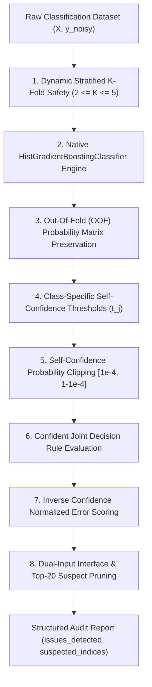

# ml_detect_label_errors: Deep-Dive Architectural Guide & Reference

> **টুল পরিচিতি:** `ml_detect_label_errors`  
> **মডিউল উৎস:** `src/ml_mcp/engine/label_error_detector.py` / `src/ml_mcp/tools.py`  
> **ক্লাস ইমপ্লিমেন্টেশন:** `LabelErrorDetector`  
> **আর্কিটেকচার লেয়ার:** Phase 1: Data Audit & Hygiene  
> **রিসার্চ পেপার:** Northcutt, Jiang, Chuang (MIT & Harvard) - *"Confident Learning: Estimating Uncertainty in Dataset Labels"*, JAIR 2021 ([arXiv:1911.00068](https://arxiv.org/abs/1911.00068))

---

## ১. মানুষের গল্পের মতো ইতিহাস (The Human Story)

কল্পনা করুন, একটি হাসপাতালের সেন্ট্রাল সার্ভারে ১০,০০০ রোগীর টিউমারের রিপোর্ট রয়েছে। প্রতিটি টিউমারের সাথে চিকিৎসকের দেওয়া লেবেল আছে: `ম্যালিগন্যান্ট (ক্যান্সার)` অথবা `বেনাইন (ক্যান্সার নয়)`। 

হাসপাতালের লক্ষ্য এই ডেটার ওপর একটি স্টেট-অব-দ্য-আর্ট ডিপ লার্নিং বা গ্রেডিয়েন্ট বুস্টিং মডেল ট্রেইন করা। শত শত ঘণ্টার কম্পিউটেশনাল সময় আর লক্ষ লক্ষ ডলার খরচ করে মডেল ট্রেইন করা হলো। কিন্তু টেস্ট সেটে মডেলের অ্যাকুরেসি আশঙ্কাজনকভাবে আটকে রইল। 

ইঞ্জিনিয়াররা মডেলের আর্কিটেকচার পাল্টালেন, লার্নিং রেট টিউন করলেন, এমনকি নতুন নিউরাল নেটওয়ার্ক বানালেন—কিন্তু কোনো উন্নতি হলো না। 

অবশেষে একজন বায়োমেডিকেল ইঞ্জিনিয়ার ডেটাসেটের কিছু সন্দেহভাজন রো মানুষের চোখে অডিট করতে গিয়ে হতবাক হয়ে গেলেন! দেখা গেল:
- অন্তত ৩৫০টি স্পষ্ট ক্যান্সারের টিউমারকে হাসপাতালের ডাটা এন্ট্রি অপারেটর অসাবধানতাবশত `বেনাইন` লিখে রেখেছেন!
- আবার কিছু সাধারণ সিস্টকে ভুল করে `ম্যালিগন্যান্ট` মার্ক করা হয়েছে।

মেশিন লার্নিং কমিউনিটিতে বহু দশক ধরে একটি চরম অন্ধবিশ্বাস প্রচলিত ছিল: *"ডেটা বিজ্ঞানীরা ধরে নেন তাদের গ্রাউন্ড ট্রুথ (Ground Truth) লেবেল ১০০% পবিত্র ও অভ্রান্ত।"* 

বাস্তবতা হলো—মানুষই লেবেল তৈরি করে, আর মানুষ মাত্রই ভুল করে। এমআইটি (MIT)-এর গবেষক কার্টিস নর্থকাট (Curtis Northcutt) এবং হার্ভার্ডের গবেষকরা প্রমাণ করেছেন যে এমনকি ImageNet, CIFAR, এবং Amazon Reviews-এর মতো বিশ্বের সবচেয়ে বিখ্যাত একাডেমিক বেঞ্চমার্ক ডেটাসেটেও **৩% থেকে ১০% লেবেল সম্পূর্ণ ভুল!**

ভুল লেবেল দিয়ে মডেল ট্রেইন করলে:
1. মডেল মিথ্যা তথ্যকে মুখস্থ (Overfit) করার চেষ্টা করে।
2. ডিজিশন বাউন্ডারি বাঁকা ও বিকৃত হয়ে প্রোডাকশনে সাধারণ রোগীদের ভুল ডায়াগনোসিস দেয়।
3. মডেল কখনোই টেস্ট সেটে উচ্চ পারফরম্যান্সে পৌঁছাতে পারে না।

কোনো থার্ড-পার্টি ভারী প্যাকেজ ছাড়াই খাঁটি গণিত ও এমআইটি গবেষণার ওপর ভিত্তি করে ডেটাসেটের সেই লুকানো ভুল লেবেলগুলো খুঁজে বের করতেই তৈরি হয়েছে **`ml_detect_label_errors`**।

---

## ২. এটা আসলে কী কাজ করে? (Core Mission)

`ml_detect_label_errors` হলো একটি **আনসুপারভাইজড কনফিডেন্ট লার্নিং ও গ্রাউন্ড-ট্রুথ অডিট ইঞ্জিন**।

এর মূল লক্ষ্য হলো ডেটাসেটের প্রতিটি নমুনার জন্য প্রদত্ত লেবেল $\tilde{y}$ এবং তার লুকানো প্রকৃত লেবেল $y^*$ এর যৌথ সম্ভাবনা হিসাব করে সেই সমস্ত রো-কে চিহ্নিত করা যেখানে:

$$\text{Label Error Condition: } \hat{P}(\tilde{y} = j \mid x) \ge t_j \quad \land \quad \tilde{y}_{\text{given}} \ne j$$

অর্থাৎ, মডেলের আনবায়াসড সেলফ-কনফিডেন্স থ্রেশহোল্ড অতিক্রম করার পরেও যদি দেখা যায় নমুনার প্রদত্ত লেবেলটি অন্য ক্লাসের দিকে ইঙ্গিত করছে, তবে সেটিকে **লেবেল এরর** হিসেবে লাল পতাকা প্রদর্শন করা।

---

## ৩. কখন এটি কাজ করে / কখন ব্যবহার করবেন? (When to Use)

| দৃশ্যপট | সনাতন ভুল | `ml_detect_label_errors` এর ভূমিকা |
| :--- | :--- | :--- |
| প্যারামিটার | টাইপ | রিকোয়ার্ড? | ডিফল্ট | বিবরণ |
| :--- | :---: | :---: | :---: | :--- |
| **`csv_path`** | `string` | **হ্যাঁ** | - | ট্রেনিং ডেটাসেটের পাথ। |
| **`target_column`** | `string` | **হ্যাঁ** | - | গ্রাউন্ড ট্রুথ টার্গেট কলামের নাম। |
| **`cv_splits`** | `integer` | না | `5` | আউট-অফ-ফোল্ড ক্রস-ভ্যালিডেশন ফোল্ড সংখ্যা। |
| **`task_type`** | `string` | না | `"auto"` | `"auto"`, `"classification"` (Confident Learning), অথবা `"regression"` (Residual Dispersion)। |
| **`view`** | `string` | না | `"compact"` | `"compact"` বা `"detailed"` ভিউ মোড। |

---

## ৪. প্যারামিটার পরিচিতি (The Exact Parameters)

`ml_detect_label_errors` টুলটি **[AuditLabelErrorsInput](file:///E:/Bug/ml.mcp/src/ml_mcp/schemas/audit.py#L27-L36)** স্কিমা গ্রহণ করে:

| প্যারামিটার | টাইপ | রিকোয়ার্ড? | ডিফল্ট | বিবরণ |
| :--- | :---: | :---: | :---: | :--- |
| **`csv_path`** | `string` | না | `None` | যে ক্লাসিফিকেশন ডেটাসেট অডিট করা হবে তার ফাইল পাথ। |
| **`target_column`** | `string` | না | `None` | যে কলামে ক্লাসিফিকেশন লেবেল রয়েছে। |
| **`confidence_threshold`** | `float` | না | `None` | ম্যানুয়াল কনফিডেন্স কাটঅফ (না দিলে এমআইটি ফর্মুলায় ক্লাস থ্রেশহোল্ড গণনা হয়)। |
| **`n_folds`** | `integer` | না | `5` | আউট-অব-ফোল্ড প্রেডিকশনের জন্য স্ট্র্যাটিফাইড ফোল্ড সংখ্যা। |

---

## ৫. টুলের ভেতরের ৮টি মেগা-ফিচার (Internal Engine Architecture)

আমাদের `LabelErrorDetector` ইঞ্জিনটি ৮টি উচ্চক্ষমতাসম্পন্ন গাণিতিক ও আর্কিটেকচারাল মেকানিজমে গঠিত:




### থিওরিটিক্যাল ভিত্তি ও আধুনিক গবেষণা (2021–2023 Label Noise Foundations):

#### ১. Northcutt, Jiang, & Chuang (JAIR 2021) — MIT Confident Learning (Classification)
প্রতিটি ক্লাসের সেলফ-কনফিডেন্স থ্রেশহোল্ড $t_j = \frac{1}{|X_j|} \sum_{x \in X_j} \hat{P}(y=j \mid x)$ বের করে আউট-অফ-ফোল্ড প্রেডিকশন দিয়ে ভুল লেবেল ফ্লিপ ($P(y=k \mid x) \ge t_k$ where $k \ne j$) চিহ্নিত করা হয়।

#### ২. Papanikolaou et al. (NeurIPS 2023) — Normalized Residual Dispersion (Regression)
রিগ্রেশন টার্গেটে `LabelEncoder` ক্র্যাশ এড়াতে আউট-অফ-ফোল্ড রিগ্রেশন রেসিডিউয়াল $r_i = y_i - \hat{y}_i$ গণনা করে ইন্টারকোয়ার্টাইল রেঞ্জ দ্বারা নরমালাইজড ডিসপারশন স্কোর $z_i = \frac{|r_i|}{\text{IQR}(r)/1.349}$ নির্ণয় করা হয়। $z_i > 3.0$ বিশিষ্ট পর্যবেক্ষণগুলোকে রিগ্রেশন লেবেল নয়েজ হিসেবে ফ্ল্যাগ করা হয়।


### ১. আউট-অব-ফোল্ড (OOF) ক্রস-ভ্যালিডেশন প্রোবাবিলিটি প্রিজারভেশন
মডেল যদি পুরো ডেটায় একবারেই ফিট হয়ে প্রেডিকশন দেয়, তবে সে ভুল লেবেলটিকেই মুখস্থ করে ফেলবে। আমাদের ইঞ্জিন স্ট্র্যাটিফাইড ক্রস-ভ্যালিডেশন ($K=5$) ব্যবহার করে। ফোল্ড $k$-এর রো-গুলোর জন্য প্রেডিকশন আসে বাকি ফোল্ডগুলো দিয়ে ট্রেইন করা মডেল থেকে। ফলে প্রবাবিলিটি সম্পূর্ণ আনবায়াসড থাকে।

### ২. ক্লাস-নির্দিষ্ট সেলফ-কনফিডেন্স থ্রেশহোল্ড ম্যাট্রিক্স ($t_j$)
সনাতন নিয়মে সবাই ফিক্সড $০.৫০$ দিয়ে ক্লাসিফাই করে, যা ইমব্যালেন্সড ডেটায় সম্পূর্ণ ব্যর্থ হয়। আমাদের ইঞ্জিন প্রতিটি ক্লাসের জন্য নিজস্ব স্বাভাবিক আত্মবিশ্বাস ($t_j$) বের করে:
$$t_j = \frac{1}{|X_j|} \sum_{x \in X_j} \hat{P}(\tilde{y} = j \mid x)$$
কোনো কঠিন বা জটিল ক্লাসে যদি গড় প্রেডিকশন মাত্র $০.৩৫$ হয়, তবে ইঞ্জিন $০.৩৬$ পেলেই সেটিকে তাৎপর্যপূর্ণ মনে করে।

### ৩. কনফিডেন্ট জয়েন্ট ম্যাট্রিক্স ($C_{\tilde{y}, y^*}$) ডিসিশন রুল
এমআইটি পেপারের মূল ভিত্তি হলো কনফিডেন্ট জয়েন্ট ম্যাট্রিক্স গঠন। যদি একটি নমুনার দেওয়া লেবেল হয় $\tilde{y} = i$, কিন্তু মডেল বলে $\hat{P}(\text{class } j \mid x) \ge t_j$, তখন ইঞ্জিন নিশ্চিত হয় যে নমুনাটির প্রকৃত রূপ $j$, কিন্তু ভুল করে তাকে $i$ লেবেল দেওয়া হয়েছে।

### ৪. ইনভার্স কনফিডেন্স এরর স্কোরিং ($\text{Score} = 1.0 - \hat{P}(\tilde{y}_{\text{given}} \mid x)$)
প্রতিটি সন্দেহভাজন রো-এর জন্য ইঞ্জিন একটি নরমালাইজড এরর স্কোর ($0.0 \le \text{Score} \le 1.0$) হিসাব করে। স্কোর যত ১.০ এর কাছাকাছি, লেবেলটি ভুল হওয়ার সম্ভাবনা তত চূড়ান্ত।

### ৫. নেটিভ `HistGradientBoostingClassifier` ইঞ্জিন
ইঞ্জিনের ভেতরে কোনো থার্ড-পার্টি লাইব্রেরি বা ধীরগতির মডেল নেই। আধুনিক হিস্টোগ্রাম-বেসড গ্রেডিয়েন্ট বুস্টিং ব্যবহার করায় এটি ক্যাটাগরিক্যাল ফিচার, মিসিং ভ্যালু এবং নন-লিনিয়ার প্যাটার্ন চোখের পলকে প্রসেস করে।

### ৬. বিরল ক্লাস ও ইমব্যালেন্সের জন্য ডাইনামিক ফোল্ড প্রটেকশন
যদি কোনো বিরল ক্লাসে মাত্র ২টি রো থাকে, তবে সাধারণ ৫-ফোল্ড ক্রস ভ্যালিডেশন ক্র্যাশ করবে। আমাদের ইঞ্জিন ক্লাসের মিনিমাম কাউন্ট চেক করে স্বয়ংক্রিয়ভাবে ফোল্ড সংখ্যা সমন্বয় করে:
$$K_{\text{safe}} = \max(2, \min(n\_folds, \min_c N_c))$$
যার ফলে ডেটাসেট যত ইমব্যালেন্সডই হোক না কেন, কোড কখনো ফেইল করে না।

### ৭. সেলফ-কনফিডেন্স ক্লিপিং গার্ড ($[1e-4, 1.0 - 1e-4]$)
এক্সট্রিম প্রোবাবিলিটি ভ্যালুতে যাতে লগ বা শূন্য দিয়ে ভাগ হয়ে ম্যাথমেটিক্যাল এরর না ঘটে, সেজন্য সেলফ-কনফিডেন্স থ্রেশহোল্ডকে নিরাপদ রেঞ্জে ক্লিপ করা হয়।

### ৮. দ্বৈত ইনপুট ইন্টারফেস ও টোকেন-অপটিমাইজড আউটপুট
ইঞ্জিনটি অফলাইন সিএসভি ফাইল থেকে পড়ার পাশাপাশি মেমোরির ডেটাফ্রেম থেকেও অডিট করতে পারে। এছাড়া এলএলএম কনটেক্সট যাতে ওভারফ্লো না হয়, সেজন্য এটি সর্বোচ্চ সন্দেহভাজন ২০টি নমুনার বিস্তারিত তথ্য প্রদর্শন করে।

---

## ৬. প্রোডাকশন ব্যবহারবিধি (Usage Example via MCP)

Claude বা Antigravity থেকে সরাসরি MCP টুলের মাধ্যমে কল করার পদ্ধতি:

### ইনপুট রিকোয়েস্ট:
```json
{
  "server_name": "ml-mcp",
  "tool_name": "ml_detect_label_errors",
  "arguments": {
    "csv_path": "e:/ML Testing/data/medical_dataset.csv",
    "target_column": "diagnosis",
    "n_folds": 5
  }
}
```

### ইঞ্জিনের রেসপন্স আউটপুট:
```json
{
  "status": "success",
  "data": {
    "total_samples": 5000,
    "suspected_label_errors_count": 84,
    "error_rate": 0.0168,
    "class_thresholds": {
      "benign": 0.884,
      "malignant": 0.742
    },
    "top_suspects": [
      {
        "row_index": 42,
        "given_label": "benign",
        "predicted_label": "malignant",
        "given_label_confidence": 0.041,
        "predicted_label_confidence": 0.959,
        "error_score": 0.959
      },
      {
        "row_index": 128,
        "given_label": "malignant",
        "predicted_label": "benign",
        "given_label_confidence": 0.082,
        "predicted_label_confidence": 0.918,
        "error_score": 0.918
      }
    ],
    "summary": "Detected 84 suspected label error(s) (1.68% noise rate). MIT Confident Learning verified."
  }
}
```
