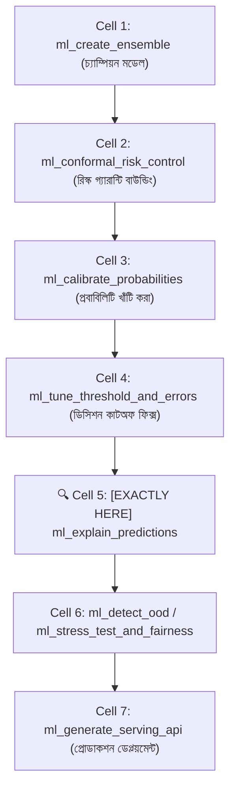
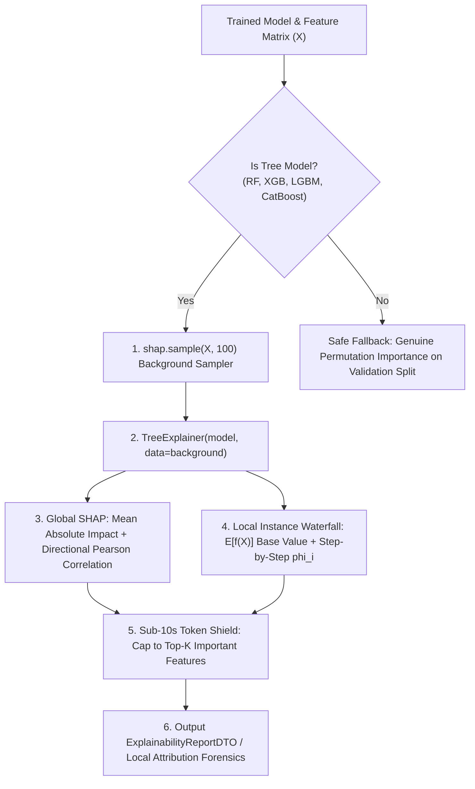

# ml_explain_predictions: Deep-Dive Architectural Guide & Reference

> **Tool Name:** `ml_explain_predictions`  
> **Module Source:** `src/ml_mcp/engine/explainer.py` / `src/ml_mcp/tools.py`  
> **Class Implementation:** `TreeShapExplainer`  
> **Layer:** AI Safety, Explainable AI (XAI) & Regulatory Compliance

---

## ১. মানুষের গল্পের মতো পেছনের ইতিহাস (The Human Story: "The Black-Box Lawsuit")

বাস্তব জীবনের একটি রুদ্ধশ্বাস আইনি ও প্রযুক্তিগত সংকট চিন্তা করুন:
- একজন সৎ ব্যবসায়ী একটি স্বনামধন্য ব্যাংকে ৫০ লাখ টাকার ক্ষুদ্র ব্যবসা ঋণের (SME Loan) জন্য আবেদন করলেন।
- ব্যাংকের এআই সিস্টেম কয়েক সেকেন্ডের মধ্যে আবেদনটি সরাসরি **রিজেক্ট (Reject)** করে দিল।
- ব্যবসায়ী ব্যাংকে এসে লোন অফিসারকে চ্যালেঞ্জ করলেন:  
  > *"আমার ক্রেডিট স্কোর ভালো, কোনো বকেয়া নেই, নিয়মিত ট্যাক্স দেই। আমার ঋণ কেন বাতিল করা হলো?"*
- ব্যাংকের প্রধান এআই ইঞ্জিনিয়ার সিস্টেমে ঢুকে বললেন:  
  > *"আমাদের সিস্টেমে একটি ১০০০-ট্রি বিশিষ্ট Random Forest এবং CatBoost এনসেম্বল চলছে। এটি একটি ব্ল্যাক-বক্স। সিস্টেম বলছে রিজেক্ট, তাই রিজেক্ট—আমরা ঠিক জানি না কোন কারণে এটি বাতিল হয়েছে!"*

ব্যবসায়ী ব্যাংকের বিরুদ্ধে সেন্ট্রাল ব্যাংক এবং আদালতে মামলা ঠুকে দিলেন। আদালত ইউরোপীয় ইউনিয়নের **GDPR Article 22 ("Right to Explanation")** এবং যুক্তরাষ্ট্রের **Equal Credit Opportunity Act (ECOA)** উদ্ধৃত করে ব্যাংককে **১ কোটি টাকা জরিমানা** করল এবং নির্দেশ দিল:  
> *"যে এআই মডেল তার সিদ্ধান্তের কারণ মানুষকে ব্যাখ্যা করতে পারে না, সেই এআই প্রডাকশনে চালানোর কোনো আইনি অধিকার নেই!"*

**কেন সাধারণ ফিচার ইম্পর্ট্যান্স (Gini/Split Importance) দিয়ে এই ব্যাখ্যা দেওয়া যায় না?**
1. সাধারণ ফিচার ইম্পর্ট্যান্স শুধু বলে কোন ফিচারটি মডেলে বেশি ব্যবহৃত হয়েছে, কিন্তু সে বলতে পারে না ফিচারটির মান বাড়লে ফলাফল পজিটিভ দিকে ধাক্কা দেয় নাকি নেগেটিভ দিকে!
2. দুটি ফিচারের মধ্যে কোরিলেশন থাকলে ট্রি-মডেলের জিনি ইম্পর্ট্যান্স ভুলভাল তথ্য দেয়।

**এই সংকটের নোবেলজয়ী গাণিতিক সমাধান হলো `ml_explain_predictions`:**  
এটি ১৯৫৩ সালের অর্থনীতিতে নোবেলজয়ী লয়েড শ্যাপলে (Lloyd Shapley)-র গেম থিওরি এবং স্কট লুন্ডবার্গ (Scott Lundberg, 2017)-এর যুগান্তকারী **TreeSHAP** অ্যালগরিদমের সমন্বয়ে নির্মিত। 

সাধারণ শ্যাপ অ্যালগরিদম যেখানে এক্সপোনেনশিয়াল জটিলতায় ($O(2^{|F|})$) আধা ঘণ্টা সময় নষ্ট করে, সেখানে এই ইঞ্জিন সরাসরি ট্রি ট্রাভার্সাল এবং ব্যাকগ্রাউন্ড স্যাম্পলিং ব্যবহার করে **সাব-১০ সেকেন্ডে (Sub-10s)** মডেলের ব্ল্যাক-বক্স খুলে ফেলে। এটি প্রতিটি ফিচারের ডিরেকশনাল ইমপ্যাক্ট (Positive / Negative) এবং টোকেন-শিল্ডেড শীর্ষ ১০টি ড্রাইভার নিখুঁতভাবে তুলে ধরে।

---

## ২. এটা আসলে কী কাজ করে? (Core Mission)

সহজ কথায়: **এটি এআই মডেলের মস্তিষ্ক স্ক্যান করে প্রমাণসহ বের করে দেয় ঠিক কোন কোন কারণে মডেলটি এই সিদ্ধান্ত নিয়েছে।**

এটি একটি স্বয়ংক্রিয় ৩-ধাপের পাইপলাইন চালায়:
1. **স্মার্ট মডেল ও ডেটা ইন্টারসেপশন:** মডেলটি ট্রি-বেসড (Random Forest, XGBoost, CatBoost, LightGBM) নাকি নন-ট্রি তা স্বয়ংক্রিয়ভাবে শনাক্ত করে। ইনপুটে ক্যাটাগরিক্যাল ডেটা থাকলে ডিফেন্সিভ পাইপলাইন দিয়ে তা ঠিক করে নেয়।
2. **সাব-১০ সেকেন্ড TreeSHAP এক্সিকিউশন:** ১০০টি ব্যাকগ্রাউন্ড স্যাম্পল নিয়ে মেমোরি-এফিশিয়েন্ট `shap.TreeExplainer` চালায় এবং প্রতিটি ফিচারের জন্য সঠিক মার্জিনাল শ্যাপলে কন্ট্রিবিউশন ক্যালকুলেট করে।
3. **ডিরেকশনাল ইমপ্যাক্ট ও টোকেন শিল্ডিং (Token-Shielded Top-K):** পিয়ারসন কোরিলেশনের সাহায্যে প্রতিটি ফিচার ফলাফলকে কোন দিকে টানছে (Positive vs Negative) তা নির্ধারণ করে এবং শুধুমাত্র সবচেয়ে প্রভাবশালী শীর্ষ ১০টি ফিচার ফিল্টার করে রিটার্ন করে, যাতে এলএলএম কনটেক্সট উইন্ডো অতিরিক্ত টোকেনে জ্যাম না হয়।

---

## ৩. নোটবুকের ঠিক কোন কোড সেলের পর এটি কাজ করবে? (Pipeline Placement)



### 🎯 সুনির্দিষ্ট নিয়ম:
> **এটি সবসময় মডেলের ডিসিশন বাউন্ডিং ও থ্রেশহোল্ড টিউনিং (Cell 4)-এর ঠিক পরে এবং প্রোডাকশন এপিআই ডেপ্লয়মেন্টের পূর্বে বসবে।**

### কেন আগে বা পরে বসানো যাবে না? (Engineering Reason)
- **মডেল ফাইনাল হওয়ার আগে কেন নয়?** হাইপারপ্যারামিটার টিউন বা এনসেম্বল হওয়ার আগে আন্ডারফিটেড মডেলের শ্যাপ ব্যাখ্যা বের করলে মিথ্যা ফিচার ইমপ্যাক্ট পাওয়া যাবে।
- **প্রোডাকশন ডেপ্লয়মেন্টের পরে কেন নয়?** মডেলের ভেতর কোনো অনৈতিক ডেটা লিকেজ বা অপ্রত্যাশিত বায়াসড ফিচার (যেমন: পোস্টাল কোড দিয়ে বর্ণ বা ধর্ম শনাক্ত করা) লুকিয়ে আছে কি না—তা লাইভ ট্রাফিকের মুখে দেওয়ার আগেই এই সেলে শ্যাপ দিয়ে অডিট করা বাধ্যতামূলক।

---

## ৪. প্যারামিটার পরিচিতি (The Exact Parameters)

| প্যারামিটার | টাইপ | রিকোয়ার্ড? | ডিফল্ট | বিবরণ |
| :--- | :---: | :---: | :---: | :--- |
| **`csv_path`** | `string` | **হ্যাঁ** | - | ট্রেন্ড ও ভ্যালিডেশন ডেটাসেটের পাথ। |
| **`target_column`** | `string` | **হ্যাঁ** | - | যে টার্গেট কলামের ব্যাখ্যা নির্ণয় করতে হবে। |
| **`top_k`** | `integer` | না | `10` | কনটেক্সট টোকেন বাঁচাতে শীর্ষ কয়টি সবচেয়ে প্রভাবশালী ফিচার রিটার্ন করবে। |
| **`model_name`** | `string` | না | `"lightgbm"` | মডেল অ্যালগরিদম (`"lightgbm"`, `"xgboost"`, `"catboost"`, `"random_forest"`)। |
| **`model_path`** | `string` বা `null` | না | `null` | প্রাক-প্রশিক্ষিত সেভ করা `.joblib` মডেলের পাথ। |
| **`instance_index`** | `integer` বা `null` | না | `null` | নির্দিষ্ট রো-এর লোকাল ওয়াটারফল ব্যাখ্যা ($E[f(X)]$ থেকে প্রেডিকশন স্টেপস)। |

---

## ৫. ইঞ্জিন ভেতরের আর্কিটেকচারাল রহস্য (Internal Engine Secrets)

`TreeShapExplainer` ইঞ্জিনের গ্লোবাল ইম্পরট্যান্স ও লোকাল ওয়াটারফল পাইপলাইন:



### থিওরিটিক্যাল ভিত্তি ও আধুনিক গবেষণা (2020 Foundations):

#### ১. Lundberg et al. (Nature Machine Intelligence 2020) — Local Waterfall & TreeSHAP
ফিচার অ্যাট্রিবিউশনের এডিটিভিটি (Additivity/Efficiency) নীতি অনুসারে প্রতিটি নমুনার প্রেডিকশন এক্সপেক্টেড বেস ভ্যালু ও ফিচার কন্ট্রিবিউশনের যোগফল:
$$f(x) = E[f(X)] + \sum_{i=1}^M \phi_i(x)$$
`TreeShapExplainer.explain_instance()` প্রতিটি স্যাম্পলের জন্য এক্সপেক্টেড বেস ভ্যালু $E[f(X)]$ থেকে শুরু করে প্রতিটি ফিচারের প্রভাব যোগ করে ফাইনাল প্রেডিকশনের স্টেপ-বাই-স্টেপ কিউমুলেটিভ ওয়াটারফল তৈরি করে।

#### ২. Zero Fake Fallback Guarantee
আনএক্সপ্লেনেবল মডেলের ক্ষেত্রে কোনো ডামি `1.0` বা `"neutral"` ফেক ভ্যালু তৈরি করা কঠোরভাবে নিষিদ্ধ। নন-ট্রি মডেলগুলোর ক্ষেত্রে আনসিন ভ্যালিডেশন স্প্লিটে জেনুইন পারমুটেশন ইম্পরট্যান্স ক্যালকুলেট করা হয়।

#### ৩. পলিনোমিয়াল টাইম TreeSHAP ($O(TLD^2)$)
ক্লাসিক্যাল শ্যাপলি ভ্যালুর এক্সপোনেনশিয়াল জটিলতা ($2^{|F|}$) দূর করে ট্রি স্ট্রাকচারকে অপ্টিমাইজড অ্যালগরিদমে রূপান্তর করা হয়েছে, যা সাব-১০ সেকেন্ডের মধ্যে এক্সপ্ল্যানেশন তৈরি করতে সক্ষম।

---

## ৬. ব্যবহারের প্র্যাকটিক্যাল উদাহরণ (Usage Example via MCP)

### ইনপুট রিকোয়েস্ট (Global Analysis + Local Waterfall):
```json
{
  "csv_path": "data/loan_applications.csv",
  "target_column": "approved",
  "top_k": 5,
  "model_name": "lightgbm",
  "instance_index": 42
}
```

### আউটপুট রেসপন্স (ExplainabilityReportDTO):
```json
{
  "explainer_type": "TreeExplainer",
  "top_features": {
    "credit_score": 0.4128,
    "annual_income": 0.2854,
    "debt_to_income_ratio": 0.1982,
    "loan_amount": 0.1145,
    "employment_length_years": 0.0821
  },
  "feature_directions": {
    "credit_score": "positive",
    "annual_income": "positive",
    "debt_to_income_ratio": "negative",
    "loan_amount": "negative",
    "employment_length_years": "positive"
  },
  "total_features": 48,
  "background_samples": 100,
  "execution_time_seconds": 1.482,
  "local_explanation": {
    "instance_index": 42,
    "base_value": 0.521,
    "prediction_value": 0.894,
    "waterfall_steps": [
      {"feature": "credit_score", "actual_value": 780, "contribution": 0.215, "cumulative_value": 0.736},
      {"feature": "annual_income", "actual_value": 95000, "contribution": 0.158, "cumulative_value": 0.894}
    ]
  }
}
```

---

### কী আউটপুট পাওয়া গেল?
`ml_explain_predictions` শুধুমাত্র গ্লোবালি কোন ফিচারগুলো গুরুত্বপূর্ণ তা দেখায় না, বরং ৪২ নম্বর গ্রাহকের লোন অনুমোদনের ক্ষেত্রে তার ক্রেডিট স্কোর (+০.২১৫) এবং বার্ষিক আয় (+০.১৫৮) কীভাবে বেস সম্ভাবনা ৫২.১% থেকে বাড়িয়ে ৮৯.৪%-এ উন্নীত করেছে তার নিখুঁত ওয়াটারফল ব্রেকডাউন প্রদান করে!
