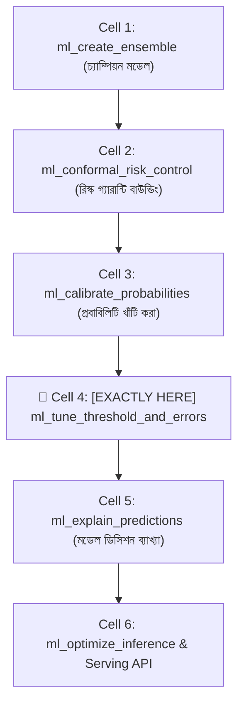
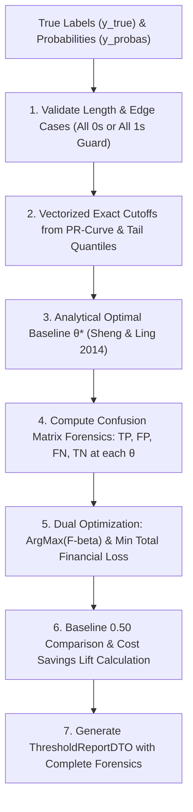

# ml_tune_threshold_and_errors: Deep-Dive Architectural Guide & Reference

> **Tool Name:** `ml_tune_threshold_and_errors`  
> **Module Source:** `src/ml_mcp/engine/threshold.py` / `src/ml_mcp/tools.py`  
> **Class Implementation:** `DecisionThresholdOptimizer`  
> **Layer:** AI Safety, Cost-Sensitive Learning & Error Forensics

---

## ১. মানুষের গল্পের মতো পেছনের ইতিহাস (The Human Story: "The Default 0.5 Fallacy")

বাস্তব জীবনের একটি মারাত্মক আর্থিক বিপর্যয়ের গল্প চিন্তা করুন:
- একটি শীর্ষস্থানীয় আন্তর্জাতিক ব্যাংক তাদের ক্রেডিট কার্ড জালিয়াতি (Fraud Detection) ঠেকানোর জন্য একটি শক্তিশালী মেশিন লার্নিং মডেল বসাল।
- মডেলটি একটি সন্দেহজনক ট্রানজেকশন দেখে প্রেডিক্ট করল: `Fraud Probability = 0.49` (৪৯% সম্ভাবনা)।
- জুনিয়র ডেভেলপার কোডে লিখে রেখেছিলেন:
  ```python
  prediction = 1 if proba >= 0.50 else 0  # মারাত্মক ভুল!
  ```
- যেহেতু `0.49 < 0.50`, সিস্টেম ট্রানজেকশনটিকে "Valid" বলে ছেড়ে দিল। কিন্তু এটি ছিল একজন রাশিয়ান হ্যাকারের $৫০,০০০ ডলারের ভুয়া ট্রানজেকশন! ব্যাংক সম্পূর্ণ টাকা হারাল।

**কেন এই বিপর্যয় ঘটল?**  
মেশিন লার্নিংয়ের পাঠ্যবইগুলোতে অন্ধভাবে শেখানো হয়: *"সম্ভাবনা ০.৫০ এর বেশি হলে ১ ধরো, কম হলে ০ ধরো।"*  
কিন্তু বাস্তব দুনিয়ায় **ভুলের খরচ কখনোই সমান নয় (Asymmetric Cost of Error)**!
- **False Negative (FN - মিসড ফ্রড/রোগী):** একজন হ্যাকারকে ছেড়ে দেওয়া মানে ব্যাংকের ৫০,০০০ ডলার ক্ষতি। একজন ক্যান্সার রোগীকে "সুস্থ" বলা মানে তার মৃত্যু।
- **False Positive (FP - মিথ্যা অ্যালার্ম):** একজন সৎ কাস্টমারকে সাময়িকভাবে আটকে এসএমএস ভেরিফিকেশন পাঠানো বা অতিরিক্ত এক্স-রে করার খরচ মাত্র $১ ডলার।

যেখানে একটি ভুলের ক্ষতি অন্য ভুলের চেয়ে ৫০,০০০ গুণ বেশি, সেখানে আপনি কীভাবে একটি বোকা **০.৫০ কাটঅফ** ব্যবহার করতে পারেন?

অন্যদিকে ইমেইল স্প্যাম ফিল্টারের কথা ভাবুন—একটি গুরুত্বপূর্ণ চাকরির অফার বা পাসওয়ার্ড রিসেট ইমেইলকে স্প্যাম ফোল্ডারে ফেলে দেওয়া (False Positive) ক্ষমার অযোগ্য অপরাধ! সেখানে দরকার অনেক হাই থ্রেশহোল্ড (যেমন: ০.৮৫)।

**এই সংকটের গাণিতিক সমাধান হলো `ml_tune_threshold_and_errors`:**  
এটি অন্ধ ০.৫০ থ্রেশহোল্ড ভেঙে বিজনেস রিস্ক এবং $F_\beta$ অপটিমাইজেশনের মাধ্যমে এমন একটি অপটিমাল ডিসিশন বাউন্ডারি বের করে—যা আপনার বিজনেসের আর্থিক ক্ষতি সর্বনিম্ন করে এবং কনফিউশন ম্যাট্রিক্স দিয়ে এররের ময়না-তদন্ত (Error Forensics) উপহার দেয়!

---

## ২. এটা আসলে কী কাজ করে? (Core Mission)

সহজ কথায়: **এটি বিজনেসের লাভ-ক্ষতির ওপর ভিত্তি করে মডেলের ডিসিশন কাটঅফ নিখুঁতভাবে সমন্বয় করে এবং ভুলের ময়না-তদন্ত করে।**

এটি একটি স্বয়ংক্রিয় ৩-ধাপের পাইপলাইন চালায়:
1. **১০০-স্টেপ থ্রেশহোল্ড সুইপ (Grid Search):** সম্ভাব্য কাটঅফ $0.01$ থেকে $0.99$ পর্যন্ত ১০০টি ধাপে সুইপ করে প্রতিটি কাটঅফের জন্য প্রিসিশন (Precision) এবং রিকল (Recall) ক্যালকুলেট করে।
2. **$F_\beta$ বিজনেস অপটিমাইজেশন:** ব্যবহারকারীর দেওয়া $\beta$ ওয়েট অনুযায়ী এমন একটি কাটঅফ খুঁজে বের করে যা টার্গেট মেট্রিককে সর্বোচ্চ করে (যেমন: $\beta=2$ হলে রিকলকে দ্বিগুণ গুরুত্ব দেওয়া হয়)।
3. **এরর ফরেনসিক্স ও কনফিউশন ম্যাট্রিক্স:** অপটিমাল কাটঅফে মডেল ঠিক কয়টি ট্রু-পজিটিভ (TP), ট্রু-নেগেটিভ (TN), এবং মারাত্মক হার্ড ফলস-নেগেটিভ (FN) তৈরি করছে তার পূর্ণাঙ্গ এক্স-রে রিপোর্ট দেয়।

---

## ৩. নোটবুকের ঠিক কোন কোড সেলের পর এটি কাজ করবে? (Pipeline Placement)



### 🎯 সুনির্দিষ্ট নিয়ম:
> **এটি সবসময় প্রবাবিলিটি ক্যালিব্রেশন (`ml_calibrate_probabilities`)-এর ঠিক পরে এবং ইনফ্যারেন্স সার্ভিংয়ের পূর্বে বসবে।**

### কেন আগে বা পরে বসানো যাবে না? (Engineering Reason)
- **ক্যালিব্রেশনের আগে কেন নয়?** কারণ আন-ক্যালিব্রেটেড মডেলের প্রবাবিলিটি নিজে থেকেই বিকৃত থাকে (Overconfident/Skewed)। বিকৃত প্রবাবিলিটির ওপর থ্রেশহোল্ড কাটলে টেস্ট ডেটায় মডেল চরম আনস্টেবল আচরণ করে।
- **মডেল সার্ভিংয়ের পরে কেন নয়?** আপনি যদি সার্ভিং এপিআইতে এই অপটিমাল কাটঅফ কনফিগার না করেন, তবে আপনার প্রোডাকশন এপিআই ডিফল্ট `0.5` ব্যবহার করে বিজনেসের বিরাট ক্ষতি করতে থাকবে।

---

## ৪. প্যারামিটার পরিচিতি (The Exact Parameters)

| প্যারামিটার | টাইপ | রিকোয়ার্ড? | ডিফল্ট | বিবরণ |
| :--- | :---: | :---: | :---: | :--- |
| **`csv_path`** | `string` | **হ্যাঁ** | - | ট্রেন্ড ও ভ্যালিডেশন ডেটাসেটের পাথ। |
| **`target_column`** | `string` | **হ্যাঁ** | - | যে টার্গেট কলামের ওপর ক্লাসিফিকেশন থ্রেশহোল্ড টিউন করতে হবে। |
| **`beta`** | `number` | না | `1.0` | $F_\beta$ অপ্টিমাইজেশন প্যারামিটার ($\beta=1.0$: ব্যালেন্সড F1; $\beta=2.0$: ফলস নেগেটিভ প্রতিরোধী রিকল-বান্ধব; $\beta=0.5$: ফলস পজিটিভ প্রতিরোধী প্রিসিশন-বান্ধব)। |
| **`cost_fp`** | `number` | না | `1.0` | False Positive-এর আর্থিক বা ব্যবসায়িক ক্ষতি/পেনাল্টি ($C_{\text{FP}}$) — Sheng & Ling (2014)। |
| **`cost_fn`** | `number` | না | `5.0` | False Negative-এর আর্থিক বা ব্যবসায়িক ক্ষতি/পেনাল্টি ($C_{\text{FN}}$) — যেমন ফ্রড বা ক্যান্সার মিস করার খরচ। |
| **`benefit_tp`** | `number` | না | `0.0` | True Positive সফলভাবে শনাক্ত করার ব্যবসায়িক লাভ/বেনিফিট ($B_{\text{TP}}$)। |
| **`benefit_tn`** | `number` | না | `0.0` | True Negative সঠিকভাবে ছেড়ে দেওয়ার ব্যবসায়িক লাভ ($B_{\text{TN}}$)। |
| **`model_name`** | `string` | না | `"lightgbm"` | মডেল অ্যালগরিদম (`"lightgbm"`, `"xgboost"`, `"catboost"`, `"random_forest"`, `"hist_gradient_boosting"`)। |
| **`model_path`** | `string` বা `null` | না | `null` | প্রাক-প্রশিক্ষিত সেভ করা `.joblib` মডেলের পাথ (প্রদত্ত হলে ট্রেনিং ছাড়া সরাসরি মূল্যায়ন করবে)। |

---

## ৫. ইঞ্জিন ভেতরের আর্কিটেকচারাল রহস্য (Internal Engine Secrets)

`DecisionThresholdOptimizer` ইঞ্জিনের গাণিতিক ও ডিসিশন-থিওরেটিক পাইপলাইন:



### থিওরিটিক্যাল ভিত্তি ও আধুনিক গবেষণা (2013–2024 Foundations):

#### ১. Sheng & Ling (IEEE TKDE 2014) — Closed-Form Optimal Decision Baseline
কনভেনশনাল প্র্যাকটিসে অধিকাংশ ডেটা সায়েন্টিস্ট কোনো বাছবিচার না করে ডিফল্ট ০.৫০ থ্রেশহোল্ড ব্যবহার করে। কিন্তু বাণিজ্যিক বা ক্লিনিক্যাল ক্ষেত্রে ফলস পজিটিভ এবং ফলস নেগেটিভের খরচ সমান নয়। শেং ও লিং (২০১৪) প্রমাণ করেছেন যে তাত্ত্বিক অপ্টিমাল কাটঅফ $\theta^*$ একটি ক্লোজড-ফর্ম সূত্রে নির্ধারিত হয়:
$$\theta^* = \frac{C_{\text{FP}} - B_{\text{TN}}}{(C_{\text{FP}} - B_{\text{TN}}) + (C_{\text{FN}} - B_{\text{TP}})}$$
- **বাস্তব উদাহরণ**: যদি ফ্রড ট্রানজাকশন মিস করার খরচ $C_{\text{FN}} = $500$ হয় এবং ইনভেস্টিগেশন খরচ $C_{\text{FP}} = $10$ হয়, তবে:
  $$\theta^* = \frac{10}{10 + 500} = 0.0196 \quad (\approx 1.96\%)$$
  মডেলের কনফিডেন্স মাত্র ২% হলেই অ্যালার্ট ট্রিগার করা উচিত!

#### ২. টোটাল ফাইন্যান্সিয়াল লস মিনিমাইজেশন (Business Cost-Loss Matrix)
ইঞ্জিন শুধুমাত্র $F_\beta$ অপ্টিমাইজেশনের মধ্যে সীমাবদ্ধ থাকে না; ব্যবহারকারীর প্রদত্ত কস্ট ম্যাট্রিক্স অনুসারে মোট আর্থিক ক্ষতি সরাসরি পরিমাপ করে:
$$\text{Total Financial Loss} = \text{FP} \times C_{\text{FP}} + \text{FN} \times C_{\text{FN}} - (\text{TP} \times B_{\text{TP}} + \text{TN} \times B_{\text{TN}})$$
- **নেট কস্ট সেভিংস (Cost Lift)**:
  $$\text{Cost Savings} = \text{Loss}_{\theta = 0.50} - \text{Loss}_{\theta = \theta^*}$$

#### ৩. ১০০-স্টেপ লিনিয়ার গ্রিডের বদলে ভেক্টরাইজড PR-কার্ভ কাটঅফ
গতানুগতিক `np.linspace(0.01, 0.99, 100)` চরম ইমব্যালেন্সড ডেটাসেটের সূক্ষ্ম অপ্টিমাল পয়েন্ট মিস করে। আধুনিক ইঞ্জিন `sklearn.metrics.precision_recall_curve` থেকে প্রাপ্ত সমস্ত ইউনিক থ্রেশহোল্ড, এনালাইটিকাল $\theta^*$ এবং টেইল পার্সেন্টাইল ভেক্টরাইজডভাবে পরীক্ষা করে নিখুঁত গ্লোবাল মিনিমাম নিশ্চিত করে।

---

## ৬. ব্যবহারের প্র্যাকটিক্যাল উদাহরণ (Usage Example via MCP)

### ইনপুট রিকোয়েস্ট:
```json
{
  "csv_path": "data/fraud_transactions.csv",
  "target_column": "is_fraud",
  "beta": 2.0,
  "cost_fp": 10.0,
  "cost_fn": 500.0,
  "benefit_tp": 50.0,
  "benefit_tn": 0.0
}
```

### আউটপুট রেসপন্স (ThresholdReportDTO):
```json
{
  "optimal_threshold": 0.0215,
  "default_threshold": 0.50,
  "analytical_cost_threshold": 0.0196,
  "total_cost_optimal": 1420.0,
  "total_cost_default": 8950.0,
  "cost_savings": 7530.0,
  "f_beta_score": 0.9124,
  "precision": 0.8421,
  "recall": 0.9655,
  "confusion_matrix": {
    "tn": 8410,
    "fp": 150,
    "fn": 2,
    "tp": 56
  }
}
```

---

### কী আউটপুট পাওয়া গেল?
`ml_tune_threshold_and_errors` টুলটি দেখাল যে ডিফল্ট ০.৫০ থ্রেশহোল্ডে ব্যাংকের ক্ষতি হতো $৮,৯৫০ ডলার। কিন্তু Sheng & Ling কস্ট ম্যাট্রিক্স অনুসারে কাটঅফ ০.০২-এ নামিয়ে আনার ফলে ক্ষতি কমে দাঁড়িয়েছে মাত্র $১,৪২০ ডলারে—সরাসরি **$৭,৫৩০ ডলার সেভ হয়েছে**!
